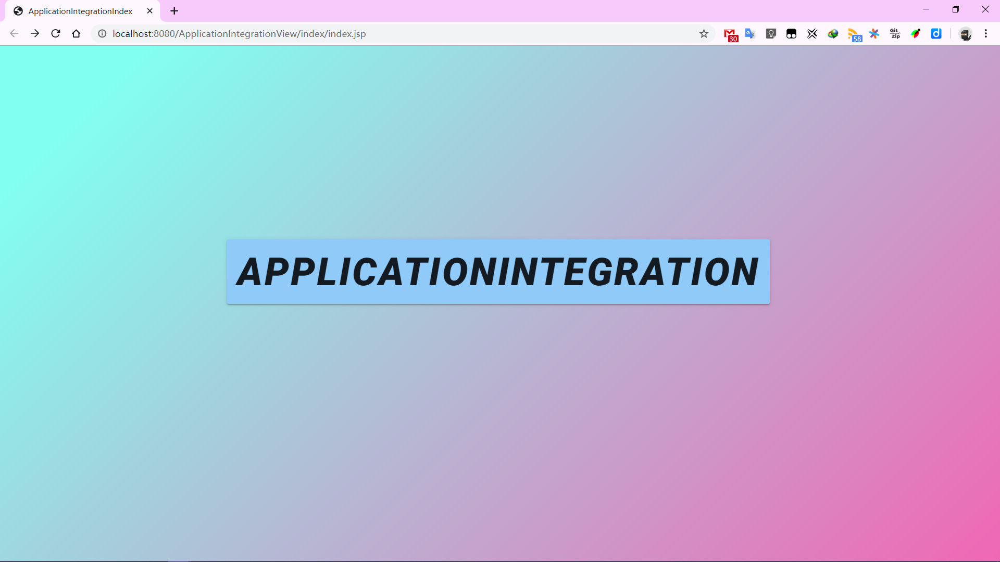
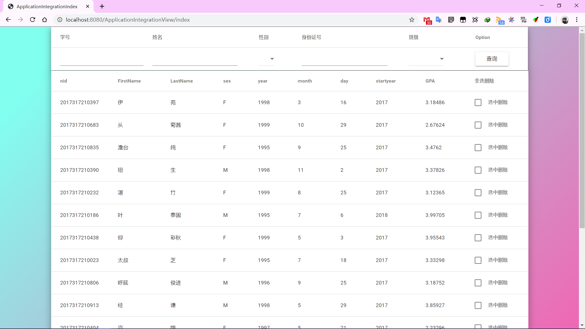
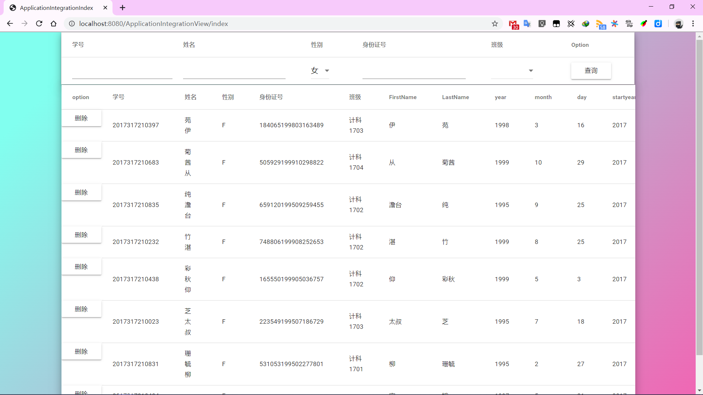
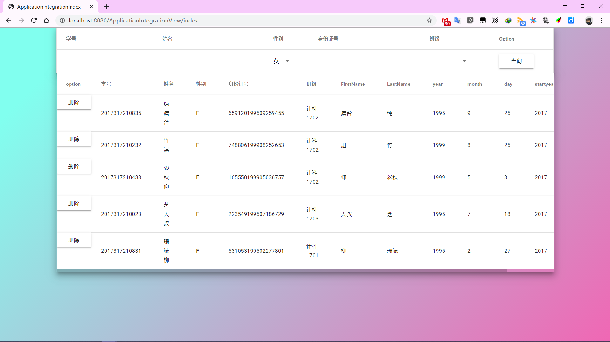

应用集成原理与工具集成实验报告

计科1701 王旭 2017317210122

# 实验环境

+ 普通PC机、Windows10系统
+ Eclipse Java集成开发平台
+ Mysql数据库运行环境
+ Chrome 版本 79.0.3945.88（正式版本） （64 位）
+ Visual Studio Code 64位最新版

# 实验目的

实验目的为实现一个简单小型MVC模式的数据库集成项目，用户可以在不感受到后台具体数据库的情况下，对数据进行增删改查等功能，后台根据人工编写的XML文件动态化的对数据库进行操作，实现数据上的集成处理，最终的结果数据的展现通过前端Web页面呈现出来。

# 实验内容

## 阶段一

建立两个数据库，这两个数据库中新建两个表，如主要以学⽣信息，选课信息（或者其他）为主，2个DB的内容基本⼀致，只是要求针对学⽣描述的字段信息必须有区别，包括属性名、格式等，尽可能的差异化字段名和类型，以便后续的集成实现；

## 阶段二

对以上的各数据库的表结构使用XML进行描述，这一步的主要目的是对于同一类型的数据，虽然在不同表中的字段名不同，但可以使用一个名字来表示这一类字段，方便之后后端对数据库的操作，如学号可以都是用 cid 来表示；

## 阶段三

使用Tomcat搭建服务器，后端主要使用servlet，前端使用jsp+js+jquery等前端技术，实现一个基本带有登录功能的MVC模式的增删改查的页面，要求所有对数据的逻辑处理功能都只能在后端实现，前端只负责接收数据、发送数据、呈现数据的功能；

## 阶段四

在基本完成阶段三的情况下，利用之前编写的XML文件，修改后端对数据的处理逻辑以实现数据集成的功能，使得前端感受不到后台存在多个数据库多个表的情况下对数据库进行操作，及完全屏蔽后台；要求代码中不能出现具体的数据库名称，对于某一个学生的操作要实现所有数据库中与之关联的数据项都要做出相应的变化；


# 实验步骤

## 项目解释

+ \ApplicationIntegration\ApplicationIntegration 是数据库的初始化，用于建立数据库，随机数据
+ ApplicationIntegration\ApplicationIntegrationView 是集成的代码项目
+ ApplicationIntegration\ApplicationIntegrationView 是所有数据库操作的包
+ ApplicationIntegration\ApplicationIntegrationView\src\DatabasesTables 是集成的所有代码以及对数据库、表的一个描述
+ ApplicationIntegration\ApplicationIntegrationView\src\databasesXML 是所有xml文件的操作代码
+ ApplicationIntegration\ApplicationIntegrationView\src\servlet 即为每一个操作对应的后台servlet
+ WebContent 包含所有前端的资源


## 数据库的建立以及数据的生成

为了后边对数据库操作的简单、方便，以及高效的生成数据库表中的数据，所以先写一个简单的程序用来完成数据库表的建立和数据的生成：

### 数据库的操作

在 ``ApplicationIntegration\ApplicationIntegration\src\DatabaseOperation`` 包中实现一个基本的数据库操作

核心代码有：

数据库的链接：

```java
/**
    * @Title: getConnection
    * @Description: TODO 链接数据库
    * @param @return    参数
    * @return Connection    返回类型
    * @throws
    */
    
public Connection getConnection() {
    try {
        con = (Connection) DriverManager.getConnection(url, user, pwd);
    } catch (SQLException e) {
        // TODO: handle exception
        con = null;
        e.printStackTrace();
    }
    return con;
}
```

数据库的增删改查等：

```java
/**
    * @Title: executeQuery
    * @Description: TODO sql's query
    * @param @param sql
    * @param @param obj
    * @param @return    参数
    * @return ResultSet    返回类型
    * @throws
    */
    
public ResultSet executeQuery(String sql, Object[] obj) {
    if(sql != null) {
        con = getConnection();
        if(con != null) {
            try {
                pstm = (PreparedStatement) con.prepareStatement(sql);
                if(obj != null) {
                    for(int i = 0; i < obj.length; ++i) {
                        pstm.setObject(i + 1, obj[i]);
                    }
                }
                ret = pstm.executeQuery();
            } catch (SQLException e) {
                // TODO: handle exception
                e.printStackTrace();
            }
        }
    }
    return ret;
}
```

### 数据库数据的生成

在 ``ApplicationIntegration\ApplicationIntegration\src\InitDatabase`` 包下，实现对数据库中表随机生成数据:

核心代码：

```java
public boolean createDataBase1() {
		try {
			String name = null;
			String firstName = null;
			String SecondName = null;
			String sex = null;
			String birth = null;
			String nid = null;
			String id = null;
			String className = null;
			String classId = null;
			File file = new File("G:\\Backup\\CollegeProjectBackup\\ApplicationIntegration\\ApplicationIntegration\\src\\InitDatabase\\name.txt");
			FileInputStream rf = new FileInputStream(file);
			Scanner io = new Scanner(file);
			this.createTable("drop table student1;", 0); this.createTable("drop table student2;", 0);
			this.createTable("drop table student1;", 1); this.createTable("drop table student2;", 1);
			String sql = "create table student1 (学号 char(13), 姓名 varchar(10), 性别 char(4), 身份证号 char(20), 班级 varchar(30));";
			this.createTable(sql, 0);
			sql = "create table student2 (nid char(13), FirstName varchar(4), LastName varchar(10), sex char(2), year char(4), month char(2), day char(2), startyear integer(4), GPA float(3));";
			this.createTable(sql, 1);
			int num = 1;
			while(io.hasNext() && num <= 20) {
				firstName = io.next();
				SecondName = io.next();
				name = SecondName + firstName;
				sex = io.next();
				++num;
				Random rnd = new Random();
				int year = rnd.nextInt(5) + 1995;
				int month = rnd.nextInt(12) + 1;
				int day = rnd.nextInt(30);
				birth = String.valueOf(year * 10000 + month * 100 + day);
				nid = String.valueOf(rnd.nextInt(1000) + Long.parseLong("2017317210000"));
				id = String.valueOf(rnd.nextInt(999999)) + birth + String.valueOf(rnd.nextInt(9999));
				String[] classname = {"计科1701", "计科1702", "计科1703", "计科1704", "生信1701", "生信1702"};
				int classNum = classname.length;
				int classid = rnd.nextInt(classNum);
				className = classname[classid];
				classId = String.valueOf(1700 + classid + 1);
				int startyear = (rnd.nextInt(100) < 10 ? 1 : 0) + 2017;
				double gpa = rnd.nextDouble() * (rnd.nextInt(100) <= 10 ? -1 : 1) + 3.0;
				// create table1
				String sql1 = "insert into student1 values (";
				sql = null;
				sql = sql1 + "\'" + nid + "\', " + "\'" + name + "\', " + "\'" + sex + "\', " + "\'" + id + "\', " + "\'" + className + "\');";
				int probaility = rnd.nextInt(100);
				if(probaility > 10) {
					this.executeInsert(sql, 0);					
				}
				// create table2
				if(sex.equals("男")) {
					sex = "M";
				}
				else {
					sex = "F";
				}
				String sql2 = "insert into student2 values (";
				sql = null;
				sql = sql2 + "\'" + nid + "\', " + "\'" + firstName + "\', " + "\'" + SecondName + "\', " + "\'" + sex + "\', " + "\'" + year + "\', " + "\'" + month + "\', " + "\'" + day + "\', " + "\'" + startyear + "\', " + "\'" + gpa + "\');";
				System.out.println(sql);
				if(probaility > 20 || probaility <= 10) {
					this.executeInsert(sql, 1);					
				}
			}
		io.close();
		rf.close();			
		} catch (Exception e) {
			// TODO: handle exception
			e.printStackTrace();
			return false;
		}
		return true;
    }
```

## 编写XML文件

为了实现在系统不重启的条件下对系统的配置进行修改，如添加删除数据库表，表结构的更改等操作，使用XML文件来使得系统读文件来获取配置的变化；

对数据库的表的XML描述如下，其他数据库表的XML文件类似:

```xml
<?xml version="1.0" encoding="UTF-8"?>
<database>
	<properties>
		<driverClassName>com.mysql.cj.jdbc.Driver</driverClassName>
		<url>jdbc:mysql://localhost:3306/applicationintegration1?serverTimezone=UTC</url>
		<username>root</username>
		<password>123456</password>

		<databaseName>applicationintegration1</databaseName>
		<databaseTableNum>1</databaseTableNum>
	</properties>
	
	<table id='1'>
		<tableproperties>
			<tableName>student1</tableName>
			<tableColNum>5</tableColNum>
		</tableproperties>
		<columns>
			<cid>
				<name>学号</name>
				<type>string</type>
				<isSelect>false</isSelect>
			</cid>
			<cname>
				<name>姓名</name>
				<type>string</type>
				<isSelect>false</isSelect>
			</cname>
			<csex>
				<name>性别</name>
				<type>string</type>
				<isSelect>true</isSelect>
			</csex>
			<id>
				<name>身份证号</name>
				<type>string</type>
				<isSelect>false</isSelect>
			</id>
			<cclass>
				<name>班级</name>
				<type>string</type>
				<isSelect>true</isSelect>
			</cclass>
		</columns>
	</table>
</database>
```

此外还应有一个总XML描述表，用于统一字段，方便后续的操作；

## 前后端主要逻辑功能的实现

后端使用Tomcat来搭建服务器，使用servlet来实现后台对前端的应答，获取前端发送来的数据，链接数据库处理数据，如合并分解等功能，最后将数据发送到前端；

前端使用jsp+js+jquery+ajax等技术来实现页面主体不绘制的的情况下，与后端交互，获取数据库的数据后利用js等技术来绘制页面，展现数据；

此外使用 ``mdui`` 等第三方资源美化页面，简化中间的处理步骤；

前后端交互中所有的数据都由 ``gson`` 封装成 标准json 数据传送，简化双方的数据处理描述过程；

以查询操作为例，一些核心代码：

主体页面：

```jsp
<%@page import="java.sql.ResultSetMetaData"%>
<%@page import="java.sql.ResultSet"%>
<%@ page language="java" contentType="text/html; charset=UTF-8"
    pageEncoding="UTF-8"%>
<%@ taglib uri="http://java.sun.com/jsp/jstl/core" prefix="c"%>
<%@ taglib uri="http://java.sun.com/jsp/jstl/sql" prefix="sql"%>
<!DOCTYPE html>
<html>
	<head>
		<meta charset="UTF-8">
		<title>ApplicationIntegrationIndex</title>
		<link rel="shortcut icon" href="#" />	
		<!-- mdui样式表 -->
		<link rel="stylesheet" href="//cdnjs.loli.net/ajax/libs/mdui/0.4.3/css/mdui.min.css">
		<script src="//cdnjs.loli.net/ajax/libs/mdui/0.4.3/js/mdui.min.js"></script>		
		<!-- 自定义背景色 -->
		<link rel="stylesheet" type="text/css" href="./css/index.css">
		<!-- jquery -->
		<script src="https://code.jquery.com/jquery-3.4.1.min.js"></script>
		<!-- 查询的结果由 get-qryres.js 得到并重新绘制页面 -->
		<!-- 因为key-select会调用get-qryres中的方法，所以要前置 -->
		<script src="./js/get-qryres.js"></script>
		<!-- 查询选择区域的显示由 key-select.js 完成 -->
		<script src="./js/key-select.js"></script>
		<!-- 删除某一个元素 -->
		<script src="./js/delete.js"></script>	
	</head>
	<body>
		<div>
			<div class= "mdui-container">
				<!-- 数据库的每一个字段的选择区域 -->
				<!-- 首次加载页面时将显示所有可以选择的项目 -->
				<!-- 此后的每一次查询都将重新请求，刷新可选项 -->
				<div class="mdui-talbe-fluid mdui-shadow-10" id="key-select">
					<form id="keysSelectForm">						
					</form>
				</div>
				<!-- 结果的显示区域 -->
				<!-- 第一次加载页面时显示数据库中所有数据 -->
				<!-- 此后的每一次查询，采用ajax的异步请求实现页面的局部区域的刷新（即不使用jsp+servlet模式） -->
				<div class="mdui-table-fluid mdui-shadow-10" id="get-qryres">					
					<table class="mdui-table mdui-talbe-hoverable">					
					<%
						%><tr><%
						ResultSet rs = (ResultSet)request.getAttribute("rs");
						ResultSetMetaData rsmd = (ResultSetMetaData)request.getAttribute("rsmd");
						String colVal = null;
						int len = rsmd.getColumnCount();
						for(int i = 1; i <= len; ++i){
							colVal = rsmd.getColumnName(i);
							%><th><%=colVal %></th><%
						}						
						%><th>
							全选删除
						</th><%
						%></tr><%						
						while(rs.next()){
							%><tr><%
							
							for(int i = 1; i <= len; ++i){
								colVal = rs.getString(i);
								%><td><%=colVal %></td><%
							}							
							%><th>
							<label class="mdui-checkbox">
								<input type="checkbox"/>
								<i class="mdui-checkbox-icon"></i>
								选中删除
							</label>
						</th><%							
							%></tr><%
						}
					%>										
					</table>			
				</div>
			</div>
		</div>
	</body>
</html>
```

因为使用了 ajax 异步请求和 js动态绘制页面的方法，所以前端页面的展示只需一个文件即可实现，其余的数据处理、发送功能都由各js文件处理即可；

前端获取后台数据并重绘数据展现的js代码：

```js
function getqry(send){
    // 根据查询的要求来获取数据：
    console.log("getqrt" + send);
    $.ajax({
        type: "post",
        // async: true,
        dataType: "json",
        url: "/ApplicationIntegrationView/DatabasesQry",
        data: send,
        success: function(result){
            console.log("get qrt data");
            console.log(result);
            changeTable(result);
            console.log("data has change in table");
        },
        error: function(errorMsg){
            console.log('error' + errorMsg);
        }
    });
}

function changeTable(json){
    // 清空原来的数据表
    var tablediv = document.getElementById("get-qryres");
    tablediv.removeChild(tablediv.getElementsByTagName("table")[0]);

    var $$ = mdui.JQ;
    $$.each(json, function(i, val){
        console.log(i + "::" + val[0].xmlname);
    });
    $$(tablediv).append('<table class="mdui-table mdui-talbe-hoverable"></table>');
    var table = $$(tablediv).find('table')[0];

    // 绘制表头
    $$(table).append('<tr></tr>');
    var tr = $$(table).find('tr')[0];
    // 为删除按钮挪位置
    $$(tr).append('<th>option</th>');
    $$.each(json[0], function(i, val){
        $$(tr).append('<th value="' + val.xmlname + '">' + val.name + '</th>');
    });

    $$(table).append('<tbody></tbody>');
    var tbody = $$(table).find('tbody')[0];

    $$.each(json, function(i, val){
        if(i != 0){
            $$(tbody).append('<tr nid="' + val[0].value + '"></tr>')
            tr = $$(tbody).find('tr')[i - 1];
            // 添加一个删除按钮
            deletebtn(tr);

            $$.each(val, function(j, v){
                let str;
                if(v != null){
                    str = '<td id="' + v.xmlname + '" value="' + v.value + '">' + v.value + '</td>';
                }
                else{
                    str = '<td></td>'                    
                }
                $$(tr).append(str);
            });
        }
    });
    
    function deletebtn(tr){
        let btnstr = '<button class="mdui-btn mdui-btn-raised mdui-ripple mdui-color-theme-accent" type="button" id="deletebtn">删除</button>';
        $$(tr).append(btnstr);
        let btn = $$(tr).find('button')[0];
        // btn = $$(tr).find('btn')[i];
        $$(btn).on('click', function(e){
            console.log(e);
            console.log('delete');
            console.log($$(btn).parent().attr('nid'));
            Delete($$(btn).parent().attr('nid'));
            // 删除这一行
            $$(btn).parent().remove();
    function handler(event) {
        console.log(event.type); // log event type
    }
    document.addEventListener("mousewheel", handler, {passive:true});
}
```

此处的页面绘制等一部分操作使用的是 ``mdui`` 自带的一个小型的类似 jquery 库，他比原生 jquery 操作更加简单、高效

后台servlet代码：

```java
/**
	 * @see HttpServlet#doGet(HttpServletRequest request, HttpServletResponse response)
	 */
	protected void doGet(HttpServletRequest request, HttpServletResponse response) throws ServletException, IOException {
		// TODO Auto-generated method stub
//		response.getWriter().append("Served at: ").append(request.getContextPath());
		BufferedReader streamReader = new BufferedReader( new InputStreamReader(request.getInputStream(), "UTF-8"));
        StringBuilder responseStrBuilder = new StringBuilder();
        String inputStr;
        while ((inputStr = streamReader.readLine()) != null)
            responseStrBuilder.append(inputStr);
        String requestJson = responseStrBuilder.toString();
        System.out.println(requestJson);
		response.setContentType("application/json; charset=utf-8");
        response.setHeader("cache-control", "no-cache");
        PrintWriter out = response.getWriter();
        DatabasesIntegration databasesIntegration = new DatabasesIntegration();
        out.append(databasesIntegration.databasesQry(requestJson));
    }
```

可以看到后台的servlet的主要任务就是： 收请求->调用对应逻辑的处理方法->将处理后的数据返回到前端即可

对于其他的操作其核心思想大同小异，只要完成一处，其他的操作都很简单；

## 数据的集成

数据的集成主要的任务是： XML的读取、数据的分解、合并处理等逻辑功能

这一部分的完成依靠前面阶段的XML文件，所以一个合格的XML文件将会影响后面的数据的处理部分代码的复杂与否，这里因为相关操作很多，故不放代码，简述流程：

以查询操作为例：

+ 后台接收到前端发来的查询条件后
+ 将查询条件分离，遍历每一个查询条件
+ 对每一个查询条件对应的字段名xmlname 去遍历每一张表的自己字段名name
+ 获得该表下的 sql语句中 where 的正确形式，即 ``where name="value"`` ，不同的数据库、表的name不同，所以要通过此方法来获得sql语句
+ 将得到的sql语句对每个数据库进行查询，获得数据
+ 将每个表获得的数据按一定的逻辑进行合并，得到最终的数据
+ 发送到前端，前端由此来重绘页面

## 部分页面运行截图

+ 初始登录页面时： 
+ 第一次登录将显示所有的数据： 
+ 按一定条件查询时只有数据展示页面进行重绘： 
+ 删除部分条目后： 


# 实验总结

本次实验通过使用许多的技术，如 Tomcat服务器、jsp+servlet+js+ajax+jquery+mdui等等许多前端技术以及xml读写等处理操作，基本完成了一个MVC模式的数据集成系统，但是该系统仍存在很多的问题，如数据库的结构在前期的构建中不够准确，在数据和字段异构的同时某些字段的种类也不同，导致最后在集成阶段的处理很麻烦，也就是最后集成度不十分理想，并且因为对项目进度和任务的安排不够合理，导致很多问题在发现后也没能有时间去处理，中间的许多逻辑处理的实现中只考虑了结果而没有兼顾效率、安全等问题，只能作为一个熟悉数据集成和Web下MVC模式系统的项目。

# 实验感悟

通过这次实验，我除了加深到了很多理论课上的知识，还独自学会很多以前从未了解的技术，如js+ajax+xml+servlet等等，更重要的是这些工具的集成使用，除此之外，对于这次实验中所使用到的技术大多都是第一次使用，前期一直在不断的安装、学习工具的使用，虽是缺点，但也有所学习。还有认识到的一点是，对于完成一个项目，最重要的就是前期要十分准确的理解项目的需求，分析出要实现的内容，要使用的工具，以及妥善安排自己的项目进度、项目任务，在完成实验中，因为各种工具的不熟悉，前期每能高效的安排项目的进度，导致在完成最关键的集成阶段没有足够的时间去全部实现，除了导致集成度的不够，也使得中间很多逻辑处理代码的效率及其低下，没有安全可言。但是我从中学到了很多实际开发的经验，也初步的掌握了MVC模式的开发，java网络编程也得到了一个锻炼，前端的各种技术也或多或少的有了了解，数据、工具的集成以及XML的一个重要作用也在这次实验过程中体现出来，对于我来说，受益匪浅。