<center><font size=14>实验三、静态路由基础</font></center>


# 实验目的

静态路由是指由管理员 **手动配置和维护** 的路由。

静态路由配置简单，广泛运用于网络中，另外，静态路由还可以实现 **负载均衡** 、 **路由备份** 等功能。所以要掌握静态路由的配置与应用方法。

# 实验过程

## 实验需求

通过配置路由器的静态路由表来实现： **基本的静态路由配置** 、 **负载分担** 、 **路由备份** 、 **缺省路由** 以及一个经典的静态路由局域网的应用。

## 实验步骤

### 静态路由配置

#### 物理连接

路由器A（RTA）端口1连接主机A，端口0连接路由器B（RTB），路由器B（RTB）端口1连接主机B


#### 路由器及主机的配置

+ PCA设置IP为 ``192.168.1.1`` 网关为 ``192.168.1.254`` ，同理PCB也做类似的设置；
+ RTA对端口1设置IP为 ``192.168.1.254`` ，命令为； ``ip add 192.168.1.254 24`` ，同理对RTB的端口1也做类似设置
+ RTA对端口0设置IP为 ``10.0.12.1`` ，命令为： ``ip add 10.0.12.1 24`` ，同理对RTB的端口0做类似处理
+ 对RTA设置静态路由表： （方法多种）``ip route-static 192.168.2.0 255.255.255.0 10.0.12.2`` 含义为将所有 **目的地址** 为 ``192.168.2.0`` 网络的IP数据报转发到 ``10.0.12.2`` 这个地址，也就是下一跳地址，同理对RTB设置

三种设置静态路由的方式：

```text
[RTB]ip route-static 192.168.1.0 255.255.255.0 10.0.12.1 （方法一）
[RTB]ip route-static 192.168.1.0 255.255.255.0 G1/0/0 （方法二）
[RTB]ip route-static 192.168.1.0 24 G1/0/0 （方法三）
```

#### 验证配置

此时配置的静态路由将允许 ``192.168.1.0`` 这个网络中的设备通过路由器RTA转发数据报到路由器RTB，同理对于 ``192.168.2.0`` 这个网络的设备也有相同效果，

也就是说，主机A可以 经由路由器 ping 到主机B，主机B也可以ping到主机A：


### 负载分担

负载分担的作用主要是使得到达同一目的地址的数据报可以通过多条线路以达到负载分担到多条线路上的目的。

#### 物理连接

在上一个实验的基础上，增加一条RTA到RTB的线路：从RTA端口一到RTB端口一: 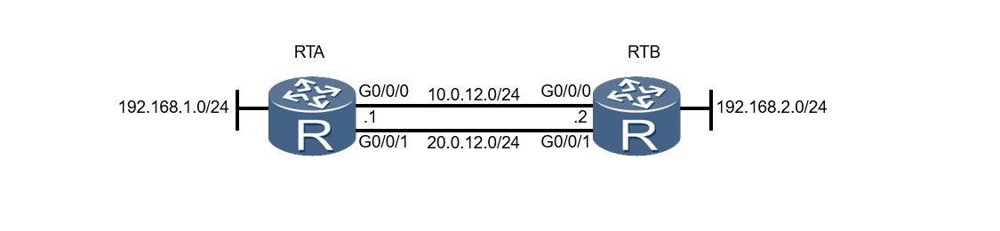

#### 路由器配置

+ 路由器RTA设置端口一的IP ``10.0.20.1`` 同理对RTB设置
+ 增加一条通过新加端口的静态路由

#### 验证

查看静态路由表，可以看到目的地址的静态路由有两个： 

### 路由备份

浮动路由在网络中主路由失效的情况时，会自动加入到路由表中并承担数据的转发的任务。

#### 物理连接

与负载分担一致。

#### 路由器配置

在对第二条线路设置静态路由表时，设置其 ``preference`` : ``ip route-static 192.168.1.0 255.255.255.0 20.0.12.1 preference 100`` 

#### 验证

此时的静态路由只有一项，即备份的路由不会显示：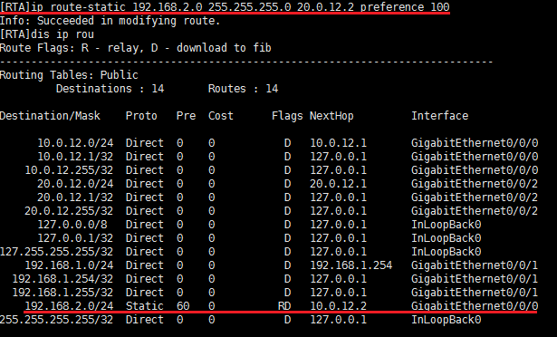

只有在主路由出现故障时才会加入到路由表中作为承担数据转发业务

### 缺省路由

在报文的目的地址与所有的路由表项不匹配时，通过缺省路由进行转发。

#### 物理连接

路由器间只有一条线路，另一个路由器RTB连接多个网络: 

#### 路由器配置

对于要设置缺省路由的路由器RTA，设置缺省路由： ``ip route-static 0.0.0.0 0.0.0.0 10.0.12.2``

#### 验证

查看路由表可以发现对于目的地址为整个网段的 ``0.0.0.0`` 的下一跳为设置的要通过的路由器地址： 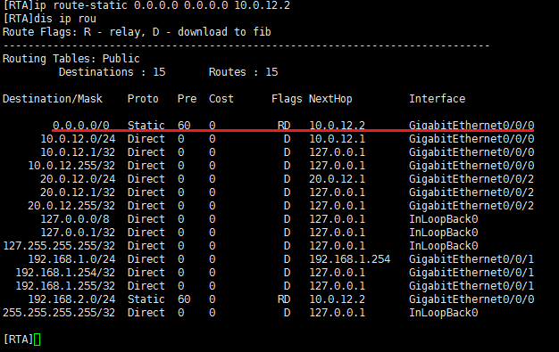


### 静态路由应用

建立一个小型的局域网，使得任意主机之间可以互通：

#### 物理连接

+ PCA连接交换机SWA的端口2
+ PCB连接交换机SWA的端口3
+ 交换机SWA端口1连接路由器RTA的端口1
+ 路由器RTA与RTB的对应端口0，2连接
+ PCC连接路由器RTB的端口1

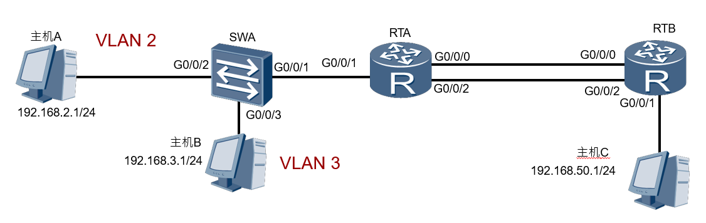

#### 配置

##### 主机

+ PCA设置其IP为 ``192.168.2.1`` ，以及网关为： ``192.168.2.254``
+ PCB设置其IP为 ``192.168.3.1`` ，以及网关为： ``192.168.3.254``
+ PCC设置其IP为 ``192.168.50.1`` ，以及网关为： ``192.168.50.254``

##### 交换机

将所连的两个主机化为两个 ``vlan``

```text
[SWA]vlan batch 2 3
[SWA-GigabitEthernet0/0/1]port link-type trunk
[SWA-GigabitEthernet0/0/1]port trunk allow-pass vlan 2 3 
[SWA-GigabitEthernet0/0/2]port link-type access
[SWA-GigabitEthernet0/0/2]port default vlan 2 
[SWA-GigabitEthernet0/0/3]port link-type access 
[SWA-GigabitEthernet0/0/3]port default vlan 3
```

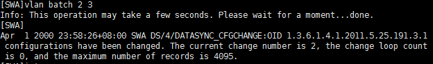


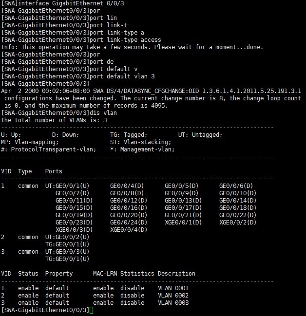

##### 路由器RTA

+ 设置一个单臂路由，使得PCA、PCB两个vlan可以互联

```text
[RTA]interface GigabitEthernet0/0/1.1
[RTA-GigabitEthernet0/0/1.1]dot1q termination vid 2
[RTA-GigabitEthernet0/0/1.1]ip address 192.168.2.254 24 
[RTA-GigabitEthernet0/0/1.1]arp broadcast enable 
[RTA]interface GigabitEthernet0/0/1.2
[RTA-GigabitEthernet0/0/1.2]dot1q termination vid 3
[RTA-GigabitEthernet0/0/1.2]ip address 192.168.3.254 24 
[RTA-GigabitEthernet0/0/1.2]arp broadcast enable
[RTA-GigabitEthernet0/0/0]ip address 192.168.10.1 24 
[RTA-GigabitEthernet0/0/0]quit
[RTA-GigabitEthernet0/0/2]ip address 192.168.20.1 24 
[RTA-GigabitEthernet0/0/0]quit
```

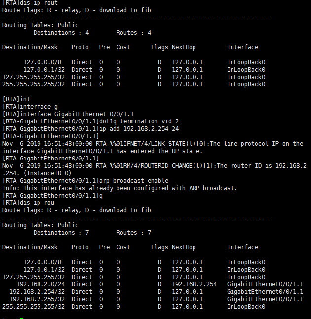

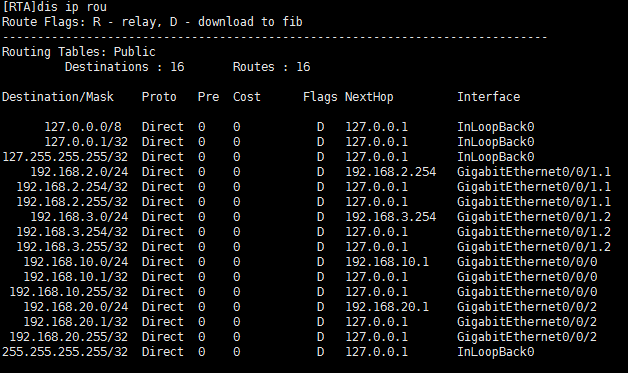


+ 设置一个与RTB的负载分担的静态路由

```text
[RTA]ip route-static 192.168.50.0 255.255.255.0 192.168.10.2 方法一
[RTA]ip route-static 192.168.50.0 255.255.255.0 192.168.20.2 方法一
[RTA]ip route-static 0.0.0.0 0 192.168.10.1 方法二
[RTA]ip route-static 0.0.0.0 0 192.168.20.1 方法二
```

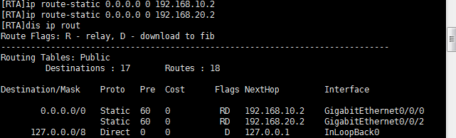

**注意** 这里RTA的两个端口的IP为 ``192.168.10.1`` 与 ``192.168.20.1`` ，对于RTB为 ``192.168.10.2`` 与 ``192.168.20.2`` 

##### 路由器RTB的配置

+ 首先指定RTB与RTA连接的两个端口的地址为 ``192.168.20.2`` 和 ``192.168.10.2`` （实验教程的PPT有误）

```text
<RTB>system-view 
[RTB]interface GigabitEthernet 0/0/0
[RTB-GigabitEthernet0/0/0]ip address 192.168.10.2 24 
[RTB-GigabitEthernet0/0/0]quit
[RTB]interface GigabitEthernet 0/0/2
[RTB-GigabitEthernet0/0/2]ip address 192.168.20.2 24 
[RTB-GigabitEthernet0/0/2]quit
```

+ 设置与RTA的静态路由，上一步如果设置错误的端口号与IP，会导致无法设置静态路由

```text
[RTB]ip route-static 192.168.2.0 24 192.168.10.1
[RTB]ip route-static 192.168.3.0 24 192.168.10.1
[RTB]ip route-static 192.168.2.0 24 192.168.20.1
[RTB]ip route-static 192.168.3.0 24 192.168.20.1
```

+ 设置与主机PCC相连的端口的IP

```text
[RTB]int GigabitEthernet 0/0/1 
[RTB-GigabitEthernet0/0/1]ip address 192.168.50.1 24
[RTB-GigabitEthernet0/0/1]quit
```

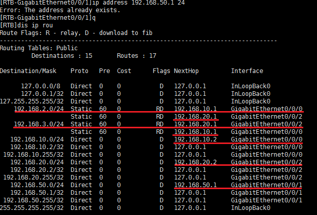

#### 验证

+ 从路由器B可以ping通PCA

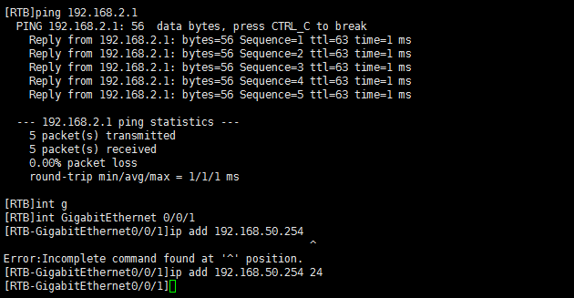

+ 从PCC可以ping通PCA、PCB
  
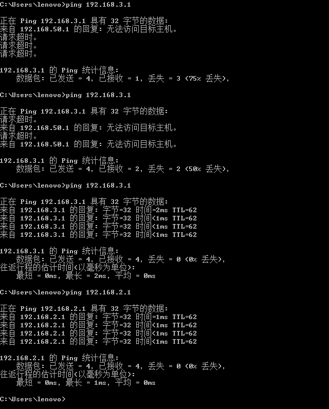

出现一定几率丢包现象是前期的端口IP为设置正确与路由表信息有误导致

# 实验总结

+ 实验的主要目的是了解静态路由表的建立过程，在此基础上实现负载分担、路由备份、缺省路由以及结合之前所学的一个小型局域网的配置；
+ 静态路由表的主要内容是每一条表项的 **目的地址** 以及 **下一跳地址** ；
+ 负载分担的主要内容是路由器间的多条线路间的路由信息的建立，以达到同一目的地址的数据报可以通过多条线路转发，减轻线路的负载；
+ 路由备份的主要内容是增加一条备用的路由线路，以备在主线路故障时能自动的上线承担数据的转发业务；
+ 缺省路由的主要内容是对于处理一些指定的网络的转发方式外的其他的所有为指定的目的网路确定一个转发的下一跳，实现局域网与广域网的连接；
+ 最后的静态路由局域网结合前面课程的单臂路由、静态路由、负载均衡等知识组建了一个小型局域网；

# 心得体会

这次实验受益匪浅，首先在接触静态路由的理论知识后，虽然对静态路由的实现有一定的印象，但是没有实践的基础，仅仅了解静态路由表的组成，在这次试验课后，清楚的理解了静态路由的实现方式以及对于具体网络、具体设备的静态路由的配置也有了一定的理解，同时也复习了上一节课的单臂路由等实验知识，更加的熟练相关的配置方法；对于实验中的操作，收获最大的是：动手前一定要在纸上画出要操作的内容，想清楚每一个环节需要配置的东西，同时与队友讨论，双方一致同意之后再进行动手操作，同时，最重要的是要自己动脑，根据问题运用所学的理论知识，大胆的确定所要操作的内容，不要一味参考实验的指导内容，要相信自己所掌握的知识以及自己的推理判断，即使出现错，也要冷静分析，通过一切排错的手段，不断缩小错误出现的范围，锁定出现错误的位置，然后反思自己先前的逻辑的漏洞，切记不要局限与书本以及参考资料。