<center><font size=14>实验二-VLAN间的路由技术</center></font>


# 实验目的

部署了VLAN的传统交换机的网络不能实现不同VLAN之间的二层报文的转换，所以必须利用路由技术来实现不同VALN间的通信。实现的方法为 **二层交换机与路由器的配合（单臂路由）** 来实现或者 **使用三层交换机** 来实现。

# 实验过程

## 实验需求

VLAN在分割广播域的同时限制了不同VLAN间的设备的二层通信：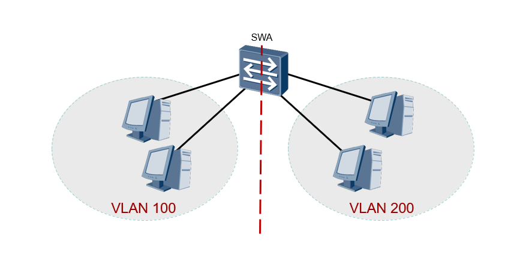但是在某些场景中又要求不同VLAN间可以进行相互通信，故本次实验要求使用两种方法（ **单臂路由法** 和 **三层交换法** ）使得处于两个不同VLAN的设备可以互联访问。


## 实验步骤

### 单臂路由法

#### 物理连接

对交换机的每一个VLAN使用一条网线连接路由器：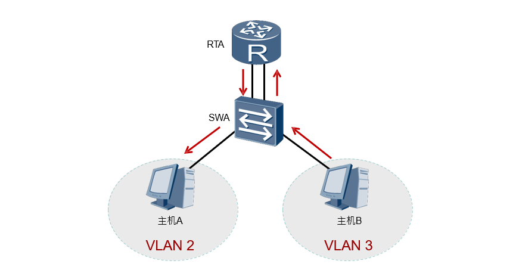

#### 链路层链接

将交换机RTA与路由器SWA间的链路配置为Trunk链路，并在路由器中创建支持VLAN路由的子接口，使得物理上的连线抽象成逻辑上的一条线路：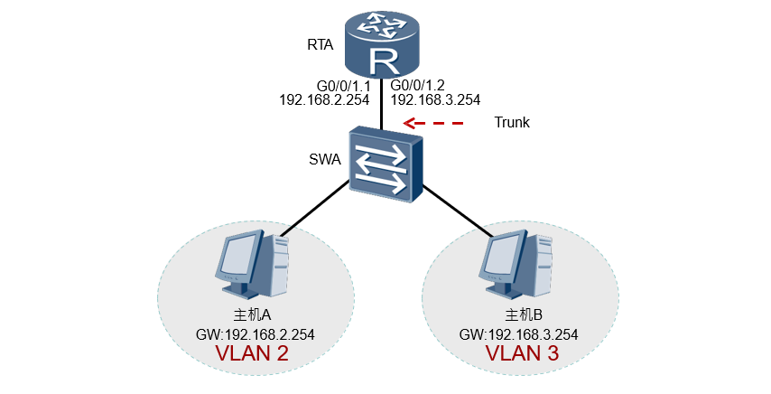

#### 链路层配置

计算机console连接交换机，进入其对应的配置系统： 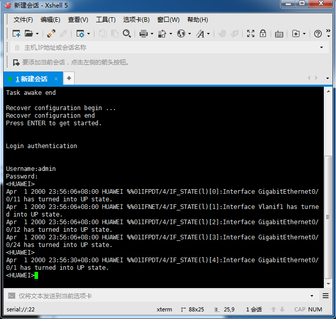 （进入路由器同理）

##### 交换机

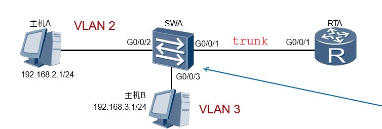

+ 进入与路由器链接的端口
+ 创建vlan 2 3
+ 配置trunk
+ 分别进入各vlan的主机端口，划分其vlan，设置连接类型为 access


```swift
[SWA]vlan batch 2 3
[SWA-GigabitEthernet0/0/1]port link-type trunk
[SWA-GigabitEthernet0/0/1]port trunk allow-pass vlan 2 3 
[SWA-GigabitEthernet0/0/2]port link-type access
[SWA-GigabitEthernet0/0/2]port default vlan 2 
[SWA-GigabitEthernet0/0/3]port link-type access 
[SWA-GigabitEthernet0/0/3]port default vlan 3
```

部分截图：

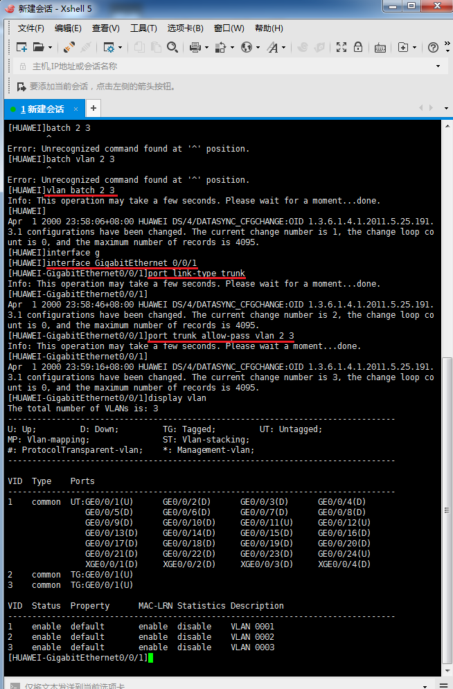
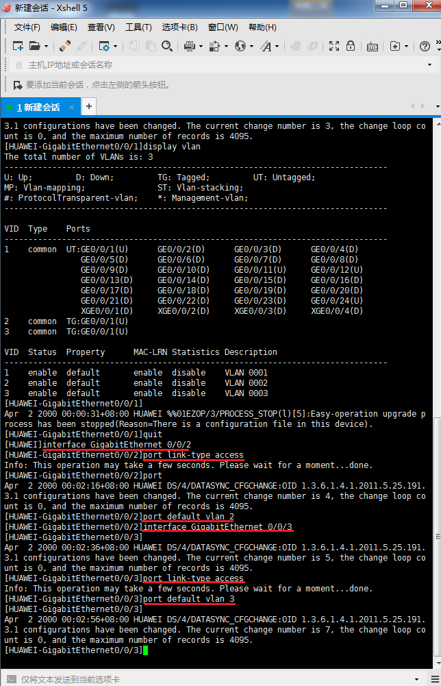

##### 路由器

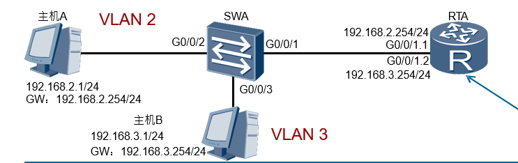

创建子接口：

+ 进入一个端口
+ 对其所在的vlan封装802.1q协议，为转发报文做准备
+ 指定其IP地址（要和对应vlan的IP段一致）
+ 开启ARP广播
+ 对其他的vlan进行相应的配置

```swift
[RTA]interface GigabitEthernet0/0/1.1
[RTA-GigabitEthernet0/0/1.1]dot1q termination vid 2
[RTA-GigabitEthernet0/0/1.1]ip address 192.168.2.254 24 
[RTA-GigabitEthernet0/0/1.1]arp broadcast enable 
[RTA]interface GigabitEthernet0/0/1.2
[RTA-GigabitEthernet0/0/1.2]dot1q termination vid 3
[RTA-GigabitEthernet0/0/1.2]ip address 192.168.3.254 24 
[RTA-GigabitEthernet0/0/1.2]arp broadcast enable
```

部分操作截图：

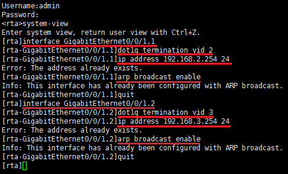

##### 配置验证测试

192.168.3.1 设备对其他设备的ping测试，可以ping通表示两者互联成功。

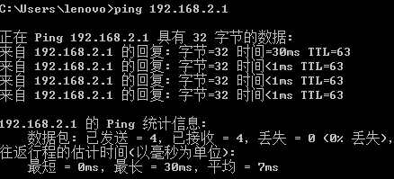

### 三层交换法

通过两台交换机的某一端口间的配置来实现两台交换机下不同vlan间设备的互联互通。

#### 物理连接

各交换机进行vlan的划分配置，其中两者之间存在一个相同的valn，一些不同的vlan，相同的vlan可以相互访问，但不同的vlan只能和本vlan中的设备进行相互访问，同时将两台交换机连接起来：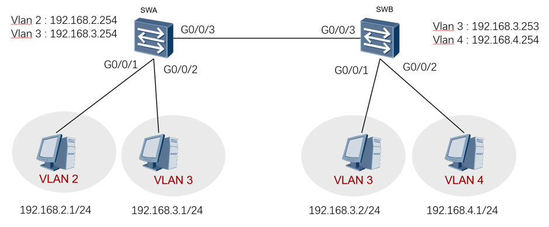

#### 链路配置

##### vlan配置

首先对各交换机下的设备进行vlan的划分，在这个实验中，两台交换机都要又vlan3

```swift
[SWA]vlan batch 2 3
[SWA-GigabitEthernet0/0/1]port link-type access [SWA-GigabitEthernet0/0/1]port default vlan 2 
[SWA-GigabitEthernet0/0/2]port link-type access [SWA-GigabitEthernet0/0/2]port default vlan 3
```

部分截图：


##### vlanif配置

对每一台交换机的每一个vlan进行vlanif的配置，同时要设置网关：

```swift
[SWA]interface vlanif 2
[SWA-Vlanif2]ip address 192.168.2.254 24 
[SWA-Vlanif2]quit
[SWA]interface vlanif 3
[SWA-Vlanif3]ip address 192.168.3.254 24 [SWA-Vlanif3]quit

[SWB]interface vlanif 3
[SWB-Vlanif3]ip address 192.168.3.253 24 
[SWB-Vlanif3]quit
[SWB]interface vlanif 4
[SWB-Vlanif4]ip address 192.168.4.254 24 
[SWB-Vlanif4]quit
```

交换机A的配置：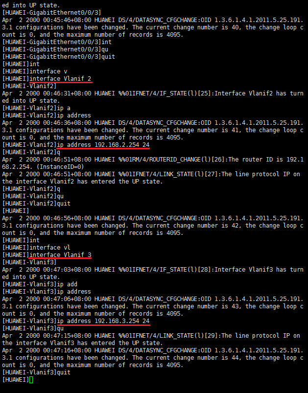

交换机B的配置： 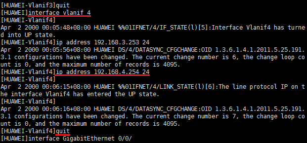

##### 建立路由

对两台交换机的连接的端口设置为 ``access`` 类型，同时划分vlan为两个网络中相同的vlan中（vlan3），然后设置路由转换：

```swift
在交换机A中：
[SWA-GigabitEthernet0/0/3]port link-type access 
[SWA-GigabitEthernet0/0/3]port default vlan 3
[SWA]ip route-static 192.168.4.0 24 192.168.3.253

在交换机B中：
[SWB-GigabitEthernet0/0/3]port link-type access 
[SWB-GigabitEthernet0/0/3]port default vlan 3
[SWB]ip route-static 192.168.2.0 24 192.168.3.254
```

SWB：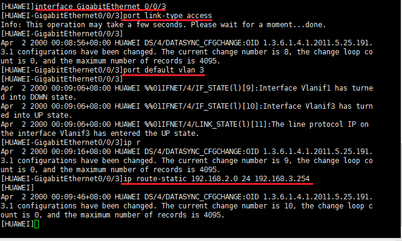
对SWA进行类似操作。

##### 配置验证测试

SWA中vlan3的设备向同交换机下的vlan2的设备、不同交换机下的vlan4（不同vlan）的设备进行ping测试，都可以ping通，表示三层路由交换配置成功，同理SWB中的设备向其他设备也可以正常ping通： 

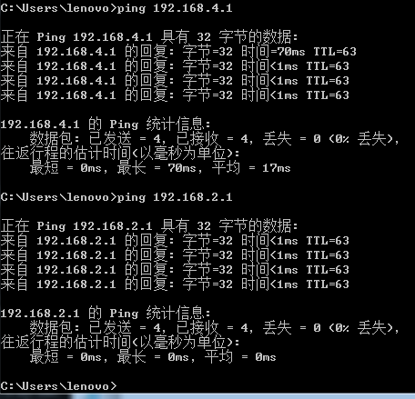


# 实验总结

+ 局域网下的不同设备可以在交换机中使用vlan来分隔出不同的网络，使得不在同一vlan下的设备不可以相互访问，但是如果要实现之间的互联，就要使用vlan路由技术。vlan路由技术有两种： **单臂路由法** 和 **三层交换法** ，前者借用一台路由器来实现两个vlan中设备的报文的交换，以达到相互访问的目的；后者通过多个交换机之间的连接，创建 **vlanif** 来使得不同vlan下的设备的报文通过vlanif来交换，也达到目的；两者相比，各有优劣，前者使用路由器，配置简单方便，后者配置过程略复杂但是经济使用，更有效率，将路由器宝贵的端口节省下来，同时交换机间的传输效率优于路由器与交换机间的效率。
+ 配置命令 ``dot1q termination vid <vlan-id>`` 的目的是什么? : dot1q 指的是802.1q协议，配置子接口是为了节省端口；这句命令的作用是： 在该子接口接收到带有 ``vlan-id`` 的报文时剥离tag并进行三层转发；在发送时，会添加对应的 ``vlan-id`` 到报文中。[^1]
+ 配置单臂路由时，要将网线接入到路由器的右侧的1号端口（路由器左面的上下排端口是从3号开始），同时路由器要对两个端口进行 dot1q 的配置、IP的配置以及其中arp广播
+ arp广播的原因： 广播是因为路由器的接口隔离广播域，每一个接口就是一个广播域，而ARP报文只能在同一个     广播域泛洪，所以要开启ARP广播。[^2]
+ 在配置完单臂路由后进行三层交换的实现时，因为某些端口已经更改了配置信息，所以要清空这些端口的配置信息，激活端口后再进行三层交换的实验配置，清空端口的配置： ``clear configuration this`` ， 激活端口： ``undo shutdown`` 。


[^1]: dot1q_termination_vid_<vlan-id>的具体意义，https://zhidao.baidu.com/question/1818254079042244388.html
[^2]: 开启arp广播的原因，http://blog.sina.com.cn/s/blog_eb8b39050102wiiy.html

# 心得体会

这一次实验我除了较为熟练的掌握了vlan路由的两种实现方法，同时还极大的锻炼的我的动手能力和学习新知识与原有只是结合的能力。从老师开始上课抛出一个现实问题的场景时，我便开始思考该如何解决不同vlan下的设备的互联，根据经验当然是首先想到使用路由器，但是因为生活中的问题解决方法与生产中的解决方法是不一样的，所以我实际上也是不知道该如何利用路由器来具体的一步一步的实现。同时，三层交换的解决方法使我印象最深的一种方法。每一次的实验开始前，我和同小组成员首先进行的是具体的网络拓扑图的实现，如果不首先画出网络拓扑图直接上手，就会发现有很多的细节问题在没有碰到时是不会想到的，按照缜密的逻辑规划出的实验步骤才能保证动手实验时不会出现差错，当然出现差错也不是不好的事情，从头梳理后发现错误解决错误也是一种学习，也会在之后再次碰到时不会犯错。此外，本着真正的学回具体的操作，在一些实验过程中，每台设备的IP、连接的端口、划分的vlan编号等等都尽可能不和实验指导一致，以为的照搬实验指导的步骤只是不断地复制粘贴命令，而不清楚命令的具体的作用、每一步的目的，毕竟在现实中碰到类似问题是一定是与实验指导不一致的。计算机网络的实验不仅是理论的学习，同时弄明白各个设备，因为有时出现的问题不一定就只是知识性的错误，可能是现实设备的连接等等上的问题。此外，实验报告书的书写一定程度上也是一种学习，实验课上不断的接收新知识，进行各种操作，实验的确成功了，但是有一些与实验无关的理论知识因为在具体的操作中不会使用，所以可能会在实验课上忽略，而完成实验报告的过程中就是一次温习，就像 ``dot1q temination vid <vlan-id>`` 这样的命令当时在实验课上敲在终端中，运行也没有问题，也达到了自己想要的效果，然后就在结束后忽略了它，直到在书写实验报告再一次复习实验指导时才记住了它，同时查阅资料了解了它更多的信息，实验报告不仅仅是一次实验的简单记录，更是一次查漏补缺再次学习的过程。