<center><font size=14>实验五、访问控制列表-NAT应用</font></center>


# 实验目的

企业网络中的设备进行通信时，有时需要保障数据传输的安全可靠和网络的性能稳定，所以需要有针对性的对设备进行一定规则的控制数据流量；

访问控制列表ACL(Access Control List)可以定义一系列不同的规则，设备根据这些规则对数据报进行分类，并针对不同类型的报文进行不同的处理，从而实现对网络访问行为的控制、限制流量、提高网络性能、防止网络攻击等等。

本实验要掌握ACL在企业网络中的应用、其工作原理以及其配置方法。

随着网络的发展，ipv4地址已经耗尽，尽管ipv6可以解决问题，但是当下过渡时期，许多的应用设备还在使用ipv4，所以要使用一种技术来节省地址；网络地址转化技术NAT(Network Address Translation)是一种用于实现位于内部网络的主机访问外部网络的技术；当局域网内的主机需要访问外部网络时，通过NAT技术可以将其私网地址转化为公网地址，并且多个私网用户可以公用地址，这样可以保证网络的畅通的同时节省公网地址；

本实验要掌握NAT的工作原理以及基本的配置。

# 实验过程

## 实验需求

+ 完成ACL在企业网络中的应用、其工作原理以及基本的配置方法；
+ 完成NAT技术的基本工作原理及其配置方法；

## 实验步骤

### 访问控制列表ACL

#### ACL的基本作用

ACL可以通过定义规则来控制流量的是否可以通过本路由器：

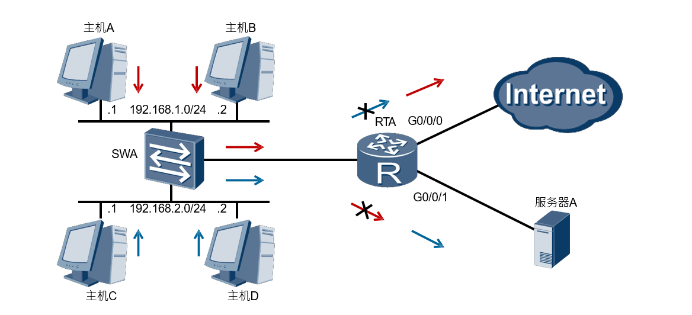

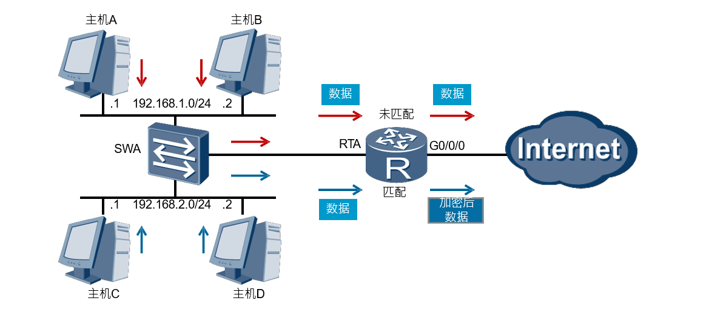

ACL共分为三类，每一类由ACL的编号来确定，每一类的ACL的作用范围不同：

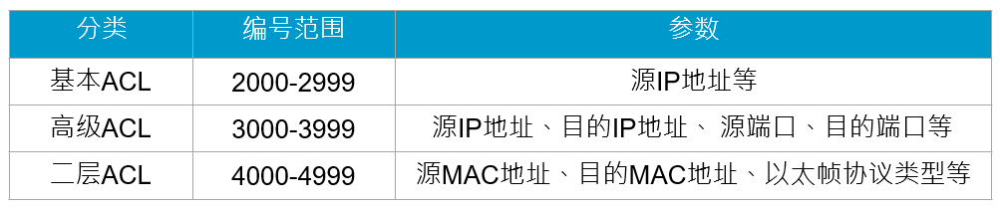

每一个ACL可以包含多条规则，路由器根据具体的规则对数据流量进行过滤；

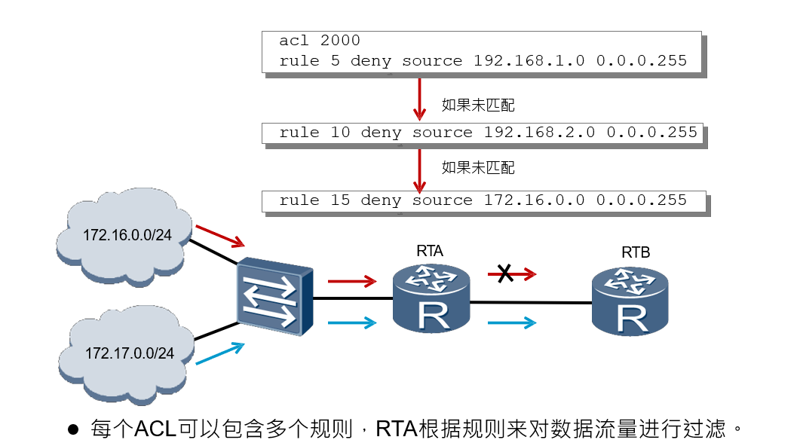

#### 基本ACL配置

##### 网络的连接

首先进行如下网络拓扑图的连接，并进行相应端口IP的设置：

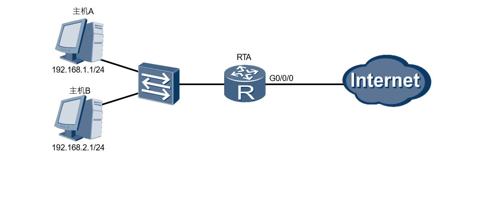

##### ACL的配置

对于RTA路由器的0端口的出去的流量进行设置ACL规则，实现对于 ``192.168.1.0/24`` 网络的流量不能转发到 internet 

设置的命令如下：

```js
[RTA]acl 2000
[RTA-acl-basic-2000]rule deny source 192.168.1.0 0.0.0.255
[RTA]interface GigabitEthernet 0/0/0
[RTA-GigabitEthernet 0/0/0]traffic-filter outbound acl 2000
```

之后进行查看acl的配置以验证配置是否成功：

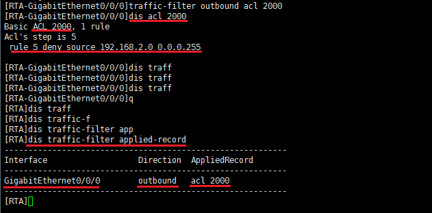

#### 高级ACL配置

与基本acl配置的不同，高级ACL的规则配置上增加了对应用层具体的流量的约束，使得对网络中的设备的管理更加的细化；

##### 网络的连接

首先进行如下的网络拓扑图的连接，并进行相应端口IP的配置：

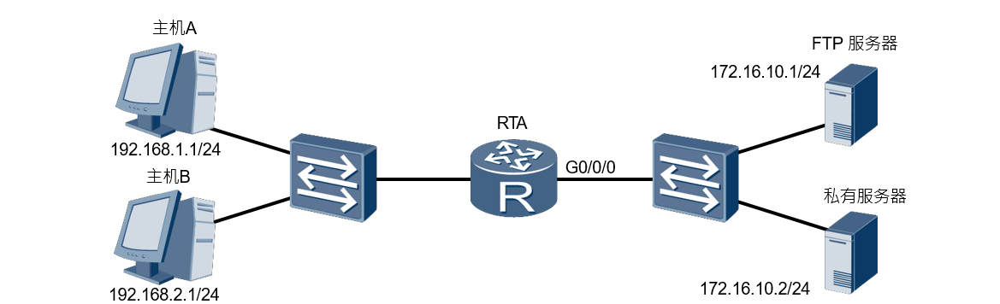

##### ACL的配置

对路由器RTA添加高级ACL，并设置一些规则：

要求 ``192.168.1.0/24`` 网络的tcp数据报，目的地址为ftp服务器的端口的流量禁止转发，也就是该网络不能使用ftp服务访问ftp服务器上的资源，同时对于另一个网络的主机不能访问私有服务器；

设置的命令如下：

```js

[RTA]acl 3000
[RTA-acl-adv-3000]rule deny tcp source 192.168.1.0 0.0.0.255
destination 172.16.10.1 0.0.0.0 destination-port eq 21
[RTA-acl-adv-3000]rule deny tcp source 192.168.2.0 0.0.0.255 
destination 172.16.10.2 0.0.0.0
[RTA-acl-adv-3000]rule permit ip
[RTA-GigabitEthernet 0/0/0]traffic-filter outbound acl 3000
```

之后查看ACL配置信息以验证是否配置成功：

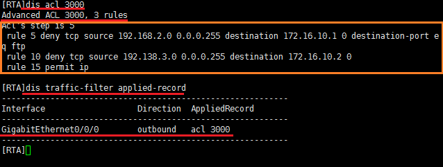

#### ACL应用-NAT

通过设定ACL规则可以实现内网地址向公网地址池的映射，也即是一个NAT的转化。

##### 网络的连接

进行如下的网络拓扑图的连接，并设定指定端口的IP：

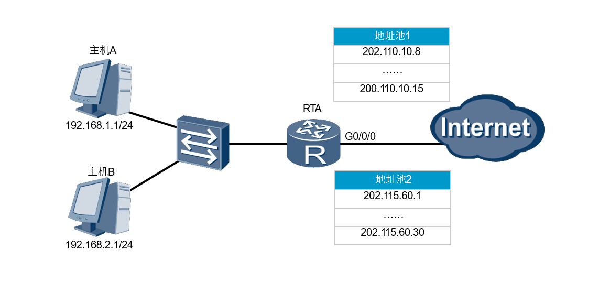


##### ACL下的NAT的配置

首先建立来个NAT地址池，然后建立两个ACL，并指定所要处理的内网地址，最后指定每一个nat的出口流量应用对应的ACL和地址池即可，相关命令如下：

```js

[RTA]nat address-group 1 202.110.10.8 202.110.10.15 
[RTA]nat address-group 2 202.115.60.1 202.115.60.30 

[RTA]acl 2000
[RTA-acl-basic-2000]rule permit source 192.168.1.0 0.0.0.255

[RTA-acl-basic-2000]acl 2001
[RTA-acl-basic-2001]rule permit source 192.168.2.0 0.0.0.255 

[RTA-acl-basic-2001]interface GigabitEthernet0/0/0
[RTA-GigabitEthernet0/0/0]nat outbound 2000 address-group 1
[RTA-GigabitEthernet0/0/0]nat outbound 2001 address-group 2
```

通过查看路由器的配置信息即可看到最后的配置情况：

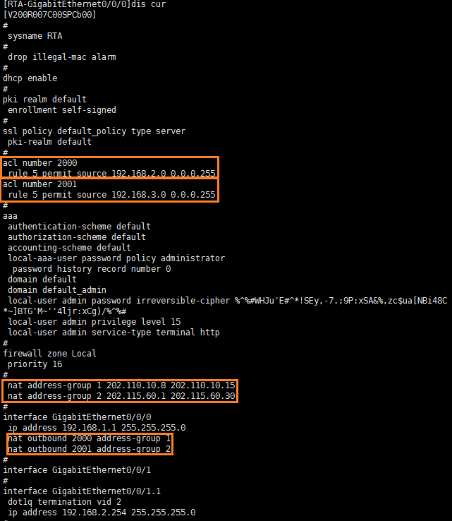

### 网络地址转换NAT

#### NAT的基本作用以及应用场景

+ NAT的主要应用场景为一个组织内部的私有网络，运营商维护的是一个公有地址，私有地址不能在公网中路由，但是可以通过NAT来通过公网地址来与外界通信；NAT一般部署在链接内网和外网的网关设备上：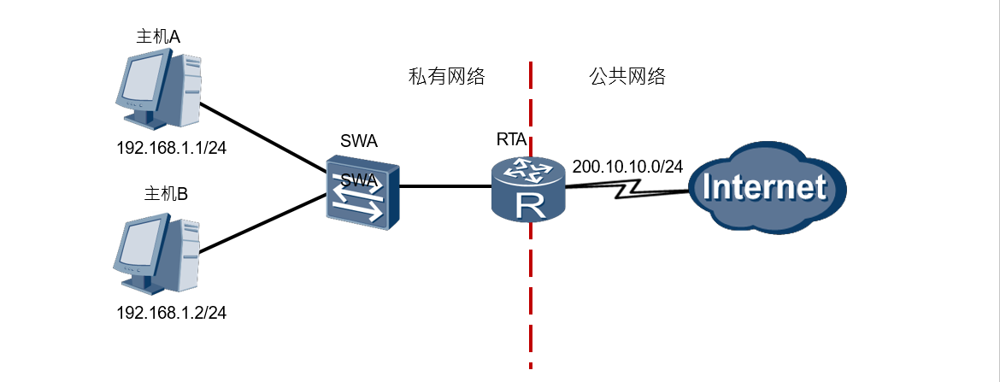
+ 静态NAT是指私有地址与公网地址的一个一对一的映射，对于一个公网地址，它会被唯一分配给一个固定的内网设备上： 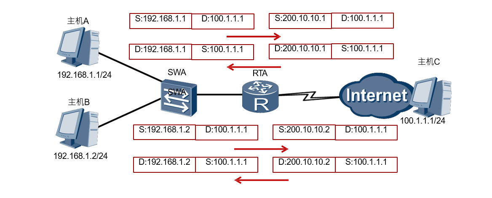
+ 动态NAT通过地址池实现私有地址与公有地址的一个转换： 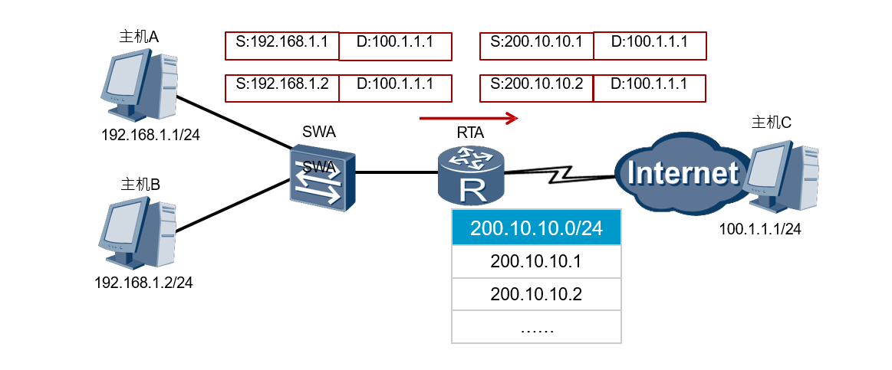
+ NAPT:网络地址端口转换允许 **多个内部地址** 映射到 **同一个公有地址的不同端口** ：
+ Easy IP 将允许多个内部地址映射到网关出接口地址上的不同端口： 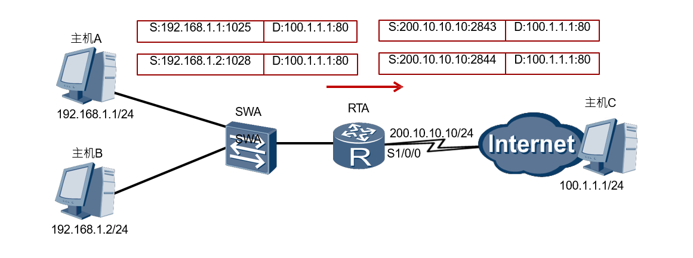
+ NAT服务器：使外网用户访问内网服务器: 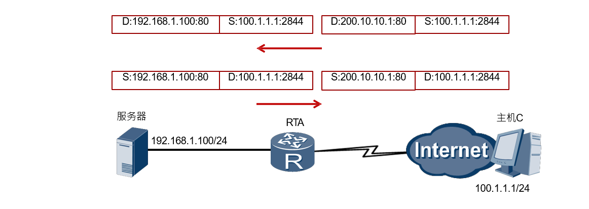

#### 静态NAT配置

##### 网络的连接

首先按照如下的网络拓扑图进行连接，并配置个端口、设备的IP：

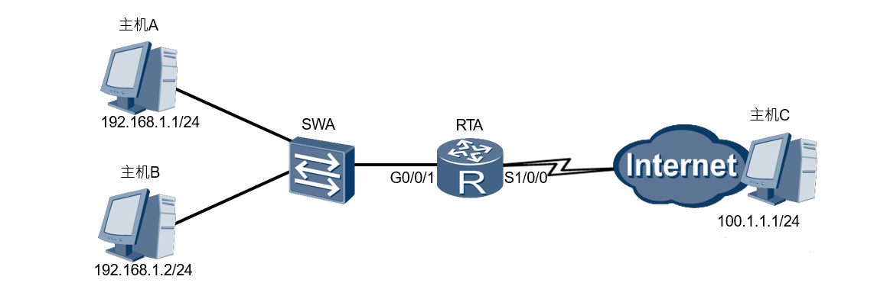

##### 静态NAT的配置

对于网络的出端口（与外网连接的端口）添加静态NAT，将每一个台内网的设备设置一个转换后的公网地址：

```js
[RTA-GigabitEthernet1/0/0]nat static global 202.10.10.1 inside 192.168.1.1 
[RTA-GigabitEthernet1/0/0]nat static global 202.10.10.2 inside 192.168.1.2
```

之后查看NAT静态配置即可：


#### 动态NAT配置

##### 网络的连接

首先按照如下的网络拓扑图进行连接，并配置个端口、设备的IP：

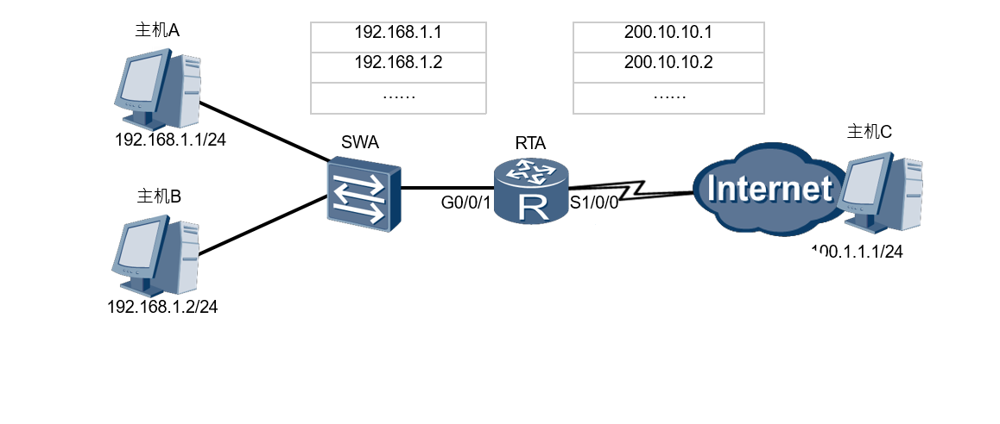

##### 动态NAT的配置

基本的配置方法为：为nat添加一个地址池，使用acl建立一个控制规则，然后将出端口应用该acl规则，以达到动态nat转换的目的：

```js
[RTA]nat address-group 1 200.10.10.1 200.10.10.200 
[RTA]acl 2000
[RTA-acl-basic-2000]rule 5 permit source 192.168.1.0 0.0.0.255
[RTA-acl-basic-2000]quit
[RTA]interface GigabitEthernet1/0/0
[RTA-GigabitEthernet1/0/0]nat outbound 2000 address-group 1 no-pat
```

之后查看该nat下的配置信息为：

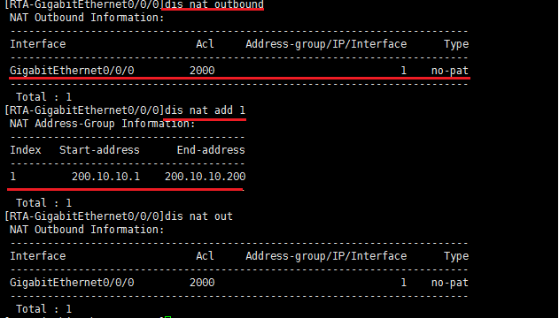

#### Easy IP配置

##### 网络的连接

首先按照如下的网络拓扑图进行连接，并配置各端口、设备的IP：

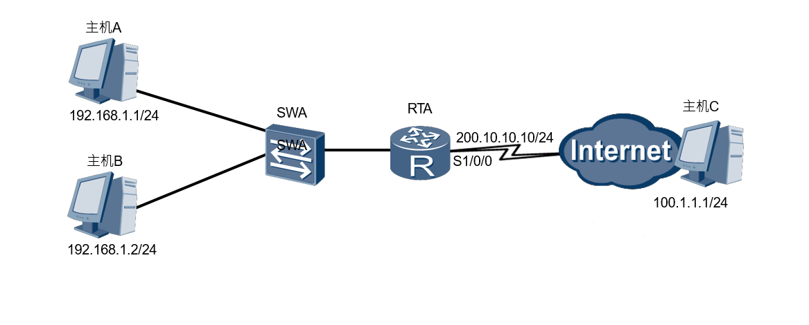

##### Easy IP 的配置

仅使用acl添加一项规则并在出端口启动nat即可：

```js
[RTA]acl 2000
[RTA-acl-basic-2000]rule 5 permit source 192.168.1.0 0.0.0.255 
[RTA-acl-basic-2000]quit
[RTA]interface GigabitEthernet1/0/0
[RTA-GigabitEthernet1/0/0]nat outbound 2000
```

查看nat出端口信息如下：

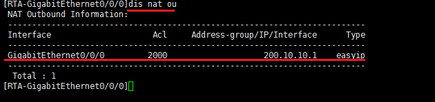

#### NAT服务器配置

##### 网络的连接

按照如下的网络拓扑图进行连接，并配置指定地址的的IP：

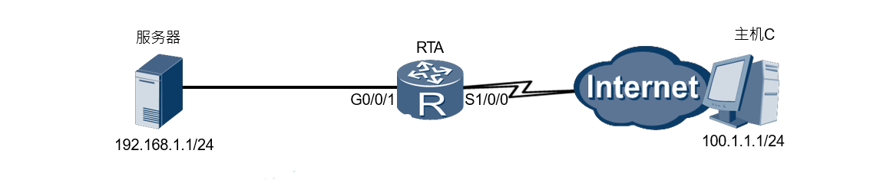

##### NAT服务器的配置

服务器的建立仅需在出端口配置如下命令即可：

```js
nat server protocol tcp global 202.10.10.1 www inside 192.168.1.1 8080
```

查看nat服务器即可看到详细的配置信息：

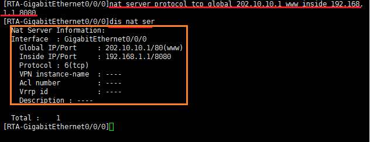

# 心得体会

在网络建立后，安全往往是之后要考虑的问题，一个网络往往要考虑其内部的一些设备可以访问的网络，并加以限制，于是ACL网络访问控制列表变成了一项重要的技术，此外，随着ipv4的耗尽，即使在过渡时期，仍然存在的大量的ipv4地址，一个组织往往公有地址很少，但是用的设备又很多，所以要使用NAT技术来实现一个私有网络中的地址向公网地址的转换的技术，同时内部的设备也一定程度上隐藏了自身的IP，会使得局域网更加易于管理，更加的安全；这两个技术并不难，作为一个工具，关键是理解其不同的技术所对应的问题模型，根据问题来选择所要使用的方法，在充分理解每一个技术后便可以轻松的完成需求；