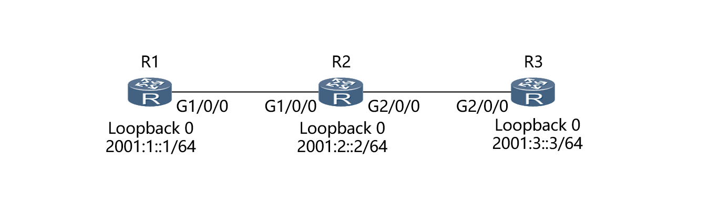
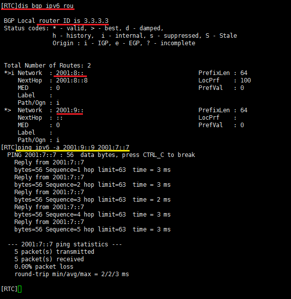
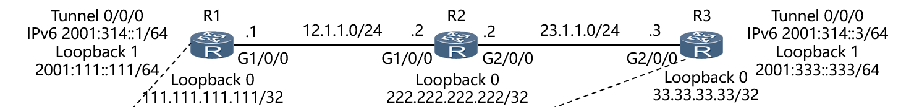
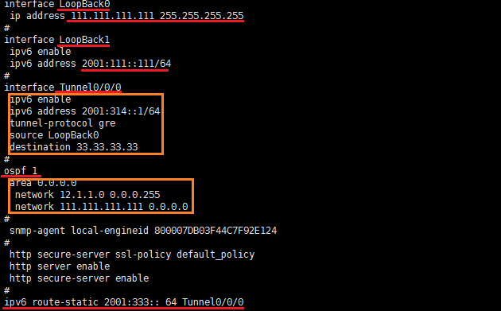
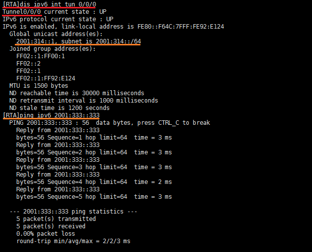
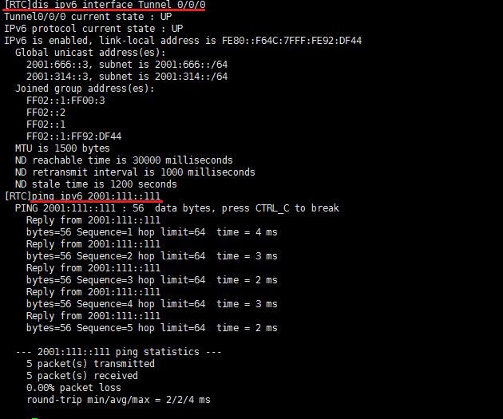

<center><font size=15>实验六、ipv6</font></center>

# 实验目的

在一个ipv6的网络下，配置ospfv3、BGP4+、手工隧道以及GRE隧道。BGP4+实现两个自治区域的互联互通，手工隧道和GRE隧道实现在现如今ipv4耗尽向ipv6过渡时期路由器通过ipv4数据报来实现ipv6数据报的转发功能；

+ BGP4+是对BGP（边界网关协议）对IPv6单播网络的扩展，用于控制IPv6单播网络中路由的传播和选择，当IPv6单播网络中不同的自制系统AS需要通讯时，就可以应用 BGP4+ 为IPv6 的单播网络传输跨AS的路由信息；
+ 手工隧道和GRE实现两个IPv6网络通过穿越IPv4网络实现互联互通；

# 实验过程

## 实验需求

在配置基础的OSPFv3等划分区域工作后，实现配置BGP4+、手工隧道以及GRE隧道等任务，并验证配置；

## 实验步骤

### BGP4+的配置及验证

#### 基础链路层的配置及实验任务

按如下的网络拓扑图进行连接，并配置各端口的IP地址，其中任意两个路由器间的网络为： ``2001:AB::X`` ，此外，R1和R2之间使用端口0，R2和R3之间使用端口1，回环地址为 ``2001:{7,8,9}::{7,8,9}`` ：



之后配置OSPF，使得R2与R3的互联接口，以及各自的环回接口，部署在OSPFv3区域0；同时R1属于AS100，R2和R3属于AS200；

实验的任务是：

+ R2与R3建立稳定的IBGP邻居关系，R1与R2使用物理接口建立EBGP邻居关系；
+ R1、R2和R3将各自的环回口地址宣告进BGP；
+ BGP会话采用MD5验证，密码为Huawei。

使得最后R3的Loopback0可以ping到R1的Loopback0，同理其他的端口也可以ping通，也就是说R1可以通过BGP4+来和不在同一个自治区域的R2、R3通信，也就可以交换各自的路由信息；

#### 具体配置及验证过程

+ 对R3进行bgp配置：

配置bgp，设置路由编号、将R2的回环地址宣告进bgp、设置地址簇

```js
bgp 200
 router-id 3.3.3.3
 peer 2001:8::8 as-number 200 
 peer 2001:8::8 password simple Huawei    
 #
 ipv4-family unicast
  undo synchronization
 #
 ipv6-family unicast
  undo synchronization
  network 2001:9:: 64 
  peer 2001:8::8 enable
```

+ 对R2进行bgp配置：

和R3类似，将R3的回环地址宣告进bgp，同时还有R1的bgp以及对应的端口的地址：

```js
bgp 200
 router-id 2.2.2.2
 peer 2001:9::9 as-number 200 
 peer 2001:9::9 connect-interface LoopBack0
 peer 2001:9::9 password simple Huawei    
 peer 2001:12::1 as-number 100 
 peer 2001:12::1 password simple Huawei 
 #
 ipv4-family unicast
  undo synchronization
 #
 ipv6-family unicast
  undo synchronization
  network 2001:8:: 64 
  peer 2001:9::9 enable
  peer 2001:9::9 next-hop-local 
  peer 2001:12::1 enable
```

+ 对R1进行类似的配置，注意是 ``bgp 100``

配置完成后验证时，查看RTC的 bgp路由表的具体信息，以及从RTC的回环pingRTA的回环，可以发现可以ping通，说明bgp建立成功，实现两个区域的通信：




### 手工隧道的配置及验证

#### 基础链路层的配置及实验任务

按照如下的网络拓扑图进行连接、配置各端口的IP地址，两个路由器间的线路的网络是 ``AB.1.1.0/24`` ，其中R1和R2之间连接的端口是端口0，R2和R3之间是端口3：

（注意PPT上的某些标识有误）

之后配置OSPFv2，将这个三个路由器的所有ipv4地址的网络放入到一个ospfv2的区域0中；

#### 具体配置及验证过程

配置手动隧道的主要步骤是配置 Tunnel和Loopback1的地址以及启动隧道、配置静态路由表项：

+ 对R1做如下的配置：

```js
interface Tunnel0/0/0           // 配置R1的一个隧道
 ipv6 enable 
 ipv6 address 2001:314::1/64    
 tunnel-protocol ipv6-ipv4      //转换的模式是ipv6到ipv4
 source LoopBack0               //指定tunnel的源端口是loopback0
 destination 33.33.33.33            //转发的目的是另一端的路由器R3，R3将数据报再发送到其对应的隧道中，转到隧道的终点loopback1
#                                         
ospf 1                          //配置这个路由器的ospf
 area 0.0.0.0 
  network 111.111.111.111 0.0.0.0 
  network 12.1.1.0 0.0.0.255 
#                               //添加一项路由表项，所有目的地址是对面的loopback1网络的数据报都将ipv6的数据报转化为ipv4通过tunnel转发，实现手动隧道的功能
ipv6 route-static 2001:333:: 64 Tunnel0/0/0
```

最后RTA的配置信息如下： 

+ 同理对R3做类似的配置：

```js
interface Tunnel0/0/0
 ipv6 enable 
 ipv6 address 2001:314::3/64 
 tunnel-protocol ipv6-ipv4
 source LoopBack0
 destination 111.111.111.111
#                                         
ospf 1 
 area 0.0.0.0 
  network 33.33.33.33 0.0.0.0 
  network 23.1.1.0 0.0.0.255 
#
ipv6 route-static 2001:111:: 64 Tunnel0/0/0
```

+ 对于R2，仅需配置对应的端口地址，以及将其加入到ospf的区域0即可；

+ 配置完成后的验证可以通过隧道两端的隧道信息以及通过ping的方式来查看隧道是否建立：


### GRE隧道的配置及验证

#### 基础链路层的配置及实验任务

按照如下的网络拓扑图进行连接、配置个端口的IP地址，（按照手动隧道的配置即可）

#### 具体配置及验证过程

gre隧道的配置与手动隧道的配置基本类似，仅需在配置隧道的模式将 `` tunnel-protocol`` 的参数改为 ``gre`` 即可，其余设置按照手动隧道的过程配置即可，验证的结果类似，任意一端的ping另一端可以ping到即表明隧道建立成功：


# 心得体会

ipv4已经全部耗尽，现在已经进入 ipv4向ipv6过渡的时间，虽然ipv4还会使用，但是今后的网络中出现的配置更多的将是ipv6技术，而ipv4与ipv6的结合的任务会逐渐增多，同时为了兼容ipv4，于是有隧道技术的产生，使用ipv4数据报也可以用来ipv6设备间的通信，此外，多个自治区域间的通信也是bgp的使用的原因，例如不同运营商间的网络的互通便要使用bgp来交换路由信息、选择数据报的最优道路等等。这次实验虽然东西不多，东西也很简单，但是，在做实验的过程中，也出现了很多的之前不注意的问题，比如说ipv6在路由器中使用必须要用命令启用，否则即使配置了地址，但是端口不会转发ipv6的数据，除此之外，这次的实验主要是OSPF的一些功能上的提升，所以要对之前的OSPF要熟悉，这样才能很快的玩成每个实验前的配置工作，实验的每个内容仅仅是这项技术的一个简单的应用，实际的生产中是很复杂的，一个网络也结合了很多的知识来实现具体的需求，查阅了很多的网络资料，了解到了实验中不会使用的内容，以及这些技术的优缺点，总之，实验不仅仅是动手完成，更重要是每一次实验前的不断的思考，这样才能充分的理解实验的每一项内容。