<!--
 * @Author: 31415926535x
 * @Date: 2019-11-09 22:09:57
 * @LastEditTime: 2019-12-04 22:39:55
 * @https://www.cnblogs.com/31415926535x/
 -->
<center><font size=14>实验四、动态路由协议</font></center>


# 实验目的

通过配置一个局域网的 **距离矢量路由协议RIP** 与 **链路状态路由协议OSPF**　来实现一个网络的动态路由协议，并同时对一个IPV6网络做同样的配置。

路由信息RIP（Routing Information Protocol）的简称，是一种基于距离矢量（Distance-Vecto）算法的协议，使用跳数作为度量来度量到达目的网络的距离，RIP主要应用于规模较小的网络；

开放式最短路优先OSPF（Open Shortest Path First）协议式IETF定义的一种基于链路状态的内部网关路由协议；RIP是一种基于距离矢量算法的路由协议，存在着收敛慢、易产生路由环路、可扩展性差等问题，目前已逐渐被OSPF取代；

实验的主要目的是： **掌握RIP的基本工作原理及其配置方法** ，以及 **掌握OSPF的基本工作原理及其配置方法** ，同时对于 IPV6 的网络进行相同的配置并验证；

# 实验过程

## 实验需求

完成 ipv4、ipv6下的 RIP　的基本配置，以及OSPF的配置，并验证；

## 实验步骤

### RIP 原理

+ 在对路由器进行配置RIP后，会首先发送 **路由更新请求** ，收到请求的路由器此时会发送自己的 RIP路由进行交换路由，此外在网络稳定后，路由器之间会周期的发送路由信息；
+ **RIP的度量** ：RIP中会使用 **跳数** 作为衡量到达其他网络的距离，每次传递一个路由信息，RIP的度量会加一，在达到一定值后认为网络不可达；RIP规定超过15跳为网络不可达；
+ **RIP环路** ： 当网络发生故障时，RIP网络有可能产生路由环路；
+ **RIP环路避免-水平分割** ：指的是路由器从某个接口学习到的路由，不会从该路由器的接口再送给邻居路由器；
+ **RIP环路避免-毒性反转** ：指的是路由器从某个接口学习到的路由后，会将该路由的跳数设置为16， 并从源接收接口发回邻居路由器；
+ **RIP环路避免-触发更新** ：值当路由信息发送变化后，立即向邻居设备发送触发更新报文；

#### RIP的基本配置命令

##### 基本配置

```js
[RTA]rip
[RTA-rip-1]version 2
[RTA-rip-1]network 10.0.0.0
```

##### 设置 metricin

```js
[RTC-GigabitEthernet0/0/0]rip metricin 2
```

##### 设置 metricout

```js
[RTA-GigabitEthernet0/0/0]rip metricout 2
```

##### 水平分割-毒性反转

```js
[RTC]interface GigabitEthernet 0/0/0
[RTC-GigabitEthernet0/0/0]rip split-horizon
[RTC-GigabitEthernet0/0/0]rip poison-reverse
```

##### 抑制接口

```js
[RTD-rip-1]silent-interface GigabitEthernet 0/0/1
```


#### ipv4 下的 RIP 配置及其验证

##### 链路层的配置及IP地址的分配

首先按照如下的网络拓扑图进行连接线路，并设置每一个设备的所用端口的IP地址： 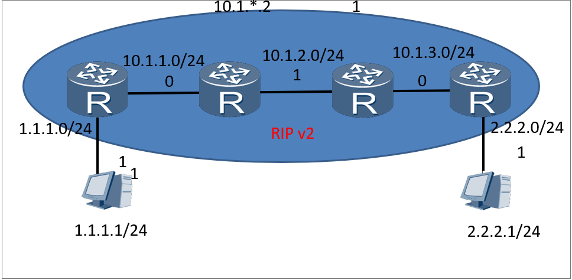其中路由器间的线路的IP地址的分配规则为当前所在网络+左2右1，例如RTA的右边0号端口的地址为 ``10.1.1.2``

##### 配置RIP及验证

对于每一个路由器进行配置RIP，广播其所连的所有网络，使得路由器间可以相互交换路由，此时便可以达到两端设备的相互通信目的， 此时查看 RTC、RTD 的RIP验证可以看到已经配置的相关信息：

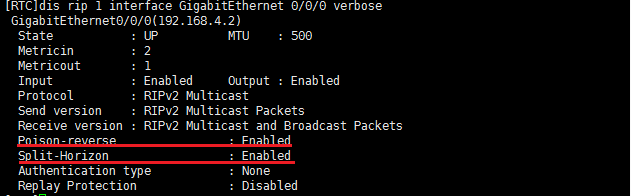

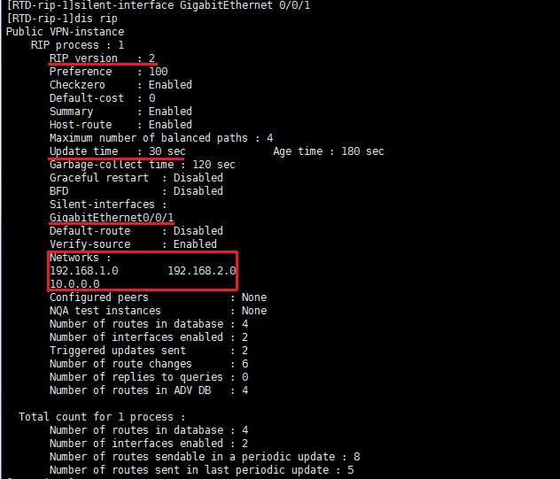


完成以上配置并无误后，此时在 ``1.1.1.1`` 主机上ping ``2.2.2.1`` 主机，ping的通说明网络是通的，同理反过来也可以，此时证明RIP配置成功，路由器已经交换了各自的路由信息，实现动态路由的功能；

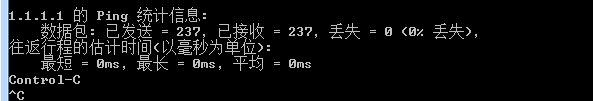

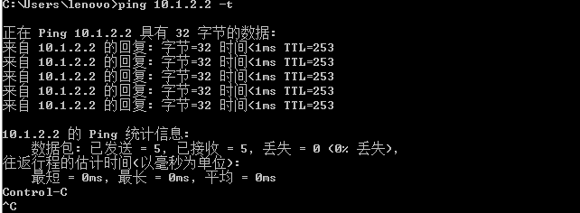


#### ipv6 下的 RIPng 配置及其验证

##### 链路层的配置及IP地址的分配

ipv6 下的RIP配置与ipv4 下的配置的主要差别是ip地址和相关命令的变化，根据下图进行网络的连接


IP地址的分配规制为对于任意两个路由器 RTA 和 RTB ，互联端口所处的网络为 ``2001:AB::X`` 如 R1 的右端口IP地址为 ``2001:12::1`` ；此外对R1 和 R3设置一个逻辑端口 ``Loopback0`` ，并设置其IP地址为 ``2001:X::X/64`` 便于后边的测试；


##### 配置RIPng及验证

对路由器进行配置，配置的流程为： 启用 IPv6 、设置端口地址、启用 RIPng ，如对R1进行配置的命令如下：

```js
ipv6
interface G0/0/0
ipv6 enable 
ipv6 address 2001:12::1/64 
ripng 1 enable
q
interface LoopBack0
ipv6 enable 
ipv6 address 2001:1::1/64 
Ripng 1 enable
q
ripng 1
```

用以上命令对 R2、R3 进行配置，配置完成后，路由器之间会进行 RIPng 路由表交换（实际是每启用一个RIPng便会进行交换，此时console会不断的刷新交换的路由表项）；

配置完成后，可以对任意路由器查看 IPv6 RIPng下的路由表，使用命令： ``dis ipv6 rou protocol ripng`` 即可：

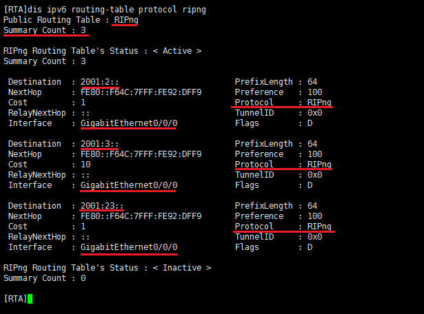

也可以查看任意路由器的任意端口的信息，命令为 ``dis ipv6 interface G0/0/1`` 如对R3的1端口进行查看：

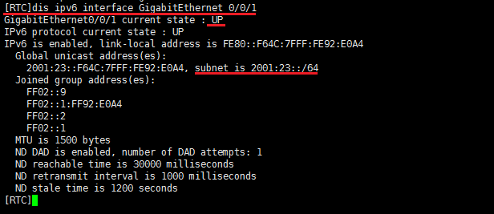

此时在一端的路由器 ping 另一端的逻辑端口 Loopback0 的结果如下：

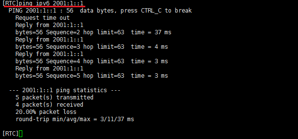

证明ipv6 下的RIPng 配置成功。

### OSPF 原理

OSPF 的主要操作是划分区域，每一个区域维护一个独立的LSDB，其中 ``area0`` 是骨干区域，其他区域都必须与此相连，设置ospf区域后，同一区域内的路由器可以相互通信，交换路由信息，相邻区域也可以在配置后实现区域间的通信；

#### ipv4 下的 OSPF配置以验证

##### 链路层的配置及IP地址的分配

按照如下网络拓扑图进行连接网络，同时配置主机以及路由器个端口的IP地址；

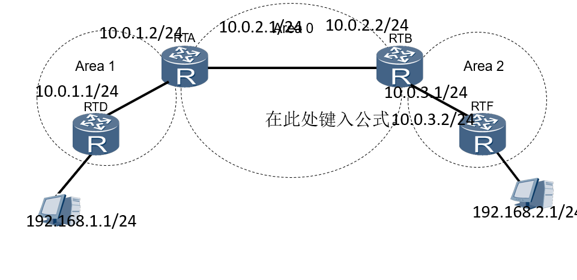

##### 配置 OSPF 及其验证

首先对每一个路由器进行配置 ``router-id`` ，按照路由器字母的顺序来指定其编号，具体的命令是： ``ospf router-id x.x.x.x`` ；

然后配置路由器所在的区域，并指定其所连接的所有网络：

```js
area 0
network ip.ip.ip.ip msk.msk.msk.msk
```

例如对于 RTD 要将其化为在区域A （area1） 并指定网络 ``192.168.1.0`` 和 ``10.0.1.0`` 这两个网络；

全部配置完毕后，待网络稳定后，可以在 ``192.168.2.1`` 主机ping任意设备，此时表明动态路由表建立完毕，也可以通过使用 ``tracert`` 命令查看路由信息：

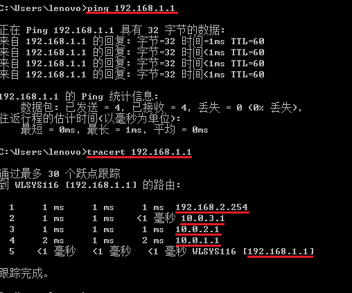

#### ipv6 下的 OSPF配置以验证

##### 链路层的配置及IP地址的分配

对于ipv6下的ospf配置与ipv4大同小异，为了实验配置及验证方便，直接使用路由器的逻辑端口 Loopback0 来模拟接入对应路由器的设备，网络的拓扑图如下：

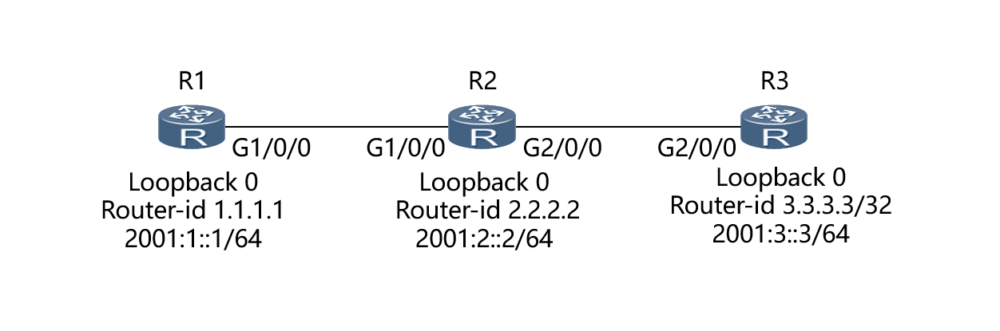

对于IP地址的划分，规定任意两台路由器 RA, RB ，其互联的端口间的网络为 ``2001:AB::`` ，对应的端口的地址即为 ``2001:AB::X`` ，对于 RX 的 Loopback0 的地址为 ``2001:X::X`` ；

设置完毕后进入 ospfv3 的设置，设置的主要流程为：设置 ospfv3 的router-id、设置端口的IP并将其加入到对应的区域中，其中R1和R2左端口G0/0/0加入到区域1中、而R2的Loopback0等剩下的端口和R3配置为区域0，例如对R2的设置如下：

```js
ipv6
ospfv3 1
router-id 2.2.2.2
area 0.0.0.1

inter g0/0/0
ipv6 enable
ipv6 add 2001:12::2/64
ospfv3 1 area 0.0.0.1

inter g0/0/1
ipv6 enalbe
ipv6 add 2001:23::2/64
ospfv3 1 area 0.0.0.0

inter Loopback0
ipv6 enable
ipv6 add 2001:2::2/64
ospfv3 1 area 0.0.0.0
```

全部设置完毕后，可以对任意路由器进行查看其端口的信息，命令为： ``dis ipv6 inter X `` 以及查看ospfv3 的路由表等信息：

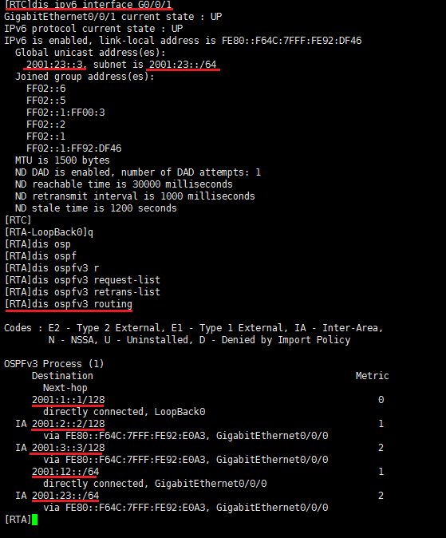

# 心得体会

这次实验除了学习到了ipv4以及ipv6下的两种动态路由的实现方式外，还进一步的掌握的书本上的理论知识，当然实验课上的操作的不熟练以及不理解也暴露了我在理论课后没有及时的复习，基础知识知识了解个大致内容，没有具体的深入了解，最后，在实验课上，对于实验目的中的一些内容不知道是什么内容，只能再次翻开书重新学习，导致最后实验课上每能及时的完成试验任务，后面自己抽时间完成这次实验的同时，也不断的独自思考，理解每一个命令的含义和目的，最后在只看网络拓扑图和目的的基础上实验了所有的内容；同时还要注意每一个细节，例如配置IP敲错等等的情况也会导致实验达不到预期，但实际上路由器配置的东西并不多，只要耐下心来查看一下所有的东西，捋一遍就能发现问题。