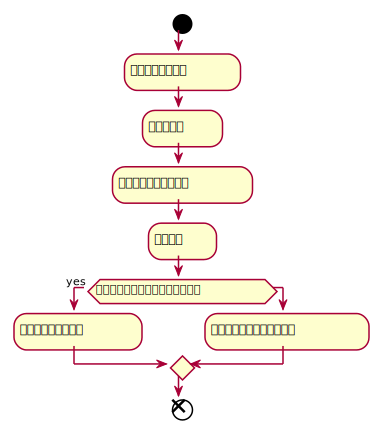
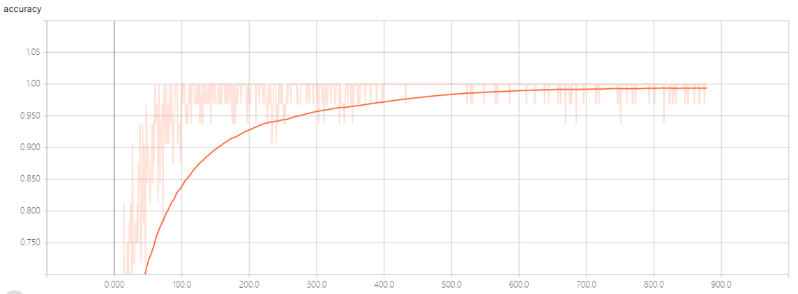
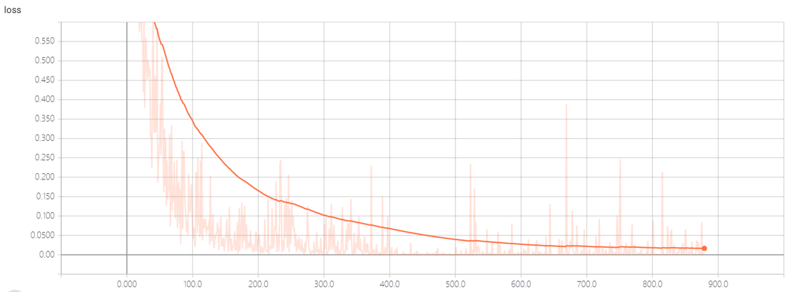

*此文档仅是人脸识别这个实验的实验报告，具体的代码的逻辑、运行请看：[基于卷积神经网络的人脸识别项目](./基于卷积神经网络的人脸识别项目.md)*


此文件夹的结构：
```text
卷 文件 的文件夹 PATH 列表
卷序列号为 D0B1-CFE7
G:.
│  acc.png									//准确率曲线
│  all.png									//运行截图
│  common.py								        //公共函数
│  dir.txt									//项目目录树
│  getFaceByCamera.py						                //获取一个人的姓名和人脸视频，并处理
│  gui.java									//简单的gui界面
│  haarcascade_frontalface_default.xml		                                //opencv人脸检测器所需文件
│  init.py									//系统初始化
│  loss.png									//损失率曲线
│  Readme.md								        //项目需求分析说明书markdown文档
│  tensorflow_face.py						                //建立数据库、训练和识别（第一次运行为训练，第二次运行为识别）
│  tensorflow_face_conv.py					                //构建网络、训练模型主代码
│  对比.PNG									//不同数据对比
│  
├─.vscode
│      launch.json							        //vscode工作目录启动文件
│      
├─checkpoint								        //训练所得模型的checkpoint
│      checkpoint
│      face.ckpt.data-00000-of-00001
│      face.ckpt.index
│      face.ckpt.meta
│      
├─dd										//参数对比的曲线
│  ├─batch_size
│  │      16acc=0.90.png
│  │      16loss.png
│  │      32acc=0.818.png
│  │      32loss.png
│  │      64acc=0.87.png
│  │      64loss.png
│  │      新建文本文档.txt
│  │      
│  ├─keep_prob
│  │      （0.25，0.5）acc=0.75.png
│  │      （0.25，0.5）loss.png
│  │      （0.5，0.75）acc=0.818.png
│  │      （0.5，0.75）loss.png
│  │      
│  └─迭代次数
│          20次acc=0.727.png
│          20次loss.png
│          40次acc=0.81.png
│          40次loss.png
│          60次acc=0.818.png
│          60次loss.png
│          80次acc=0.87.png
│          80次loss.png
│          
├─Readme									//项目需求分析说明书所需图片
│  │  流程图.md
│  │  流程图.png
│  │  流程图.svg
│  │  结构图.md
│  │  结构图.svg
│  │  
│  └─结构图
│          结构图.png
│          结构图.svg
│          
├─__pycache__								        //python运行产生的文件
│      common.cpython-36.pyc
│      tensorflow_face_conv.cpython-36.pyc
│-
            

```


# 实验目的与意义

本实验主要目的是学习掌握基于深度学习的人脸识别的环境搭建、网络搭建、构建训练模型、识别测试以及各种参数变量之间的不同的对比，了解每一个步骤中的具体流程，理解其深度学习的思想，以及认清其未来的发展趋势；

本实验的意义有：锻炼实验者的自学以及团队协作学习一门知识的能力、阅读他人项目并从中获取有用内容的能力、代码阅读编写能力、独立思考能力、团队完成项目的能力、解决问题的能力等；


# 系统实现

## 环境搭建

本次实验的所有代码运行环境均通过 Anaconda3 (64-bits) 包管理器构建，同时gui的运行基于 Java8 环境，具体的环境的搭建如下：

### Anaconda3 环境的配置

官网下载安装Anaconda3 即可，注意一下系统环境变量的配置。

### Java8 环境配置

官网下载Java的基础环境，注意配置环境变量，这一步用于项目的简单GUI的实现，如果不需要可与省略这一步。

### 项目必需环境的搭建

该项目是基于深度学习的人脸识别系统，利用了 tensorflow-gpu 来系统中最重要的功能： **网络搭建、模型训练、测试** ，故首先要配置基础的运行环境：

*此步要保证Anaconda3 安装成功，并且系统环境变量已经设置好*。


#### 创建一个环境

打开 powsershell

输入：（创建一个名为[name]的、python3.5的、拥有tensorflow-gpu1.9.0的一个环境，之后的所有代码的运行都依赖这个环境）


```js
conda create -n [name] python=3.5 tensorflow-gpu=1.9.0
```

可能这一步会很慢，，但是建议不要去换源，，因为会出现下的东西不全，最后可能不能使用gpu版的tensorflow，

输完这段命令后，，等一会会出现一些要安装的东西列表，，这时主要看一下有没有python, **tensorflow-gpu**, **cudnn**, **cudatoolkit** ，都有的话就y确定等就行了，

环境的名字随便起，

#### 激活环境

因为这时是powershell下，，，激活环境会不成功，，所以直接切换到cmd模式就行了，，输 ``cmd``，，，

```js
activate [name]
```

这时会发现前面多了一个 ``([name])`` 的东西，表示激活环境成功。

然后再测试一下python下能不能调用 tensorflow-gpu 版，，测试的方法可以参考我的上一篇[博客](https://www.cnblogs.com/31415926535x/p/10536572.html)里后面那一部分内容，主要是测试环境中的tensorflow-gpu是否能被正常调用。


#### 安装必备的库

因为这个人脸识别的实现用到了 opencv, dlib, sklearn等等，，所以先安装这些，

##### 安装opencv

```js
conda install opencv
```

##### 安装dlib

这个玩意的安装有点坑，有时貌似直接安装会安装不上，会提示没有 ``cmake`` 这个包管理软件，所以要先安装cmake，，建议是在anaconda3主程序（开始菜单里找 Anaconda Navigator）中找到你的那个环境，，然后再 uninstall 中找到 cmake 然后安装。

但是这样可能还是安装不了dlib，，无论是用conda还是pip安装。

```js
conda install dlib
pip install dlib
```

后来我找到一个解决方法，，去下载 ``dlib****.whl`` 然后本地安装：

[下载地址](https://pypi.org/project/dlib/19.1.0/#files)

再 DownloadFiles 中找到一个这个东西，
``dlib-19.1.0-cp35-cp35m-win_amd64.whl `` 。

然后放到你现在的路径下，，``pip install dlib-19.1.0-cp35-cp35m-win_amd64.whl`` 。

应该这样就可以安装上了dlib，，，当然你可以用其他的方法安装，，网上也有很多解决方法，，，也有可能直接用 pip 就能安装上（比如我的电脑就能，，室友的就会出现上面的错误，，得绕一个弯子）。

##### 安装sklearn

这个简单，，会在训练那一步用到。

``pip install sklearn``

### Vscode 安装

官网下载安装vscode，之后的编码会用到。

## 系统设计

本项目的基本流程图如下：




其中我们以实现的功能有： **人脸基础数据的录入** 、 **建立数据库** 、 **根据录入人脸数据训练出具体模型** 、 **识别人脸** 、 **模型数据查看** 、 **简单gui** 。

每一部分都由一个或多份代码实现，系统的具体实现如下：

## 系统实现

### 人脸基础数据的录入

+ 提示录入姓名
+ 拍摄一段视频，按下q结束
+ 利用dlib裁剪出所有的人脸相片，大小为64*64，共200张，保存到./image/name
+ 多次执行直到录入完所有人脸


### 建立数据库

+ 根据上一步生成的image文件夹为每一人编码，加一个label

### 构建网络、训练模型

+ 用sklearn随机划分测试集和训练集，比例为0.05:0.95
+ 构建一个3层的卷积神经网络，其中每一层都要加一层BatchNomalization层，优化网络模型
+ 计算交叉熵
+ 设置Adam优化器，学习率为0.001
+ 初始化tensorboard
+ 迭代80次训练，其中batch_size为32
+ 利用测试集测试，得到acc与loss
+ 保存训练好的模型

### 识别人脸

+ 加载训练好的模型
+ 打开摄像头，每个0.2s拍照一次
+ 利用dlib检测相片中出现的所有人脸
+ 对每张人脸利用模型进行预测，得到res向量
+ 利用res向量得到最大值的下标，认为其为下标对应的人脸
+ 使用opencv绘制矩形框以及显示预测的人脸的名字
+ 循环检测，知道按下esc退出

### 查看模型数据

+ 运行 ``tensorborad --logdir="path"`` 来加载渲染模型数据
+ 在浏览器中打开数据网页

### 简单gui

+ 编译运行gui的java文件
+ 选择相应的功能按钮即可

# 实验结果与分析

## 实验最后训练出的模型：

acc: 

loss: 

可以看出最终的模型的准确率和损失率都渐进1和0，证明网络的构建和训练较好

## 最终成果

最终的实验的成果如下，可以同时实时识别出多个人，并标记出来


## 参数修改对比


可以看出对于我们这个模型，batch_size=32，迭代次数为80，keep_prob = 0.5/0.75 是最合适的参数

## 不足

没有加入others类，故不能识别出其他未录入者，会将其识别为与录入者中最接近的人的信息


# 实验收获

通过这学期的这次数字图像实验，我和队友不仅大致掌握基于深度学习的人脸识别的基本内容、流程，而且也增强了自己的信息搜索能力、代码能力和分析问题的能力。我们在经过别人以有工程的基础上学习，检索网络上各种有用的博客、文献、代码资料，掌握了深度学习的大致使用方法，当然我们还有不足，比如说我们可能为了最终的成果而或多或少的放弃一些东西的实质、算法具体公式的推导过程，只是学习了它的使用方法；由于从未接触过深度学习的相关领域，我们对整个项目的开发计划的把握不足，以至于我们最后仅仅只能完成一个简单gui的项目，整个项目的一些细节问题没有考虑，例如放弃了实现识别未录入者的功能、gui没有认真的去优化界面等等问题。整体上来说，这个实验项目对我来说受益匪浅。


# 参考文献

[1]Batch Normalization: Accelerating Deep Network Training by Reducing Internal Covariate Shift, Sergey Ioffe,Christian Szegedy 来源：https://arxiv.org/abs/1502.03167
[2]DeepLearningFaceRepresentationfromPredicting10,000Classes, Yi Sun1, Xiaogang Wang2, Xiaoou Tang1,3
[3]激活函数-BN-参数优化, Arrow, https://blog.csdn.net/myarrow/article/details/51848285
[4]【深度学习】批归一化（Batch Normalization）, 冠军的试炼, https://www.cnblogs.com/skyfsm/p/8453498.html
[5]TensorFlow中文社区, http://www.tensorfly.cn/