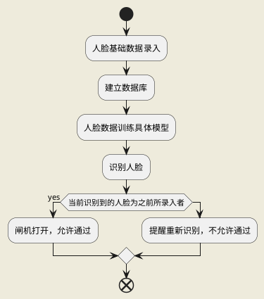

```plantuml
@startuml

skinparam backgroundColor #EEEBDC

start

:人脸基础数据录入;

:建立数据库;

:人脸数据训练具体模型;

:识别人脸;

if(当前识别到的人脸为之前所录入者) then(yes)
    :闸机打开，允许通过;
else
    :提醒重新识别，不允许通过;
endif

end

@enduml
```