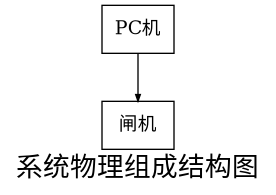

```plantuml
@startdot
digraph SchoolCardSupportSystem_1 {
    
    //图设置信息
    label="系统物理组成结构图"
    rankdir = TB
    fontsize = 20

    node[shape=record]
    edge [arrowsize= .5, fontsize=10]

    pc [label="PC机" shape=box]
    zhaji [label="闸机" shape=box]
    
    pc -> zhaji

}
@enddot
```