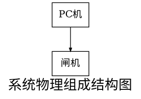

需求规格说明书

# 引言

## 编写目的

该文档是关于人脸识别闸机锁系统的功能和性能的描述，重点描述了系统的功能需求，并作为系统设计阶段的主要输入。

## 项目背景

项目名称：人脸识别系统

项目的提出者：xxxx大学xxxx老师

项目开发者：xx、xxx

用户：任意

## 参考资料

[1] 数字图像处理（第三版）[M].武汉：武汉大学出版社，2003
[2] 需求规格说明书标准[S].GB 856D-1988
[3] Python 核心编程（第三版）[M].北京： 人民邮电出版社，2016
[4] Tensorflow 技术解析与实战[M].北京： 人民邮电大学出版社，2017

## 版本信息

|修改编号|修改日期|修改后的版本|修改位置|修改内容概述|
|:----:|:----:|:----:|:----:|:----:|
|1|2019-4-20|v.1|全部|熟悉整个人脸识别流程|
|2|2019-5-1|v.2|卷积、训练代码|添加Batch Normalization层，优化训练模型|
|3|2019-5-20|v.3|全部|重写代码、添加图形界面|

# 任务概述

## 系统定义

### 项目来源及背景

该项目是由华中农业大学信息学院彭辉老师提出的一个课程设计，用于解决刷脸过闸机的问题，用户在预先录入人脸视频后可以刷脸通过闸机。

### 项目要达成的目标

该系统是为了使用户更方便、安全的刷脸通过闸机，提高用户通过效率，缓减人流压力，目标是做到系统能够以较高的准确率同时识别多个人脸，显示提示信息，提供一个易于操作的图形界面，并结合硬件实现系统功能。

### 系统整体结构

### 系统各部分组成，与其他部分的关系，各部分的接口等

本系统相对独立，无需与其他系统相连接。

## 运行环境

### 设备环境

+ 普通PC： 内存8G以上，带有摄像头（300W像素以上），**GPU GTX970M及以上**
+ 闸机：任何FPGA、树莓派等开发板

### 硬件环境

对PC的配置要求较高，近几年的配置即可以较快的速度运行整个系统

### 软件环境

+ Anaconda3(64-bit): python3.6.8、tensorflow-gpu1.9.0、tensorboard1.9.0、opencv3.4.2、dlib19.17.0、cudnn7.3.1、cudatoolkit9.0、numpy1.16.2、pip19.0.3、scikit-learn0.20.3：用于基础的系统运行
+ vscode最新版本： 用于编写具体代码以及文档
+ Chrome: 用于查看Tensorboard产生的数据
+ Java8: 用于gui的显示

### 网路环境

无

### 应用环境

## 条件限制

### 列出进行本系统开发工作的假定和约束

+ 系统仅保证在与上述软硬件相符的条件下可以运行良好，即必须在python3.6.8、tensorflow-gpu1.9.0、tensorboard1.9.0、opencv3.4.2、dlib19.17.0、cudnn7.3.1、cudatoolkit9.0、numpy1.16.2、pip19.0.3、scikit-learn0.20.3以及Java8等软件环境下运行。
+ 本项目由2017级学生开发，开发经验不足，参考很多网络上他人的项目实现代码、思路以及相关学习资料。

### 系统的最终用户、用户的教育水平和技术专长

+ 最终用户： 所有人
+ 用户的教育水平： 基础的计算机操作知识
+ 技术专长： 无

### 列出本系统的预期和使用频度

本系统是人脸识别通过闸机系统，使用频率频繁

# 数据描述

## 数据库描述

|label|name|
|:--:|:--:|
|001|张三|
|010|李四|
|100|王五|

## 数据采集

通过运行系统的采集相片模块采集待录入者的 **姓名** 及 **一段人脸视频**

# 功能需求

## 功能划分

### 系统功能组成

+ 系统启动
+ 录入人脸及名字
+ 训练模型
+ 查看模型数据
+ 识别人脸
+ 判断开放闸机

### 功能划分与描述

|编号|名称|优先级|描述|主要发起者|
|:-:|:-:|:-:|:-:|:-:|:-:|
|1|系统启动|重要|启动整个系统|管理员|
|2|录入人脸及名字|重要|录入人脸视频及名字|系统|
|3|训练模型|重要|模型训练|系统|
|4|查看模型数据|普通|查看模型数据|系统|
|5|识别人脸|重要|识别当前拍摄到的人脸|系统|
|6|判断开放闸机|重要|根据功能3的结果判断是否开关闸机|系统|

# 性能需求

## 系统精确度

准确率达到98%以上

