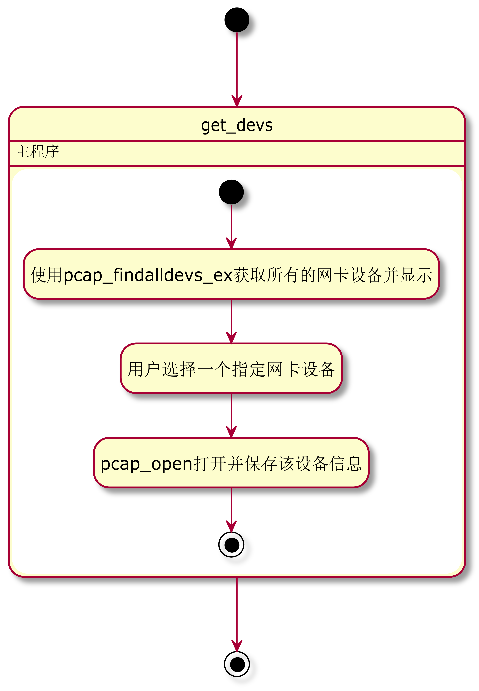

综合实训项目报告
网络流量在线分析系统的设计与实现


# 摘要

本项目使用 ``Winpcap`` 或者 ``libpcap`` 等第三方库函数，设计实现一个网络流量的捕获分析系统，完成对指定网卡设备的网络流量的捕获、各层网络不同协议分析、数据提取统计并进行流量特征的分析等功能。对流量的捕获和分析处理使用多线程来并行执行，对捕获到的数据包根据各层协议进行提取分析处理，将主要信息，如源地址、目的地址及其端口和协议等进行存储，并据此使用双向Hash链表的方式存储不同链接的建立情况，分析处理不同链接在不同时间段内的流量、数据包等信息。

# 关键字

Winpcap 流量捕获 网络协议分析 流量特征处理 网络协议

# 1.绪论

## 1.1 课题研究背景

本项目是在学习完《计算机网络》为主的课程后进行的一次偏向应用的网络流量分析任务，通过本项目主要加深掌握计算机网络在不同操作系统中的一种抓取方式，以及流量分析处理的方式。

## 1.2 课题研究的目的和意义

课题研究的目的是完成如下功能：

+ 能够实时抓取指定网络设备在一定时间内的数据包，用户可以自行定义数据包的过滤方式。
+ 对捕获到的数据包进行分析处理，逐层分析数据包不同网络层中的协议，并能一定程度上显示协议的主要字段内容。如识别显示TCP协议以及建立过程等等。
+ 对分析处理到的数据要使用hash链表保存每一个网络链接的建立过程及数据，并以双向流的形式存储。
+ 对固定时间段内的网络流量进行统计，如建立的TCP数量、UDP流量等等内容，同时尽可能的处理出更上层的协议类型，如识别出是否为DNS、SMTP等协议的流量，及对流量特征的提取。


# 2. 主要仪器及试材

+ 需要的硬件设备有： 台式计算机或笔记本计算机(含网络适配器)
+ 需要的软件设备有：
+ Windows操作系统或Linux操作系统
+ 网络数据包捕获函数包，Windows平台为winpcap，Linux平台下为libpcap。这两个函数包可在网上下载安装。
+ 编程语言选用C/C++。

# 3. 课题环境配置

设备环境为Win10，使用Vscode编写管理项目，并使用 Mingw64 编译器来编译调试C/C++项目代码，使用Winpcap函数，基本配置情况如下：

+ 首先保证Vscode可以运行调试C/C++代码，并能通过任务的方式来多文件编译项目文件
+ 下载Winpcap的开发包，并配置项目所在的工作区的 ``task.json`` 和 ``c_cpp_properties.json`` 文件，前者指定项目编译的编译命令，包括多文件、第三方include文件以及各种链接文件；后者指定代码编辑时需要的include头文件，以提供良好的代码自动补全功能

```json
// task.json
{
  "tasks": [
    {
      "type": "shell",
      "label": "build",
      // "command": "D:\\mingw64\\bin\\gcc.exe",
      "command": "D:\\mingw64\\bin\\g++.exe",
      "args": [
        "-g",
        "-std=c++17",

        "-LG:\\实验报告\\实训\\WpdPack_4_1_2\\WpdPack\\Lib\\x64",
        "-IG:\\实验报告\\实训\\WpdPack_4_1_2\\WpdPack\\Include",

        "-finput-charset=UTF-8",
        "-fexec-charset=GBK",
        
        "${fileDirname}\\global.cpp",
        "${fileDirname}\\get_devs.cpp",
        "${fileDirname}\\catch_packets.cpp",
        "${fileDirname}\\analysis_struct.cpp",
        "${file}",

        "-o",
        "${fileDirname}\\${fileBasenameNoExtension}.exe",
        
        "-lwsock32",  // #include<winsock2.h> 使用
        "-lwpcap",    // #include<pcap.h> 使用
        "-lws2_32",    // #include<ws2tcpip.h> 使用
        "-lpthread"   // #include<pthread.h> 使用
      ],
      "options": {
        "cwd": "D:\\mingw64\\bin"
      },
      "problemMatcher": [
        "$gcc"
      ]
    }
  ],
  "version": "2.0.0"
}
```

```json
// c_cpp_properties.json
{
    "configurations": [
        {
            "name": "Win64",
            "includePath": [
                "${workspaceRoot}",
                "D:\\mingw64\\lib\\gcc\\x86_64-w64-mingw32\\8.1.0\\include\\",
                "G:\\实验报告\\实训\\WpdPack_4_1_2\\WpdPack\\Include\\"
            ],
            "defines": [
                "_DEBUG",
                "UNICODE",
                "_UNICODE"
            ],
            "browse": {
                "path": [
                    "${workspaceRoot}",
                    "D:\\mingw64\\lib\\gcc\\x86_64-w64-mingw32\\8.1.0\\include\\",
                    "G:\\实验报告\\实训\\WpdPack_4_1_2\\WpdPack\\Include\\"
                ],
                "limitSymbolsToIncludedHeaders": true
            },
            "compilerPath": "D:\\mingw64\\bin\\g++.exe",
            "cStandard": "c11",
            "cppStandard": "c++17",
            "intelliSenseMode": "gcc-x64"
        }
    ],
    "version": 4
}
```


# 4.系统主要流程设计分析

## 4.1 获取本机设备所有的网络接口设备

同Linux对设备的解释类似，可以理解Winpcap将网卡设备解释成各种文件设备，可以使用winpcap函数包中 ``pcap_findalldevs_ex()`` 函数来获取所有的网卡设备，然后通过 ``pcap_open()`` 函数来打开指定的网卡设备，对于程序结束后，可以使用 ``pcap_freealldevs()`` 来释放所有的设备。

本项目将获取网卡设备过程分离为一个单独模块，大致流程如下：




```plantuml{cmd=true hide=true}
hide empty description
scale 400 width
[*] --> get_devs
get_devs --> [*]

get_devs: 主程序

state get_devs{
    [*] --> 使用pcap_findalldevs_ex获取所有的网卡设备并显示
    使用pcap_findalldevs_ex获取所有的网卡设备并显示 --> 用户选择一个指定网卡设备
    用户选择一个指定网卡设备 --> pcap_open打开并保存该设备信息
    pcap_open打开并保存该设备信息 --> [*]
}
```

此模块的代码文件见； ``get_devs.h`` 以及 ``get_devs.cpp`` ：

### 代码

```cpp
#ifndef GET_DEVS
#define GET_DEVS
#include"global.h"

int get_devs(char *devs);

#endif
```

```cpp
#include"get_devs.h"

int get_devs(char *devs){
    pcap_if_t *alldevs, *d;
    char errbuf[PCAP_ERRBUF_SIZE];

    if(!~pcap_findalldevs_ex(PCAP_SRC_IF_STRING, NULL, &alldevs, errbuf)){
        err_print("Error in pcap_findalldevs_ex(): ", errbuf);
        return -1;
    }

    int i = 0;
    for(d = alldevs; d != NULL; d = d->next){
        printf("%d. %s", ++i, d->name);
        if(d->description)printf(" (%s)\n", d->description);
        else printf(" (No description abailable\n");
    }
    if(!i){
        printf("\n No interface found!, Make sure winpcap is installed. \n");
        return -1;
    }
    printf("Enter the interface number(1-%d): ", i);
    int inum = i;
    scanf("%d", &inum);
    if(inum < 1 || inum > i){
        printf("\n Interface number out of range.\n");
        pcap_freealldevs(alldevs);
        return -1;
    }

    for(d = alldevs, i = 0; i < inum - 1; d = d->next, ++i);
    memcpy(devs, d->name, strlen(d->name) + 1);
    dev = (pcap_if_t*)malloc(sizeof(pcap_if_t));
    memcpy(dev, d, sizeof(pcap_if_t));
    if((dev_fp = pcap_open(d->name,  // 设备名
                             65536,     // 要捕捉的数据包的部分 
                                        // 65535保证能捕获到不同数据链路层上的每个数据包的全部内容
                             PCAP_OPENFLAG_PROMISCUOUS,         // 混杂模式
                             1000,      // 读取超时时间
                             NULL,      // 远程机器验证
                             errbuf     // 错误缓冲池
                             ) ) == NULL)
    {
        err_print("Unable to open the adapter. It is not supported by WinPcap\n", errbuf);
        /* 释放设备列表 */
        pcap_freealldevs(alldevs);
        return -1;
    }
    pcap_freealldevs(alldevs);
    return 0;
}
```

## 4.2 数据包的捕获并存储

winpcap函数包中对网卡设备数据包的捕获是通过 ``pcap_loop`` 函数来实现，当其捕获到一个数据包时，就会调用作为参数的回调函数，由回调函数来处理数据包，此处定义了一个数据包链表，用于存储捕获到的所有的数据包，并作为共享数据用于后续的流量分析。数据包链表节点的大致结构为一个完成的数据包结构以及指向下一个节点的指针，回调函数的处理任务仅为将捕获的数据包添加到数据包链表后即可；此外，在开始数据包捕获时，会开启一个定时计数线程，用于在用户指定的捕获时间后进行停止捕获的作用，使用的函数是： ``pcap_breakloop()`` 来结束指定设备的捕获。最后在捕获完成后将数据包链表保存的所有数据包导出为 ``.pcap`` 格式的文件，用于其他程序的使用。此外，在进行数据包捕获前，用户可以指定数据包捕获的 **过滤规则** ，如 ``ip`` 为仅捕获含有 ip 的数据包， ``ip and tcp`` 则捕获所有 TCP 协议的数据包，通过 ``set_pcap_filter()`` 函数来设定。

该模块的一个主要的流程如下：


```plantuml{cmd=true hide=true}
hide empty description
scale 600 width
[*] --> catch_packet
catch_packet --> [*]

catch_packet: 主程序

state catch_packet{
    [*] --> 使用pcap_datalink检查数据链路层仅考虑以太网
    使用pcap_datalink检查数据链路层仅考虑以太网 --> set_pcap_filter设定用户指定的过滤规则
    set_pcap_filter设定用户指定的过滤规则 --> 获取捕捉的持续时间
    获取捕捉的持续时间 --> pthread_create开启一个计时器线程
    pthread_create开启一个计时器线程 -> pcap_loop开始捕获数据包
    pthread_create开启一个计时器线程 --> pcap_breakloop停止捕捉
    pcap_breakloop停止捕捉 --> pkt_dump将捕获到的数据包导出为pcap文件

    state set_pcap_filter设定用户指定的过滤规则{
        获取用户输入的过滤规则 --> pcap_compile编译检查规则
        pcap_compile编译检查规则 --> pcap_setfilter设置过滤规则
    }

    state pcap_loop开始捕获数据包{
        等待捕获 --> 捕获到一个数据包
        捕获到一个数据包 --> 调用回调函数packet_handle
        调用回调函数packet_handle --> add_pkt将数据包保存到数据包链表
        add_pkt将数据包保存到数据包链表 --> 等待捕获
    }
}
```

此模块的代码文件见： ``catch_packets.h`` 和 ``catch_packets.cpp`` 。


### 代码

```cpp
// catch_packets.h
#ifndef CATCH_PACKETS
#define CATCH_PACKETS

#include"global.h"
#include"analysis_struct.h"


int set_pcap_filter(pcap_t *dev, char *packet_filter, bpf_u_int32 mask);
// int catch_packet();
void *catch_packet(void *);

#endif
```

```cpp
// catch_packets.cpp
#include"catch_packets.h"


// 设置过滤规则
int set_pcap_filter(pcap_t *dev, char *packet_filter, bpf_u_int32 mask){
    struct bpf_program  fcode;
    if(!~pcap_compile(dev, &fcode, packet_filter, 1, mask)){
        err_print("Unable to compile the packet filter. Check the syntax.", "");
        return -1;
    }
    if(!~pcap_setfilter(dev, &fcode)){
        err_print("Error setting the filter.", "");
        return -1;
    }
    return 0;
}

typedef struct _argument{
    pcap_t *dev;
    int timeLen;
}args;

// 设定一个计时线程，当到达捕获时间时停止捕获
void *thread_clock(void *argv){
    isCatchDone = false;
    // win下的sleep是以毫秒计时的
    Sleep((((args*)argv)->timeLen) * 1000);
    pcap_breakloop(((args*)argv)->dev);
    isCatchDone = true;
    return NULL;
}

// 回调函数，当捕获到一个数据包时调用该函数
// 在本项目中的作用是将捕获到的数据包存储到内存中（即一个数据包链表）
void packet_handle(u_char *param, const struct pcap_pkthdr *pkthdr, const u_char *packet){
    // printf("\ncatch a pkt...\n");
    add_pkt(pkt_link, pkthdr, packet);
    // printf("insert in pkt_link...\n\n");
    // Sleep(1000);
}

void *catch_packet(void *){
    printf("%s\n", dev->name);
    
    // 检查数据链路层，仅考虑以太网
    if(pcap_datalink(dev_fp) != DLT_EN10MB){
        err_print("\nThis program works only on Ethernet networks.\n", "");
        pcap_freealldevs(dev);
        // return -1;
        return NULL;
    }

    bpf_u_int32 mask;
    if(dev->addresses != NULL){
        // 获得接口的第一个地址掩码
        mask = ((struct sockaddr_in *)(dev->addresses->netmask))->sin_addr.S_un.S_addr;
    }
    else{
        // 没侑地址假设为C类地址
        mask = 0xffffff;
    }

    char packet_filter[BUFSIZ];
    printf("\nInput pcap filter string: ");
    scanf("%s", packet_filter);
    set_pcap_filter(dev_fp, packet_filter, mask);

    args a;
    a.dev = dev_fp;
    printf("\nInput catch packets time: ");
    scanf("%d", &a.timeLen);
    printf("Pcap filter string is: \"%s\", catch time is \"%d\". Start catching...\n", packet_filter, a.timeLen);

    pkt_link = (pkt_linker_heeader*)malloc(sizeof(pkt_linker_heeader));
    init_pkt_link(pkt_link);

    pthread_t ptClock;
    if(pthread_create(&ptClock, NULL, thread_clock, &a)){
        err_print("pthread_create(): Error!!!\n", "");
        // return -1;
        return NULL;
    }
    // if(pthread_create(&ptClock, NULL, analysis_pkt, NULL)){
    //     err_print("pthread_create(): catch_packet: Error!!!\n", "");
    //     return -1;
    // }
    pcap_loop(dev_fp, 0, packet_handle, (u_char*)"");
    printf("catch done!!!\n");
    
    pkt_dump(pkt_link);

    // free_pkt_link(pkt_link);
    // pcap_freealldevs(dev);
    // return 0;
    return NULL;
}
```


## 4.3 数据包的分析于流量处理

该模块将上一个模块不断获取到的数据包进行分析处理，将数据链路层的数据包不断地分析获取到链路层数据包、IP数据包、TCP/UDP数据包[^2]等等，并通过访问的端口等信息一定程度上的分析出上层应用层的协议如DNS[^3][^4]、HTTP、STMP等等。此外，通过建立一个三个链表，其中两个用于保存所有的TCP/UDP流量，另一个用于保存建立的链接的情况，使用Hash表来建立，其中使用 源地址、目的地址以及协议[^1]五元组作为hash的键值，将其映射为一个整数，即为其应在hash表中的位置，因为可能出现冲突的情况，所有每个位置的链接节点并不是一个，也是一个链表，通过对该链表的遍历来比较获取相同的链接，或者添加新的链接，当一个已经建立的链接关闭时将其加入到TCP的链表中，在整个过程中，同时统计数据包个数、流量等情况信息。c

[^1]: TCP报头标志位URG/PSH/SYN/ACK/FIN/RSThttps://blog.csdn.net/sinat_36118270/article/details/73927628
[^2]: TCP报文格式详解https://blog.csdn.net/paincupid/article/details/79726795
[^3]: DNS使用的是TCP协议还是UDP协议https://www.iteye.com/blog/benbenxiongyuan-1088085
[^4]: dns协议及帧格式https://blog.csdn.net/marywang56/article/details/77932414

该模块的大致执行流程如下：


```plantuml{cmd=true hide=true}
hide empty description
scale 600 width
[*] --> analysis_struct
analysis_struct --> [*]

analysis_struct: 主程序

state analysis_struct{
    state analysis_pkt{
        [*] -> 打开result文件
        打开result文件 -> 初始化三个链表
        初始化三个链表 -> 获取数据包链表的每一个包
        获取数据包链表的每一个包 --> 获取每个包的时间
        获取每个包的时间 --> 判断是否经过一个周期
        判断是否经过一个周期 --> 输出统计信息并初始化
        输出统计信息并初始化 --> 获取数据链路层以太网报头
        判断是否经过一个周期 --> 获取数据链路层以太网报头
        获取数据链路层以太网报头 --> 获取IP数据报报头信息
        获取IP数据报报头信息 --> 判断获取5元组信息
        判断获取5元组信息 --> 对于TCPUDP分别进行判断端口以分析上层协议
        对于TCPUDP分别进行判断端口以分析上层协议 --> 当未捕获完以及没有读到数据包链表末时读取下一个数据包
        当未捕获完以及没有读到数据包链表末时读取下一个数据包 --> 释放资源

       state 对于TCPUDP分别进行判断端口以分析上层协议{
           [*] --> UDP将其加入到UDP链表
           [*] --> TCP

           state TCP{
               获取5元组对应的哈希值 --> 获取哈希表中的位置
               获取哈希表中的位置 --> 获取每一个hash相同的链接元素
               获取每一个hash相同的链接元素 --> 判断5元组是否相同
               判断5元组是否相同 --> 根据之前链接和当前状态进行处理关闭的链接加入到TCP链表中
           }
       }
    }
}
```

该模块的代码见 ``analysis_struct.h`` 和 ``analysis_struct.cpp``

### 代码

```cpp
// analysis_struct.h

#ifndef ANALYSIS_STRUCT_H
#define ANALYSIS_STRUCT_H

#include"global.h"

// timeval 结构
typedef struct _shh_timeval{
    int tv_sec;     
    int tv_usec;
}ssh_timeval;

// pcap_next() 调用后的数据包的头部信息
typedef struct _shh_pkthdr{
    ssh_timeval ts;
    bpf_u_int32 caplen; // 包的实际捕捉到的长度
    bpf_u_int32 len;    // 包应该有长度
}shh_pkthdr;

// 网络信息五元组
typedef struct _net5net{
    u_int       sip;
    u_short     sport;
    u_int       dip;
    u_short     dport;
    u_char      protocol;
}net5set;

// 链表节点
typedef struct _net_link_node{
    net5set nln_5set;       // 五元组
    int     nln_upl_size;   // 上行数据包大小
    int     nln_downl_size; // 下行数据包大小
    int     nln_upl_pkt;    // 上行个数
    int     nln_downl_pkt;  // 下行个数
    u_char  nln_status;     // 该链接的状态
    #define CLOSED      0x00
    #define SYN_SENT    0x01    // client sent SYN
    #define SYN_RECVD   0x02    // recieve SYN, and send SYN ACK
    #define ESTABLISHED 0x03    // client get SYN & ACK, server get ACK

    #define FIN_WAIT_1  0x04    // client send FIN
    #define CLOSE_WAIT  0x05    // server recv FIN, and send ACK
    #define FIN_WAIT_2  0x06    // client recv ACK
    #define LAST_ACK    0x07    // server send FIN
    #define TIME_WAIT   0x08    // client recv FIN
    // CLOSED: client send ACK, server recv ACK
    #define UNDEFINED   0xff
    struct  _net_link_node *next;
}net_link_node, *p_net_link;

// 链表头结构
typedef struct _net_link_header{
    int count_conn;
    int count_upl_pkt;
    int count_downl_pkt;
    int count_upl;
    int count_downl;
    p_net_link link;
}net_link_header;


// 需要三个链表，一个哈希链表，保存处于连接状态的包
// 另两个链表分别保存tcp和udp的流量
extern net_link_header *FLowLink_TCP;
extern net_link_header *FLowLink_UDP;

/* ========== hash table ============= */
#define HASH_TABLE_SIZE 0xffff
extern p_net_link HashTable[HASH_TABLE_SIZE];

void init_flowLink(net_link_header *head);

void add_to_flowLink(net_link_header *head, const net_link_node *theNode);

void clear_flowLink(net_link_header *head);

void parse_flowLink_TCP(FILE *fOutput);

void parse_flowLink_UDP(FILE *fOutput);

u_short get_hash(const net5set *theSet);

void add_to_hashTable(u_short hash, const net_link_node *theNode, u_char flags);

void clear_hashTable();

void *analysis_pkt(void *argv);

#endif
```

```cpp
// analysis_struct.cpp
#include"analysis_struct.h"

// 需要三个链表，一个哈希链表，保存处于连接状态的包
// 另两个链表分别保存tcp和udp的流量
net_link_header *FLowLink_TCP;
net_link_header *FLowLink_UDP;

p_net_link HashTable[HASH_TABLE_SIZE];

// 将整形的ip转为字符型
#define IPTOSBUFFERS    12
static char *iptos(bpf_u_int32 in){
    static char output[IPTOSBUFFERS][3*4+3+1];
    static short which;
    u_char *p;

    p = (u_char *)&in;
    which = (which + 1 == IPTOSBUFFERS ? 0 : which + 1);
    sprintf(output[which], "%d.%d.%d.%d", p[0], p[1], p[2], p[3]);
    return output[which];
}


// 时间转换
char *long2time(long ltime){
    time_t t;
    struct tm *p;
    static char s[100];

    t = ltime;
    p = gmtime(&t);

    strftime(s, sizeof(s), "%Y-%m-%d %H:%M:%S", p);
    return s;
}


void init_flowLink(net_link_header *head){
    head->count_conn        = 0;
    head->count_upl_pkt     = 0;
    head->count_downl_pkt   = 0;
    head->count_upl         = 0;
    head->count_downl       = 0;
    head->link              = NULL;
}

void add_to_flowLink(net_link_header *head, const net_link_node *theNode){
    net_link_node *newNode = (net_link_node *)malloc(sizeof(net_link_node));
    memcpy(newNode, theNode, sizeof(net_link_node));

    head->count_conn ++;
    head->count_upl_pkt     += newNode->nln_upl_pkt;
    head->count_downl_pkt   += newNode->nln_downl_pkt;
    head->count_upl         += newNode->nln_upl_size;
    head->count_downl       += newNode->nln_downl_size;

    newNode->next = head->link;
    head->link = newNode;
}


void clear_flowLink(net_link_header *head){
    if( head->link == NULL ){ return;}

    net_link_node *pTemp1 = NULL;
    net_link_node *pTemp2 = NULL;

    pTemp1 = head->link;
    pTemp2 = pTemp1->next;
    while( pTemp2 != NULL )
    {
        free(pTemp1);
        pTemp1 = pTemp2;
        pTemp2 = pTemp1->next;
    }
    free(pTemp1);

    head->link = NULL;
}

void parse_flowLink_TCP(FILE *fOutput){
    fprintf(fOutput, "TCP连接个数：\t%d\n", FLowLink_TCP->count_conn);
    fprintf(fOutput, "TCP数据包个数：\t%d\n", FLowLink_TCP->count_upl_pkt + FLowLink_TCP->count_upl_pkt);
    fprintf(fOutput, "TCP数据总流量：\t%d bytes\n", FLowLink_TCP->count_upl + FLowLink_TCP->count_downl);
    fprintf(fOutput, "TCP数据上传量：\t%d bytes\n", FLowLink_TCP->count_upl);
    fprintf(fOutput, "TCP数据下载量：\t%d bytes\n", FLowLink_TCP->count_downl);
    fprintf(fOutput, "-----------------------\n");

    net_link_node *pTemp = NULL;
    pTemp = FLowLink_TCP->link;
    while( pTemp != NULL )
    {
        fprintf(fOutput, "%s\t%u\t", iptos(pTemp->nln_5set.sip), pTemp->nln_5set.sport);
        fprintf(fOutput, "==>\t%s\t%u\t", iptos(pTemp->nln_5set.dip), pTemp->nln_5set.dport);
        fprintf(fOutput, "上传包数量：%d\t", pTemp->nln_upl_pkt);
        fprintf(fOutput, "下载包数量：%d\t", pTemp->nln_downl_pkt);
        fprintf(fOutput, "upload：%d bytes\t", pTemp->nln_upl_size);
        fprintf(fOutput, "download：%d bytes\t", pTemp->nln_downl_size);
        fprintf(fOutput, "\n");
        pTemp = pTemp->next;
    }

    clear_flowLink(FLowLink_TCP);

}

void parse_flowLink_UDP(FILE *fOutput){
    fprintf(fOutput, "UDP数据包个数：\t%d\n", FLowLink_UDP->count_upl_pkt + FLowLink_UDP->count_upl_pkt);
    fprintf(fOutput, "UDP数据流量：\t%d bytes\n", FLowLink_UDP->count_upl + FLowLink_UDP->count_downl);
    clear_flowLink(FLowLink_UDP);
}


u_short get_ushort_net(u_short virtu){
    return (u_short)(virtu >> 8 | virtu << 8);
}


u_short get_hash(const net5set *theSet){
    u_int srcIP = theSet->sip;
    u_int desIP = theSet->dip;
    u_int port  = (u_int)(theSet->sport * theSet->dport);
    u_int res   = (srcIP^desIP)^port;
    u_short hash= (u_short)((res & 0x00ff)^(res >> 16));
    return hash;
}


void add_to_hashTable(u_short hash, const net_link_node *theNode, u_char flags){
    net_link_node *HashNode = (net_link_node *)malloc(sizeof(net_link_node));
    memcpy(HashNode, theNode, sizeof(net_link_node));

    if(HashTable[hash] == NULL)    {
        HashTable[hash] = HashNode;
        return;
    }
    net_link_node *pTemp = HashTable[hash];
    net_link_node *pBack = NULL;
    int isSame_up = 0;
    int isSame_down = 0;
    while(pTemp != NULL)    {
        isSame_up = (pTemp->nln_5set.sip == HashNode->nln_5set.sip)
                && (pTemp->nln_5set.dip == HashNode->nln_5set.dip)
                && (pTemp->nln_5set.sport == HashNode->nln_5set.sport)
                && (pTemp->nln_5set.dport == HashNode->nln_5set.dport);

        isSame_down = (pTemp->nln_5set.dip == HashNode->nln_5set.sip)
                && (pTemp->nln_5set.sip == HashNode->nln_5set.dip)
                && (pTemp->nln_5set.dport == HashNode->nln_5set.sport)
                && (pTemp->nln_5set.sport == HashNode->nln_5set.dport);
        if( isSame_up )        {
            pTemp->nln_upl_size += HashNode->nln_upl_size;
            pTemp->nln_upl_pkt ++;
            if(pTemp->nln_status == ESTABLISHED && (flags & TH_FIN) ){
                // 建立连接并完成数据的发送
                pTemp->nln_status = FIN_WAIT_1;
            }
            else if (pTemp->nln_status == TIME_WAIT && (flags & TH_ACK)){
                pTemp->nln_status = CLOSED;
                if(pBack == NULL)
                {
                    HashTable[hash] = NULL;
                }
                else
                {
                    pBack->next = pTemp->next;
                }
                add_to_flowLink(FLowLink_TCP, pTemp);
                free(pTemp);
            }
            else if(pTemp->nln_status == CLOSE_WAIT && (flags & TH_FIN)){
                pTemp->nln_status = LAST_ACK;
            }
            free(HashNode);
            break;
        }
        else if( isSame_down )        {
            pTemp->nln_downl_size += HashNode->nln_upl_size;
            pTemp->nln_downl_pkt ++;
            if(pTemp->nln_status == ESTABLISHED && (flags & TH_FIN)){
                pTemp->nln_status = CLOSE_WAIT;
            }
            else if(pTemp->nln_status == LAST_ACK && (flags & TH_ACK)){
                pTemp->nln_status = CLOSED;
                if(pBack == NULL){
                    HashTable[hash] = NULL;
                }
                else{
                    pBack->next = pTemp->next;
                }
                add_to_flowLink(FLowLink_TCP, pTemp);
                free(pTemp);
            }
            else if(pTemp->nln_status == FIN_WAIT_1 && (flags & TH_ACK)){
                pTemp->nln_status = FIN_WAIT_2;
            }
            else if(pTemp->nln_status == FIN_WAIT_2 && (flags & TH_FIN)){
                pTemp->nln_status = TIME_WAIT;
            }

            free(HashNode);
            break;
        }
        pBack = pTemp;
        pTemp = pTemp->next;
    }
    if(pTemp == NULL){
        pBack->next = HashNode;
    }
}

void clear_hashTable(){
    int i = 0;
    net_link_node *pTemp1 = NULL;
    net_link_node *pTemp2 = NULL;
    for(i = 0; i < HASH_TABLE_SIZE; i++)
    {
        if(HashTable[i] == NULL){ continue;}

        pTemp1 = HashTable[i];
        while(pTemp1 != NULL)
        {
            pTemp2 = pTemp1->next;
            add_to_flowLink(FLowLink_TCP, pTemp1);
            free(pTemp1);
            pTemp1 = pTemp2;
        }
        HashTable[i] = NULL;
    }
}

const char *TCP_FLAG[] = {"FIN", "SYN", "RST", "PSH", "ACK", "URG"};
void *analysis_pkt(void *argv){
    isAnalysisDone = false;
    Sleep(2000);
    printf("analysis.......\n");
    const char *file_output = "result.data";
    FILE *fOutput = fopen(file_output, "w");
    fclose(fOutput);        // clear file
    fOutput = fopen(file_output, "a+");

    const char *filename = "traffic.data";
    fprintf(fOutput, "数据文件：%s\n", filename);

    shh_pkthdr      *pkthdr     = (shh_pkthdr *)malloc(sizeof(shh_pkthdr));
    ether_header    *segEther   = (ether_header*)malloc(sizeof(ether_header));
    ip_header       *segIP      = (ip_header*)malloc(sizeof(ip_header));
    tcp_header      *segTCP     = (tcp_header*)malloc(sizeof(tcp_header));
    udp_header      *segUDP     = (udp_header*)malloc(sizeof(udp_header));
    net5set         *Cur5Set    = (net5set *)malloc(sizeof(net5set));
    net_link_node   *LinkNode   = (net_link_node *)malloc(sizeof(net_link_node));

    FLowLink_TCP = (net_link_header *)malloc(sizeof(net_link_header));
    init_flowLink(FLowLink_TCP);
    FLowLink_UDP = (net_link_header *)malloc(sizeof(net_link_header));
    init_flowLink(FLowLink_UDP);

    long    fileLen     = 0;
    int     pktLen      = 0;    // pktLen = Ether + IP
    int     trailerLen  = 0;
    u_short ipLen_real  = 0;
    u_short ipLen_total = 0;
    u_short tcpLen_real = 0;
    u_short dataLen     = 0;

    int i = 0;
    int pkt_num = 0;
    pkt_link_node *ptmp = pkt_link->link;
    
    int tstamp_start    = ptmp->pkt_node->header.ts.tv_sec;
    int tstamp_offset   = tstamp_start;
    int tstamp_now      = tstamp_start;
    int cycle           = 5;
    cycle = (cycle > 0) ? cycle : 10;
    fprintf(fOutput, "分析周期：%d s\n", cycle);
    
    // 对数据包链表进行处理
    while(ptmp != NULL){
        pktLen = ptmp->pkt_node->header.caplen;
        tstamp_now = ptmp->pkt_node->header.ts.tv_sec;
        if(tstamp_now - tstamp_offset >= cycle){
            fprintf(fOutput, "\n\n>>>>> 时间段：%s", long2time(tstamp_offset));
            fprintf(fOutput, " --> %s\n", long2time(tstamp_offset + cycle));

            fprintf(fOutput, "----------------------\n");
            clear_hashTable();
            parse_flowLink_UDP(fOutput);
            init_flowLink(FLowLink_UDP);

            fprintf(fOutput, "----------------------\n");
            parse_flowLink_TCP(fOutput);
            init_flowLink(FLowLink_TCP);
            tstamp_offset = tstamp_now;
        }
        // 获取以太网的报头
        memcpy(segEther, ptmp->pkt_node->pkt_data, ETHER_LEN);
        if(get_ushort_net(segEther->type) != ETHER_TYPE_IP){
            // 不是数据链路层的数据包跳过
            ptmp = ptmp->next;
            continue;
        }

        // 获取IP数据包的报头
        // 先获取最小的情况，也即是20个字节
        memcpy(segIP, ptmp->pkt_node->pkt_data + ETHER_LEN, IP_LEN_MIN);
        ipLen_real = (segIP->ver_ihl & 0x0f) * 4;   // IP数据报的报头长度单位是4字节，所以取值后乘四
        ipLen_total = get_ushort_net(segIP->tlen);  // IP数据报的总长度
        trailerLen = pktLen - ETHER_LEN - ipLen_total; // 因为链路层的数据帧可能会尾部补齐，所以一个数据包的后面有一些无用数据，不属于IP数据报

        // printf("analysis starting...\n");
        // if(segIP->proto != IP_TCP && segIP->proto != IP_UDP){
        //     // 非TCP、UDP数据报，舍弃
        //     continue;
        // }

        // 设置五元组
        Cur5Set->sip = segIP->saddr;
        Cur5Set->dip = segIP->daddr;
        Cur5Set->protocol = segIP->proto;

        if(segIP->proto == IP_TCP){
            memcpy(segTCP, ptmp->pkt_node->pkt_data + ETHER_LEN + ipLen_real, TCP_LEN_MIN);
            tcpLen_real = (((segTCP->th_len) >> 4) & 0x0f) * 4;
            dataLen = ipLen_total - ipLen_real - tcpLen_real;

            Cur5Set->sport = get_ushort_net(segTCP->th_sport);
            Cur5Set->dport = get_ushort_net(segTCP->th_dport);

            // parse high lavel proto in here
        }
        else if(segIP->proto == IP_UDP){
            memcpy(segUDP, ptmp->pkt_node->pkt_data + ETHER_LEN + ipLen_real, UDP_LEN);
            dataLen = ipLen_total - ipLen_real - UDP_LEN;

            Cur5Set->sport = get_ushort_net(segUDP->uh_sport);
            Cur5Set->dport = get_ushort_net(segUDP->uh_dport);


        }

        printf("\n---------------------- %d -----------------------\n", ++pkt_num);
        printf("%s -- len: %d\n", long2time(tstamp_now), ptmp->pkt_node->header.len);
        printf("%s:%d -> %s:%d\n", iptos(Cur5Set->sip), Cur5Set->sport, iptos(Cur5Set->dip), Cur5Set->dport);
        printf("protocol: ");
        int proto = segIP->proto;
        if(proto == IP_ICMP)puts("ICMP");
        else if(proto == IP_IGMP)puts("IGMP");
        else if(proto == IP_TCP)puts("TCP");
        else if(proto == IP_UDP)puts("UDP");
        else if(proto == IP_IGRP)puts("IGRP");
        else if(proto == IP_OSPF)puts("OSPF");
        else{}

        if(proto == IP_TCP){
            u_char flag = segTCP->th_flags;
            printf("[");
            for(int j = 0; j < 8; ++j){
                if((flag >> j) & 1){
                    printf("%s ", TCP_FLAG[j]);
                }
            }
            printf("], ");
            printf("Seq = %d, Win = %d, Len = %d\n", segTCP->th_seq, segTCP->th_win, segTCP->th_len);

            // 根据端口来判断上层协议DNS、web等等
            // DNS运行于53端口
            // web一般运行于80、8080、443等等端口
            if(Cur5Set->sport == (u_short)53 || Cur5Set->dport == (u_short)53){
                printf("protocol: DNS\n");
            }
            else if(Cur5Set->sport == (u_short)80 || Cur5Set->dport == (u_short)80 || 
                    Cur5Set->sport == (u_short)443 || Cur5Set->dport == (u_short)443 || 
                    Cur5Set->sport == (u_short)8080 || Cur5Set->dport == (u_short)8080){
                        printf("protocol: HTTP\n");
                    }
            else if(Cur5Set->sport == (u_short)23 || Cur5Set->dport == (u_short)23){
                printf("protocol: Telnet\n");
            }
            else if(Cur5Set->sport == (u_short)21 || Cur5Set->dport == (u_short)21 || 
                    Cur5Set->sport == (u_short)20 || Cur5Set->dport == (u_short)20){
                        printf("protocol: FTP\n");
                    }
            else if(Cur5Set->sport == (u_short)25 || Cur5Set->dport == (u_short)25){
                printf("protocol: SMTP\n");
            }
        }
        else if(proto == IP_UDP){
            if(Cur5Set->sport == (u_short)53 || Cur5Set->dport == (u_short)53){
                printf("protocol: DNS\n");
            }
            else if(Cur5Set->sport == (u_short)161 || Cur5Set->dport == (u_short)161){
                printf("protocol: SNMP\n");
            }
        }
        puts("---------------------------------------------\n");

        LinkNode->nln_5set = *Cur5Set;
        LinkNode->nln_upl_size = dataLen;
        LinkNode->nln_downl_size = 0;
        LinkNode->nln_upl_pkt = 1;
        LinkNode->nln_downl_pkt = 0;
        LinkNode->nln_status = ESTABLISHED;
        LinkNode->next = NULL;

        if(segIP->proto == IP_TCP){
            add_to_hashTable(get_hash(Cur5Set), LinkNode, segTCP->th_flags);
        }
        else{
            add_to_flowLink(FLowLink_UDP, LinkNode);
        }
        
        // Sleep(2000);
        while(ptmp->next == NULL && !isCatchDone){
            Sleep(cycle * 10);
        }
        ptmp = ptmp->next;
    }

    fprintf(fOutput, "\n\n>>>>> 时间段：%s", long2time(tstamp_offset));
    fprintf(fOutput, " --> %s\n", long2time(tstamp_offset + cycle));

    fprintf(fOutput, "#----------------------#\n");
    parse_flowLink_UDP(fOutput);

    fprintf(fOutput, "#----------------------#\n");
    parse_flowLink_TCP(fOutput);

    printf("over\n");
    fprintf(fOutput, "\nover...\n");
    free(pkthdr);
    free(segEther);
    free(segIP);
    free(segTCP);
    free(segUDP);
    free(Cur5Set);
    free(LinkNode);
    free(FLowLink_TCP);
    free(FLowLink_UDP);
    fclose(fOutput);

    
    printf("Done!\n");
    isAnalysisDone = true;
    return NULL;
}
```

## 4.4 程序入口

为了将各模块整合，设立入口程序，先调用获取设备模块，然后建立一个线程，调用数据包的捕获模块，最后建立一个线程调用流量分析模块。

### 代码

```cpp
// main.cpp
#include"get_devs.h"
#include"catch_packets.h"

int main(){
    char devs[PCAP_BUF_SIZE];
    get_devs(devs);
    pthread_t ptClock;
    isCatchDone = true;
    if(pthread_create(&ptClock, NULL, catch_packet, NULL)){
        err_print("pthread_create(): catch_packet: Error!!!\n", "");
        return -1;
    }
    while(isCatchDone);
    if(pthread_create(&ptClock, NULL, analysis_pkt, NULL)){
        err_print("pthread_create(): catch_packet: Error!!!\n", "");
        return -1;  
    }
    while(!isAnalysisDone){
        Sleep(1000);
    }
    pcap_freealldevs(dev);
    free_pkt_link(pkt_link);
    // catch_packet(NULL);
    // analysis_pkt(NULL);
    return 0;
}
```

# 5. 运行结果示意

将项目中的源文件编译后生成一个可执行文件 ``main.exe`` ，编译的指令如下：

```
D:\mingw64\bin\g++.exe -g -std=c++17 -LG:\实验报告\实训\WpdPack_4_1_2\WpdPack\Lib\x64 -IG:\实验报告\实训\WpdPack_4_1_2\WpdPack\Include -finput-charset=UTF-8 -fexec-charset=GBK g:\实验报告\实训\program\final\global.cpp g:\实验报告\实训\program\final\get_devs.cpp g:\实验报告\实训\program\final\catch_packets.cpp g:\实验报告\实训\program\final\analysis_struct.cpp g:\实验报告\实训\program\final\main.cpp -o g:\实验报告\实训\program\final\main.exe -lwsock32 -lwpcap -lws2_32 -lpthread
```


运行程序，一个输出如下（此处选择第三个网卡，即该本机下的无线网卡，过滤规则为所有ip，捕获时间5s）：

```
PS G:\实验报告\实训\program\final> .\main.exe
1. rpcap://\Device\NPF_{5E3C391D-E871-4FE4-AE6D-F01E77749DA4} (Network adapter 'Realtek PCIe GBE Family Controller' on local host)
2. rpcap://\Device\NPF_{8F3B52EB-9CB1-4249-949D-AF020CB0827B} (Network adapter 'Microsoft' on local host)
3. rpcap://\Device\NPF_{54584F28-ABCC-40AA-A1FA-0436E989D5A6} (Network adapter 'Microsoft' on local host)
Enter the interface number(1-3): 3
rpcap://\Device\NPF_{54584F28-ABCC-40AA-A1FA-0436E989D5A6}

Input pcap filter string: ip

Input catch packets time: 5
Pcap filter string is: "ip", catch time is "5". Start catching...
A pkt add success!!
A pkt add success!!
A pkt add success!!
A pkt add success!!
A pkt add success!!
A pkt add success!!
A pkt add success!!
A pkt add success!!
A pkt add success!!
A pkt add success!!
A pkt add success!!
A pkt add success!!
A pkt add success!!
A pkt add success!!
A pkt add success!!
A pkt add success!!
analysis.......

---------------------- 1 -----------------------
2020-07-09 03:39:20 -- len: 66
192.168.0.185:13975 -> 31.13.73.17:443
protocol: TCP
[SYN ], Seq = -1657115098, Win = 61690, Len = 0
protocol: HTTP
---------------------------------------------


---------------------- 2 -----------------------
2020-07-09 03:39:20 -- len: 54
31.13.73.17:443 -> 192.168.0.185:13975
protocol: TCP
[RST ACK ], Seq = 0, Win = 11281, Len = 0
protocol: HTTP
---------------------------------------------


---------------------- 3 -----------------------
2020-07-09 03:39:20 -- len: 66
192.168.0.185:13974 -> 31.13.73.17:443
protocol: TCP
[SYN ], Seq = -1003432054, Win = 61690, Len = 0
protocol: HTTP
---------------------------------------------


---------------------- 4 -----------------------
2020-07-09 03:39:20 -- len: 54
31.13.73.17:443 -> 192.168.0.185:13974
protocol: TCP
[RST ACK ], Seq = 0, Win = 12561, Len = 0
protocol: HTTP
---------------------------------------------


---------------------- 5 -----------------------
2020-07-09 03:39:20 -- len: 80
192.168.0.185:59008 -> 223.5.5.5:53
protocol: UDP
protocol: DNS
---------------------------------------------


---------------------- 6 -----------------------
2020-07-09 03:39:20 -- len: 66
192.168.0.185:13977 -> 31.13.73.17:443
protocol: TCP
[SYN ], Seq = 709455654, Win = 61690, Len = 0
protocol: HTTP
---------------------------------------------


---------------------- 7 -----------------------
2020-07-09 03:39:20 -- len: 54
31.13.73.17:443 -> 192.168.0.185:13977
protocol: TCP
[RST ACK ], Seq = 0, Win = 12817, Len = 0
protocol: HTTP
---------------------------------------------


---------------------- 8 -----------------------
2020-07-09 03:39:21 -- len: 126
223.5.5.5:53 -> 192.168.0.185:59008
protocol: UDP
protocol: DNS
---------------------------------------------


---------------------- 9 -----------------------
2020-07-09 03:39:21 -- len: 1392
192.168.0.185:59009 -> 203.208.43.98:443
protocol: UDP
---------------------------------------------


---------------------- 10 -----------------------
2020-07-09 03:39:21 -- len: 66
192.168.0.185:13975 -> 31.13.73.17:443
protocol: TCP
[SYN ], Seq = -1657115098, Win = 61690, Len = 0
protocol: HTTP
---------------------------------------------


---------------------- 11 -----------------------
2020-07-09 03:39:21 -- len: 84
203.208.43.98:443 -> 192.168.0.185:59009
protocol: UDP
---------------------------------------------


---------------------- 12 -----------------------
2020-07-09 03:39:21 -- len: 1392
203.208.43.98:443 -> 192.168.0.185:59009
protocol: UDP
---------------------------------------------


---------------------- 13 -----------------------
2020-07-09 03:39:21 -- len: 75
A pkt add success!!
A pkt add success!!
A pkt add success!!
A pkt add success!!
A pkt add success!!
A pkt add success!!
192.168.0.185:59009 -> 203.208.43.98:443
protocol: UDP
---------------------------------------------


---------------------- 14 -----------------------
2020-07-09 03:39:21 -- len: 569
192.168.0.185:59009 -> 203.208.43.98:443
protocol: UDP
---------------------------------------------


over
Done!
catch done!!!

Pcap File dump done!!!
```

可以看到在捕获数据包的同时进行分析的结果，最后程序将捕获的数据包导出为 pcap文件，用wireshark打开与程序输出比对，可以发现结果类似：


对于程序的分析结果，保存在 ``result.data`` 文件中，用文本编辑器打开可以得到结果如下：

```
数据文件：traffic.data
分析周期：5 s


>>>>> 时间段：2020-07-09 03:39:20 --> 2020-07-09 03:39:25
----------------------
UDP数据包个数：	52
UDP数据流量：	8115 bytes
----------------------
TCP连接个数：	5
TCP数据包个数：	30
TCP数据总流量：	5105 bytes
TCP数据上传量：	748 bytes
TCP数据下载量：	4357 bytes
-----------------------
192.168.0.185	13979	==>	40.122.160.14	443	上传包数量：5	下载包数量：4	upload：413 bytes	download：4122 bytes	
192.168.0.185	13975	==>	31.13.73.17	443	上传包数量：2	下载包数量：2	upload：64 bytes	download：40 bytes	
192.168.0.185	13974	==>	31.13.73.17	443	上传包数量：1	下载包数量：1	upload：32 bytes	download：20 bytes	
192.168.0.185	13977	==>	31.13.73.17	443	上传包数量：5	下载包数量：5	upload：160 bytes	download：100 bytes	
192.168.0.185	13818	==>	52.12.194.218	443	上传包数量：2	下载包数量：2	upload：79 bytes	download：75 bytes	


>>>>> 时间段：2020-07-09 03:39:25 --> 2020-07-09 03:39:30
#----------------------#
UDP数据包个数：	20
UDP数据流量：	1830 bytes
#----------------------#
TCP连接个数：	1
TCP数据包个数：	22
TCP数据总流量：	14852 bytes
TCP数据上传量：	1714 bytes
TCP数据下载量：	13138 bytes
-----------------------
40.122.160.14	443	==>	192.168.0.185	13979	上传包数量：11	下载包数量：15	upload：1714 bytes	download：13138 bytes	

over...
```

对于上层协议的分析：

识别DNS：

```
---------------------- 5 -----------------------
2020-07-09 03:39:20 -- len: 80
192.168.0.185:59008 -> 223.5.5.5:53
protocol: UDP
protocol: DNS
---------------------------------------------
```

识别HTTP：

```
---------------------- 10 -----------------------
2020-07-09 03:39:21 -- len: 66
192.168.0.185:13975 -> 31.13.73.17:443
protocol: TCP
[SYN ], Seq = -1657115098, Win = 61690, Len = 0
protocol: HTTP
---------------------------------------------
```

# 5.结论与未来展望

本课题在实验指导书、winpcap官方文档以及众多博客资料的帮助下完成，基本上实现课题任务，同时学习了解使用第三方函数包编程的方式，再一次从实际情况中分析学习计算机网络的知识，尤其是各层网络协议的格式以及识别读取等等，同时通过增加多线程的方式来实现流量捕获以及分析的并行处理，使得程序的效率得以提升。

对于本项目，可以通过进一步的模仿wireshark等网络流量分析软件来完善整个项目，例如，对于各种非常见协议的解析、可视化界面等等内容。