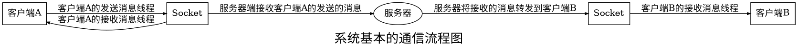

课程设计报告二：聊天室系统


# 课程设计要求与目的

## 目的：
编写一个小型Java聊天室系统，掌握Java网络通信、多线程、IO文件操作等高级应用编程技能。

## 要求：

以课本第15章 Java网络通信例15.3、15.4的源代码为基础，编写一个小型Java聊天室系统。

## 完成如下功能：

+ 多客户端模式下，实现任意已上线用户的单独通信，通信的信息（包括消息、文件数据）都经过服务器的中转；
+ 端到端的通信，任意客户端可以选定一个要聊天的对象，消息的发送、接收，文件的发送、接收都是并行处理，即一方的操作不取决于对方的状态，且任意客户端任何状态下都可以接收到其他人发送来的消息、文件，即使他未选择与任何人通信；
+ 整个聊天室的所有通信信息都封装为 ``gson`` 包装的 ``json`` 字符串，对于普通消息 ``message`` 类型的信息封装了发送者、接收者以及发送时间等信息；对于文件消息 ``file`` 类型的信息封装了除 ``message`` 的信息还包括文件的基本信息，如文件名、文件大小、已传送大小、当前传输的文件数据块以及是否传送完毕等信息，也用 ``gson`` 封装为 ``json`` 串；对于当前上线用户信息 ``accounts`` 类型的信息封装了所有的上线用户信息；
+ 文件传输以及普通消息的发送都是并行化的，即同时可以发送多个文件，发送文件的过程中可以发送消息，无须等待文件发送对方接收后才可以发送消息；
+ 简单的图形化界面（目前尚未全部完成）：简单的图像化界面使用 ``javafx`` GUI 包实现，同时相关的控件使用的是第三方包 [ ``JFoenix`` ](http://www.jfoenix.com/)， 因为一些原因当前只实现了发送消息、点击选择聊天对象等功能，其他功能后台实现但GUI未重绘；

# 系统设计

整个系统的设计从最初的课本上的示例程序开始，每一个版本的系统添加一些必要的功能，后一版本由上一版本继承，并继续添加功能。当前工程中 v1~v5都是已经全部实现对应的功能的版本，可以直接编译运行，基本的功能运行正常， v6版本添加一个简单的GUI，但是部分功能未实现；

## 设计原理与思想（Socket套接字通信原理，系统设计思想）

### 系统的基本通信原理：

整个系统的总的原理基于 Socket套接字的通信 ，任意一端（客户端、服务器端）之间的通信都是基于 Socket 的流来通信，这里的通信也就是两端的字符串之间的传送与接收；

最终的系统的通信原理：对于任意一个客户端，先与服务器建立一个 Socket 联系，然后客户端开启一个接收消息的线程，此时客户端可以在上线的状态下不管对方什么状态都可以接收到消息，并显示到自己的控制台（UI界面）下，之后客户端可以选择要与之通信的用户，具体的通信用户列表服务器会在每一个人上线时向所有人发送，当选择完毕后，客户端会根据 Socket 来与 服务器 建立一个发送消息的线程，服务器会由此前用户上线时建立的转发消息线程来接收并转发消息到要通信的用户，而对方的接收消息线程此时会获取到消息，进行显示消息的处理。




### 系统的消息封装

因为对于普通消息和文件的通信来说，本质上是字符串的通信，所以在通信上我们可以不管发送接收的内容是什么，即使他是一段文件的二进制数据，都可以转化成字符串来传送，而接收方在根据约定来进行相应的操作即可。

所以我的思路是将消息和文件数据都转化成一个json字符串，具体的形式如下：

```json
{
    "type": "message",                      //消息的类型，最后的系统消息有三种类型： message, file, account 分别表示普通消息、文件数据块、一上线的用户列表信息
    "fromAccountId": "804",                 //发送者的ID
    "fromAccountName": "149",               //发送者的昵称
    "toAccountId": "",                      //接收者的ID
    "toAccountName": "",                    //接收者的昵称
    "message": "Send own account's id",     //type=message时的具体消息
    "date": "Jun 14, 2019 11:44:53 AM",     //发送的时间
    "size": 512,                            //当为文件时传送文件的大小
    "nowLength": 0,                         //已经传送的文件的大小
    "totalLength": 0,                       //实际的文件的大小
    "flag": false                           //是否已经传送完毕
}
```

对于以上线的所有用户的列表json格式如下：

```json
{
    "type": "account",                      //表示这是一个AccountsList
    "accounts": [                           //一个Account数组，存有所有的用户的信息
        {
            "id": "790",
            "name": "362"
        },
        {
            "id": "639",
            "name": "943"
        },
        {
            "id": "818",
            "name": "545"
        }
    ]
}
```

java中生成json数据的第三方包有很多，[具体的介绍](http://www.json.org/json-zh.html)，，最后我选择了 Google 的 ``Gson`` 第三方包，，选择的原因是因为他可以将一个具体的 ``Message`` 类中的所有数据成员直接转化成一个json，，同时也以将一个json字符串转化成一个具体的类，这对于我的这个系统来说是很方便的。

### GUI的设计

虽然说GUI是Java的一个弱项，现在很多的应用、系统都向着 B/S 设计，但是学习Java的GUI设计对其他软件系统的设计，尤其是UI的设计有很大的帮助。

前期通过我的一些查阅了解到广为人知的两个JavaGUI设计包： ``AWT`` 和 ``Swing`` 因为很久不更新，已经是很过时的东西了，很多设计理念已经很现在软件的设计不同，近些年出现的另一个GUI包： ``JavaFX`` 较为符合现在的GUI的设计理念，而且也有很多的第三方控件库，例如我选择的 ``JFoenix`` 就是以MD质感设计为目标的一个控件库。

但是貌似受到大的潮流的影响， ``JavaFx`` 在国内的介绍、资料很少，，有很多的问题提出、解决的人的案例也很难寻找到，，但在国外，很多JavaGUI的设计都对 ``JavaFX`` 感兴趣，讨论的人很多，想着学习技术应该学习新的，所以尝试利用 ``JavaFx`` 来开发GUI。

因为自己对这一未曾涉足过的领域的估计不够，留给这块学习，开发的时间很少很少，，导致出现很多新手易出现的问题，尽管查找了很多的资料，边看文档边写，最后也没能完全的实现所有的GUI功能，（主要是非 ``JavaFx`` 线程下对UI的更新的操作没有实现，导致目前的成果是GUI不会自动的根据内容变化、重绘）。


## 总体设计（类与类的关系）

下列是分版本来介绍类间的关系：

### v1

这一版本主要是课本上的示例程序，共有三个类

+ MultiTalkServer.java      服务器类，实时监听某一个端口，用户上线开启一个线程，用来处理一个客户端
+ ServerThread.java         服务器线程，用来处理一个客户端的通信
+ TalkClient.java           客户端

### v2

+ Account.java              用户类，记录基本的用户的信息ID、Name等，同时可以将用户信息转化成一个字符串，并从一个字符串转化为一个用户对象，客户端、服务器端使用
+ getRandomAccountForTest.java 得到一个随机的用户对象，简化后续的测试过程
+ MultiTalkServer.java      服务器端类，存储每一个用户的信息以及socket到hashmap
+ ServerThread.java         服务器线程
+ TalkClient.java           客户端类

### v3

+ Account.java                      无变化，与上版本一致
+ getRandomAccountForTest.java      无变化，与上版本一致
+ MultiTalkServer.java              无变化，与上版本一致
+ reciveMessageThread.java          客户端的接收消息线程，实时接收任何人发来的消息
+ sendAndReciveOfServerThread.java  服务器端转发消息线程，每一个确定联系对象的客户端建立一个转发消息线程，用于转发消息
+ sendMessageThread.java            客户端发送消息线程，实时检测用户的输入，然后发送
+ ServerThread.java                 增加获取对方ID、开辟转发消息线程的功能
+ TalkClient.java                   增加开启接收信息线程、选择聊天对象并通知服务器以及控制发送消息线程功能


### v4

本版本添加文件传输的功能，但是当一个用户进行文件的发送时，他在文件没有传输完成时不能发送消息，对方在没有接收完消息时，不会接收到其他人发来的消息；

对于文件的操作：客户端A发送的文件会暂存到服务器端客户端A的相关文件夹，然后对于接收者，接收的文件将保存到自身的目录下，，以上的目录都是通过一个 文件操作 类来实现文件夹的创建，文件的读写等功能，具体的路径的设置由设置类实现；

+ Account.java                      与上版本相比，增加为当前用户创立个人文件夹的功能，路径由userGlobalSettingsInfos中的字段提供
+ fileSystemOperation.java          文件操作模块，实现文件夹的建立，文件信息的获取功能
+ getRandomAccountForTest.java      无变化
+ MultiTalkServer.java              无变化
+ reciveMessageThread.java          当接收文件时，进行文件的接收，存储到本地的功能
+ sendAndReciveOfServerThread.java  当转发文件时，先将客户端发送的文件全部保存到服务器本地，然后转发到接收的客户端
+ sendMessageThread.java            增加当发送文件时，读取文件，发送出去
+ serverGlobalSettingsInfos.java    服务器端的全局设置
+ ServerThread.java                 无变化
+ TalkClient.java                   无变化
+ userGlobalSettingsInfos.java      用户端的全局设置

### v5

本版本将字符串消息、文件转化为由Gson实现的Json字符串来传送，使得用一个接收端即可根据json中的值判断接收到的字符串是什么类型数据，实现文件数据和消息的并行的发送接收；

+ Account.java                      信息的转化改为json格式的字符串
+ fileSystemOperation.java          无变化
+ fileTransferThread.java           文件发送线程，用于多个文件间的并行发送，实现发送文件的同时可以发送消息，接收消息
+ getRandomAccountForTest.java      无变化
+ Message.java                      消息类，包含主要的普通消息，文件数据块等消息的保存，之后利用 gson 来转化成json，统一作为字符串传输，同时包括json转message的功能
+ MultiTalkServer.java              无变化
+ reciveMessageThread.java          将所有接收消息的字符串改为接收json字符串，然后根据具体的type值来进行不同的操作，对于文件类型的数据，将文件数据块追加到对应的文件后
+ sendAndReciveOfServerThread.java  服务器的转发消息线程，将所有的字符串的发送改为json字符串的发送接收，对于文件，开启一个文件传输的线程，保证并行传输文件，接收到客户端的所有文件后转发到另一客户端
+ sendMessageThread.java            客户端的转发消息线程，功能与服务器端的转发消息线程类似
+ serverGlobalSettingsInfos.java    无变化
+ ServerThread.java                 无变化
+ TalkClient.java                   将字符串改为json类型
+ userGlobalSettingsInfos.java      无变化

### v6

本版计划实现基本的GUI界面，GUI的实现用 ``JavaFx`` 来实现，将用户接收到的信息显示到文本域中，用户可以在文本框中输入要发送的信息后点击发送按钮实现消息的发送，点击发送文件按钮，用户可以选择文件，然后发送文件，用户可以点击左侧的 ``JFXListView`` 来实现不同用户间的聊天，用户可以点击退出按钮结束所有的聊天。

目前实现了用户在文本框中输入信息后点击发送按钮即可发送信息，点击刷新按钮可以刷新所有上线用户列表，点击对应的单元格可以选择与其聊天等功能；


+ Account.java                      无变化
+ accountMessage.java               以上线用户的列表信息
+ clientController.java             JavaFx下的界面控件的注册controller
+ clientScene.fxml                  JavaFxUI配置信息
+ clientStyle.css                   JavaFxUI的样式
+ communication.java                基本的通信操作
+ fileSystemOperation.java          无变化
+ fileTransferThread.java           无变化
+ getRandomAccountForTest.java      无变化
+ Message.java                      无变化
+ MultiTalkServer.java              无变化
+ reciveMessageThread.java          将标准输出到控制台到转化到UI上
+ sendAndReciveOfServerThread.java  无变化
+ sendMessageThread.java            将在控制台的标准输入转为JFXTextField上的输入信息
+ serverGlobalSettingsInfos.java    无变化
+ ServerThread.java                 无变化
+ TalkClient.java                   修改客户端的UI界面
+ userGlobalSettingsInfos.java      无变化

## 详细设计（单个类的设计，关键步骤或算法） 

### v1

基本的内容很简单，实现服务器和客户端之间的一人一句的通信

### v2

#### Account.java

实现每一个用户的基本信息，同时增加转化为字符串和从字符串转化为用户对象的功能：

此外，因为服务器端要用一个hashmap来存用户以及他申请的socket，所有 ``Account`` 类要重载 ``hashcode()`` 、 ``equals()``；

```java	
//以类作为hashmap的键时要重载 hashcode() 和 equals()
@Override
public int hashCode() {
    final int prime = 1007;
    int ret = 1;
    ret = prime * ret + id.hashCode();
    ret = prime * ret + name.hashCode();
    return ret;
}
        
@Override
public boolean equals(Object obj) {
    if(this == obj)
        return true;
    if(obj == null)
        return false;
    if(getClass() != obj.getClass())
        return false;
    Account otherAccount = (Account)obj;
    if(id == null) {
        if(otherAccount.id != null)
            return false;
    }
    else if(!id.equals(otherAccount.id))
        return false;
    
    if(name == null) {
        if(otherAccount.name != null)
            return false;
    }
    else if(!name.equals(otherAccount.name))
        return false;
    return true;
}
```

#### getRandomAccountForTest.java

随机出一个用户类

```java
public Account getARandomAccountForTest() {
		Random random = new Random();
		int id = random.nextInt(1000);
		int name = random.nextInt(1000);
		return new Account(Integer.toString(id), Integer.toString(name));
		//java中使用.toString() 会返回 "类型@字符串" 形式的值
		//return new Account((new Random()).toString(), (new Random()).toString());
	}
```

#### MultiTalkServer.java

遇上一版本相比，主要增加一个 ``hashmap`` 的插入键值、由键得值的方法

```java
static HashMap<Account, Socket> databaseMap = new HashMap<Account, Socket>();
	
	
    /**
    * @Title: putAccountIntoDB
    * @Description: TODO 将一个账户以及它当前的套接字作为键值保存到 hashMap 中
    * @param @param accountString	账户信息（用字符串表示）
    * @param @param socket    参数	套接字对象
    * @return void    返回类型
    * @throws
    */
    
public static void putAccountIntoDB(String accountString, Socket socket) {
    databaseMap.put(Account.conventStringToAccount(accountString), socket);		//将当前用户的账户的信息和他的套接字对应保存
}


    /**
    * @Title: getSocket
    * @Description: TODO 寻找到一个账户对象的套接字
    * @param @param theOtherClientString	账户字符串表示
    * @param @return    参数
    * @return Socket    返回类型
    * @throws
    */
    
public static Socket getSocket(String theOtherClientString) {
    return databaseMap.get(Account.conventStringToAccount(theOtherClientString));
}
```

#### ServerThread.java

基本无变化

#### TalkClient.java

基本无变化

### v3

#### Account.java

与上一版本基本一致

#### getRandomAccountForTest.java

与上一版本基本一致

#### MultiTalkServer.java

与上一版本基本一致

#### reciveMessageThread.java

接收消息线程，当客户端与服务器端建立联系时，开启一个一直接收消息并显示的线程，从服务器端的socket建立的接收流获取信息

主要设计为线程的 ``run()`` 方法的设计

```java
public void run() {
		Thread thisThread = Thread.currentThread();
		
		try {
			//由Socket对象得到输入流，并构造相应的BufferedReader对象
			BufferedReader is=new BufferedReader(new InputStreamReader(socket.getInputStream()));
			
			String readlineString = is.readLine();
			
			while(blinker == thisThread) {
				System.out.println(readlineString);
				readlineString = is.readLine();
			}
			
//			is.close();
			
		} catch (Exception e) {
			// TODO: handle exception
			System.out.println("Error: " + e);
		}
	}
```

#### sendAndReciveOfServerThread.java

服务器端转发消息的线程，当一个用户确定要联系的用户时，从 ``hashmap`` 中获取到双方的 ``socket`` ，记录下来，然后对客户端A建立一个输入流，实时读取客户端A发送的消息，对客户端B建立一个输出流，实时的将接收到的信息转发到客户端B，实现客户端A向客户端B任意的发送消息功能；

主要功能代码为 ``run()`` 方法的实现

```java
public void run() {
    Thread thisThread = this.currentThread();
    
    try {
        
        BufferedReader is1 = new BufferedReader(new InputStreamReader(clientASocket.getInputStream()));		//接收客户端A处的消息
        PrintWriter os2 = new PrintWriter(clientBSocket.getOutputStream());									//将接收的消息转发到B
        
        
        String readlineString = is1.readLine();
        while(blinker == thisThread) {
            os2.println("He said: " + readlineString);
            os2.flush();
            System.out.println("Client1 talk ot Client2: " + readlineString);
            if(readlineString.equals("bye")) {
                System.out.println("stoppppppppppppp");
                stopThisThread();
                break;
            }
            readlineString = is1.readLine();
        }
        
//因为流关闭会导致套接字的关闭，所以这里不管
//			is1.close();
//			os2.close();
//			clientASocket.close();
//			clientBSocket.close();
    } catch (Exception e) {
        // TODO: handle exception
        System.out.println("Erroe: " + e);
    }	
}
```

#### sendMessageThread.java

客户端的发送消息线程，当用户确定一个聊天的对象时，会向服务器建立一个一直发送消息的线程，将消息发送到服务器端，当输入 ``bye`` 时结束当前的聊天；

主要功能代码为 ``run()`` 方法的实现

```java
public void run() {
    Thread thisThread = Thread.currentThread();

    try {
        
        //由系统标准输入设备构造BufferedReader对象
        BufferedReader sin = new BufferedReader(new InputStreamReader(System.in));
        //由Socket对象得到输出流，并构造PrintWriter对象
        PrintWriter os = new PrintWriter(socket.getOutputStream());
        
        String readlineString = sin.readLine();
        
        while(blinker == thisThread) {
            os.println(readlineString);
            os.flush();
            System.out.println("You said: " + readlineString);
            if(readlineString.equals("bye")) {
                System.out.println("send Thread stop");
                stopThisThread();
                break;
            }
            readlineString = sin.readLine();
        }
        System.out.println("send thread stopped");
    //			os.close();
    //			sin.close();
        
    } catch (Exception e) {
        // TODO: handle exception
        System.out.println("Error: --" + e);
    }
    }
```

#### ServerThread.java

与上一版本相比，添加了建立转发消息线程的功能：先提示客户端A输入聊天对象，然后得到两个人的套接字，开启转发线程

主要代码实现是套接字的获取以及线程的建立：

```java
//根据昵称获取对方的套接字
socket2 = MultiTalkServer.getSocket(theOtherClientString);

//服务器与对方建立一个发消息的线程，用于将从用户收到的消息内容转发到另一用户
sendAndReciveOfServerThread clientASendMessageToClientB = new sendAndReciveOfServerThread(socket1, socket2);
clientASendMessageToClientB.start();
```

#### TalkClient.java

客户端与上一版本相比增加建立收发消息线程的过程

主要代码实现：

```java
os.println(account.conventAccountToString());	//像服务器传递自己的账户信息，记录到在线列表数据库
os.flush();


//创建收发消息两个线程，实现收发消息的任意性
reciveMessageThread recive = new reciveMessageThread(socket);
recive.start();

boolean clientIslogin = true;
while(clientIslogin) {

    String theOhterClientString;					//记录当前客户端想要与其通信的另一个客户端名称
    theOhterClientString = sin.readLine();

//				System.out.println("bbbbbbbbbbb" + theOhterClientString);
    os.println(theOhterClientString);				//向服务器请求与之通信的另一客户端
    os.flush();
    
    if(theOhterClientString.equals("exit")) {
        break;
    }
    
    sendMessageThread send = new sendMessageThread(socket);		//建立一个发送消息的线程，用于向另一个客户端发送消息
    send.start();

    
    Thread mainThread = Thread.currentThread();					//利用这个发送消息线程的flag使main线程暂停执行，即保证在通信的这段时间里一直为接发消息
    while(send.getFlag()) {
        mainThread.yield();
    }

    System.out.println("You have stopped communiating the other person");
}

//当前用户下线
recive.stopThisThread();		//停止接收消息
os.close();						//关闭各种流
is.close();						
sin.close();
//			System.out.println(23333);
socket.close();					//关闭套接字
```


### v4

#### Account.java

增加生成个人目录的功能：

```java
public void generateOwnDir(boolean userOrServer) {
    fileSystemOperation.mkdir_(id, userOrServer);
    if(!userOrServer) {
        System.out.println("\t\t\t<Server>");
    }
    System.out.println();
    System.out.println("User " + id + "'s dir has been mkdired!");
    if(userOrServer) {
        System.out.println("Now you can transfer and recive files in this dir!");
    }
    System.out.println();
}
```

#### fileSystemOperation.java

实现创建文件夹的功能

```java
public static boolean mkdir_(String fileNameString, boolean userOrServer){
    if(userOrServer) {
        fileNameString = userGlobalSettingsInfos.getUserDirString() + fileNameString;
    }
    else {
        fileNameString = serverGlobalSettingsInfos.getServerDirString() + fileNameString;
    }
    File dirFile = new File(fileNameString);
    if(!dirFile.exists()) {
        boolean flag = dirFile.mkdirs();
        if(flag) {
            System.out.println(fileNameString + ": has been mkdir!");
        }
        else {
            System.out.println(fileNameString + ": can't be mkdired!");
        }
        try {
            getInfo(dirFile);
        } catch (IOException e) {
            // TODO Auto-generated catch block
            e.printStackTrace();
        }
        return true;
    }
    else {
        System.out.println(fileNameString + ": has been existed! No need to mkdir it again");
        return false;
    }
}
```

实现得到文件信息的功能

```java
public static void getInfo(File f1) throws IOException {
    SimpleDateFormat sdf;
    sdf= new SimpleDateFormat("yyyy年MM月dd日hh时mm分");
    if (f1.isFile())
        System.out.println("<File>\t"+f1.getAbsolutePath()+"\t"+
            f1.length()+"\t"+sdf.format(new Date(f1.lastModified())));
    else
    {
        System.out.println("<Dir>\t"+f1.getAbsolutePath());
        File[] files = f1.listFiles();
        for (int i=0;i<files.length;i++)
            getInfo(files[i]);
    }
    }
```

#### getRandomAccountForTest.java

无变化

#### MultiTalkServer.java

无变化

#### reciveMessageThread.java

```java
//增加文件的接收
//当检测到文件传送时
if(readlineString.equals("<File>")) {
    System.out.println("File start");
    readlineString = is.readLine();								//得到文件名
//					System.out.println("id:" + MultiTalkServer.getAccount(socket).getId());
    System.out.println(readlineString);
                                                                //得到文件的绝对路径
    readlineString = userGlobalSettingsInfos.getUserDirString()
                    + TalkClient.account.getId() + "\\"
                    + readlineString;
    System.out.println(readlineString);
    
    File file2 = new File(readlineString);						//创建一个文件对象
    
    
    FileOutputStream wf = new FileOutputStream(file2);			//创建文件写入流
    DataInputStream dis = new DataInputStream(socket.getInputStream());	//创建文件接收流
    fileSystemOperation.getInfo(file2);
    
    long length = dis.readLong();								//得到文件大小
    long nowlength = 0;											//当前文件大小
    int count, n = userGlobalSettingsInfos.getUserBufferSize();
    byte buffer[] = new byte[n];
    System.out.println(length + ".......");
    while(nowlength < length) {
        count = dis.read(buffer, 0, n);
        nowlength += count;
        wf.write(buffer, 0, count);
        wf.flush();
        System.out.print(nowlength + " " + length + " ");
        System.out.println(nowlength * 100 / length);			//传输文件进度
    }
    wf.close();
    System.out.println("Tranfer done!");
}
```

#### sendAndReciveOfServerThread.java

增加文件的转发的功能：

```java
//增加文件的接收
//当检测到文件传输时：
if(readlineString.equals("<File>")) {
    readlineString = is1.readLine();													//读入对方文件的路径
    readlineString = readlineString.substring(readlineString.lastIndexOf("\\") + 1);	//得到文件名
    readlineString = serverGlobalSettingsInfos.getServerDirString()
                    + MultiTalkServer.getAccount(clientASocket).getId()
                    + "\\" + readlineString;											//得到服务器端保存的文件的绝对路径
    System.out.println(readlineString);													//显示得到的绝对路径
    File file2 = new File(readlineString);												//创建文件的对象
    FileOutputStream wf = new FileOutputStream(file2);									//创建文件的写入流
    DataInputStream dis1 = new DataInputStream(clientASocket.getInputStream());			//创建文件的接受数据流
    int n = serverGlobalSettingsInfos.getServerBufferSize(), count;																	//创建文件的缓冲区
    long length = dis1.readLong();														//读入文件的大小，当读入的数据大小等于此大小时，不再读入数据，转为读入消息
    long nowLength = 0;
    byte buffer[] = new byte[n];
//					readlineString = is1.readLine();
    fileSystemOperation.getInfo(file2);													//显示创建的文件的信息
    
    while(nowLength < length) {																//读入文件，并放到文件中，当当前读入的文件累计大小与传送前发送的值相等时便不再接收文件，认为文件接收完毕
        count = dis1.read(buffer, 0, n);												//得到一部分的文件，以及读入的大小
        wf.write(buffer, 0, count);														//写文件(当前写入的大小为count)
        wf.flush();
        nowLength += count;
//						System.out.print(new String(buffer));
        System.out.print(nowLength + " ");
        System.out.println(nowLength * 100 /length);
    }					
    System.out.println("tranfer done!");
    
    wf.close();																			//关闭文件写入流
//增加文件的发送					
FileInputStream rf = new FileInputStream(file2);									//打开刚才暂存的文件
DataOutputStream dos2 = new DataOutputStream(clientBSocket.getOutputStream());		//打开一个数据传输流

readlineString = readlineString.substring(readlineString.lastIndexOf("\\") + 1);	//传输文件名
os2.println(readlineString);
os2.flush();

dos2.writeLong(file2.length());														//传输文件大小
dos2.flush();

nowLength = 0;
while(nowLength < length) {															//传送文件
    count = rf.read(buffer, 0, n);
    nowLength += count;
    dos2.write(buffer, 0, count);
    dos2.flush();
}
wf.close();
rf.close();
System.out.println("File tranfer has done!");
}
```

#### sendMessageThread.java

增加文件的发送

```java
//增加文件传输
//当检测到时文件传输时
if(readlineString.equals("<File>")) {
    readlineString = sin.readLine();										//读入本地要传输的文件的路径（绝对路径）
    os.println(readlineString);												//发送到服务器端
    os.flush();
    File file1 = new File(readlineString);									//创建文件的对象
    fileSystemOperation.getInfo(file1);										//显示文件信息
    FileInputStream rf = new FileInputStream(file1);						//创建读入文件的流
    DataOutputStream dos = new DataOutputStream(socket.getOutputStream());	//创建经过socket的数据发送流
    int count, n = userGlobalSettingsInfos.getUserBufferSize();														//创建一个缓冲区
    byte buffer[] = new byte[n];
    
    System.out.println("File is tranfering...");
    
    //发送文件的大小，当对方读取到这个大小的数据之后就停止接收文件，如果直接关闭流的话，会导致socket的关闭，或者无法第二次进行传输
    dos.writeLong(file1.length());
    dos.flush();
    
    while((count = rf.read(buffer, 0, n)) != -1) {							//读取本地文件，发送，这里可以使用判断是否读到文件末来终止读入发送
        dos.write(buffer, 0, count);
        dos.flush();
//						System.out.println(new String(buffer));
        System.out.println(count);
    }
    
    System.out.println("File End");
//					dos.close();
//					socket.shutdownOutput();												//直接关闭发送流或者关闭所有发送流都无法完成需求
    rf.close();																//关闭问读入流（貌似这个关闭无影响？？）
}
```

#### serverGlobalSettingsInfos.java

服务器端的设置的设定，修改，主要字段有：

```java
static String serverDirString = "G:\\Backup\\CollegeProjectBackup\\javaChatRoom\\ChatRoom\\src\\v4\\serverData\\";
static int serverBufferSize = 2048;
```

#### ServerThread.java

无变化

#### TalkClient.java

无变化

#### userGlobalSettingsInfos.java

用户的设置，包括参数的设置，读取，更改

```java
static String usersDirString = "G:\\Backup\\CollegeProjectBackup\\javaChatRoom\\ChatRoom\\src\\v4\\userData\\";
static int userBufferSize = 2048;
```

### v5

#### Account.java

账户转化成字符串改为转化为json格式的字符串

```java
public void show() {
		System.out.println((new Gson()).toJson(this));
}
```

```java
public String conventAccountToString() {
		return (new Gson()).toJson(this);
}
```


#### fileSystemOperation.java

无变化

#### fileTransferThread.java

文件的发送线程，不断的读文件，打包数据块发送，因为数据的读入是字节流，而最后所有的发送字符串都是字符流，所以为了最后文件的存储的正确，所以要以单字节的方式转为字符串，然后打包，，主要的 ``run()`` 的实现：

```java
public void run() {
    Thread thisThread = Thread.currentThread();
    
    try {
        
        DataOutputStream dos = new DataOutputStream(socket.getOutputStream());
//			PrintWriter os = new PrintWriter(socket.getOutputStream());
        FileInputStream rf = new FileInputStream(file);
        
        System.out.println("Now it is starting fileTransferThread");
        fileSystemOperation.getInfo(file);
        
        while(blinker == thisThread) {
            
            nowLength = 0;
            while(nowLength < length) {
                
                System.out.println("Now it is sending the file: " + fileName);
                
                //获取一个数据块
                count = rf.read(buffer, 0, n);
                nowLength += count;
                
//					os.println((new Message(accountA.getId(), accountA.getName(), accountB.getId(), accountB.getName(), date, fileName, count, nowLength, length, (new String(buffer, userGlobalSettingsInfos.getEncoding())))).getJsonOfMessage());
//					os.flush();
//					dos.writeUTF((new Message(accountA.getId(), accountA.getName(), accountB.getId(), accountB.getName(), date, fileName, count, nowLength, length, (new String(buffer, userGlobalSettingsInfos.getEncoding())))).getJsonOfMessage());
//					dos.flush();
                
                //先对数据块转化成单字节的字符串类型，然后以UTF编码的json报文串发送此次的数据块，接收者再转化成单字节的byte[]字节数组，即可追加到文件末
                dos.writeUTF((new Message(accountA.getId(), accountA.getName(), accountB.getId(), accountB.getName(), date, fileName, count, nowLength, length, (new String(buffer, "ISO-8859-1"))).getJsonOfMessage()));
                dos.flush();
            }
            System.out.println(fileName + " has sent");
            rf.close();	
            stopThisThread();
        }
        
        
        
    } catch (Exception e) {
        // TODO: handle exception
        System.out.println("Error in fileTransferThread: " + e);
    }
}
```

#### getRandomAccountForTest.java

无更改

#### Message.java

所有消息的类，存储所有消息信息，以type的值来分辨具体存储的信息，同时包括发送者、接收者的信息、日期等，对于文件，存储文件的基本信息：文件大小、文件名、以传送文件大小，是否传输完毕等信息；

```java
public class Message {
	private String type = "message";			//报文的类型，"message"表示一般的消息类型，"file"表示文件传输的一个数据块
	private String fromAccountId = "000";		//发送者的ID
	private String fromAccountName = null;		//发送者的昵称
	private String toAccountId = "000";			//接收者的ID
	private String toAccountName = null;		//接收者的昵称
	private String message = "";				//消息报文的数据，即发送的消息内容
	private Date date = null;					//发送时的时间信息
	
	private String fileName = null;				//文件名
	private int size = 512;						//当前报文中包含的文件数据量
	private long nowLength = 0;					//当前文件已经传输的大小
	private long totalLength = 0;				//当前文件的原始大小
	private boolean flag = false;				//当前文件是否传送完毕
	private String data = null;					//当前文件的一个传输数据块
		    
	
	    /**
	     * 创建一个新的实例 Message.
	     *
	     * @param fromAccountId		消息的发送者的ID
	     * @param fromAccountName	消息的发送者的昵称
	     * @param toAccountId		消息的接收者的ID
	     * @param toAccountName		消息的接收者的昵称
	     * @param message			消息的内容
	     */
	    
	public Message(String fromAccountId, String fromAccountName, String toAccountId, String toAccountName, String message) {
		this.type = "message";
		this.fromAccountId = fromAccountId;
		this.fromAccountName = fromAccountName;
		this.toAccountId = toAccountId;
		this.toAccountName = toAccountName;
		this.message = message;
		this.date = new Date();
	}
	
	    /**
	     * 创建一个仅为文件的报文，在对文件用byte[]取出数据后，要将其编码转换成ISO-8859-1的字符串，这样才能拼接到文件末尾，保证传输的文件的完整
	     * 具体的流程如下：
	     * buffer 是从文件中获取的一个带传送的数据块
	     * (new String(buffer, "ISO-8859-1)即可以单字节的形式转换成字符串
	     * 然后和message组合编码为UTF型的报文
	     * 接收方通过UTF形式获取报文后，可以通过获取"data"字段的字符串并转换成“ISO-8859-1"的byte[]后拼接到文件末即可
	     * eg: wf.write(jsonObject.get("data").getAsString().getBytes("ISO-8859-1"), 0, n);
	     *
	     * @param fromAccountId			发送者的ID
	     * @param toAccountId			接收者的ID
	     * @param fileName				传输的文件名
	     * @param bufferSize			传输的缓冲区
	     * @param nowLength				传输的当前大小
	     * @param totalLength			文件的总大小
	     * @param data					传输的文件的数据块
	     */
	    
	public Message(String fromAccountId, String fromAccountName, String toAccountId, String toAccountName, Date date, String fileName, int size, long nowLength, long totalLength, String data) {
		// TODO Auto-generated constructor stub
		this(fromAccountId, fromAccountName, toAccountId, toAccountName, "");		//构造器调用另一个重载的构造器必须在第一行
		this.date = date;
		this.type = "file";
		
		this.fileName = fileName;
		this.size = size;
		this.nowLength = nowLength;
		this.totalLength = totalLength;
		this.data = data;
		
		if(nowLength < totalLength) {
			flag = false;
		}
		else {
			flag = true;
		}
	}
	

		/**
	    * @Title: getJsonOfMessage
	    * @Description: TODO 获取一个message类的json字符串，默认为UTF-8编码
	    * @param @return    参数
	    * @return String    返回类型
	    * @throws
	    */
	    
	public String getJsonOfMessage() {
		return (new Gson()).toJson(this);
	}
}
```

#### MultiTalkServer.java

无变化

#### reciveMessageThread.java

通过接收到的json字符串中的信息，判断接收到的消息的类型，对于消息类型直接输出，对于文件信息，将文件数据块追加到文件末。对于文件的数据块要转码后再追加，保证最后的文件数据的正确。

主要的实现是 ``run()``:

```java
public void run() {
    Thread thisThread = Thread.currentThread();
    
    try {
        //由Socket对象得到输入流，并构造相应的BufferedReader对象
        BufferedReader is = new BufferedReader(new InputStreamReader(socket.getInputStream()));
        
        DataInputStream dis = new DataInputStream(socket.getInputStream());
        String readlineString;
        
        while(blinker == thisThread) {
            
            //以UTF的形式获取一条报文
            readlineString = dis.readUTF();

            //创建一个jsonObject的对象，用于获取报文中的信息
            JsonObject jsonObject = (JsonObject) new JsonParser().parse(readlineString);
            
//				System.out.println(jsonObject.get("message").getAsString());
            
            //当当前报文是普通的消息时
            if(jsonObject.get("type").getAsString().equals("message")) {
                //本地显示对方发来的信息
                System.out.println(jsonObject.get("date").getAsString() + "\t" + jsonObject.get("fromAccountId").getAsString() + "-" + jsonObject.get("fromAccountName").getAsString() + " said: " + jsonObject.get("message").getAsString());
            }
            else {
                //当当前报文是一个文件传输的数据报文时
                //本地创建一个文件对象
                File file = new File(userGlobalSettingsInfos.getUserDirString() + TalkClient.account.getId() + "\\" + jsonObject.get("fileName").getAsString());
                //创建一个文件输出流
                FileOutputStream wf = new FileOutputStream(file, true);
                //获取当前数据块的大小
                int n = jsonObject.get("size").getAsInt();
                
                
//					wf.write(jsonObject.get("data").getAsString().getBytes(userGlobalSettingsInfos.getEncoding()), 0, n);
//					wf.write(jsonObject.get("data").getAsString().getBytes(), 0, n);
                
                //将数据块转码，获得byte[]类型的数据，写入文件
                wf.write(jsonObject.get("data").getAsString().getBytes("ISO-8859-1"), 0, n);
                wf.flush();
                wf.close();
                System.out.println("recive file");
            }
            
        }
        
        is.close();
        dis.close();
        
    } catch (Exception e) {
        // TODO: handle exception
        System.out.println("Error: " + e);
    }
}
```

#### sendAndReciveOfServerThread.java

服务器端的转发消息功能，基本的逻辑执行过程与上一版本的相同，在检测到接收到的字符串是文件类型时，会首先写到本地，然后当检测到文件传输完毕时，开启一个服务器到另一个客户端的传送文件线程；

```java

			
DataInputStream dis = new DataInputStream(clientASocket.getInputStream());
DataOutputStream dos = new DataOutputStream(clientBSocket.getOutputStream());


String readlineString;
while(blinker == thisThread) {
    

    //使用UTF编码的形式获取一条报文信息
    readlineString = dis.readUTF();
//				System.out.println(readlineString);
    
//				readlineString = new String(readlineByte, "UTF8");
    
    
    //将字符串形式的报文转换成json类型的实例对象，用于之后的不同key的value获取
    JsonObject jsonObject = (JsonObject) new JsonParser().parse(readlineString);
    
    
    //当当前报文是普通的消息时
    if(jsonObject.get("type").getAsString().equals("message")) {
        

        //将这条报文发送到另一个客户端
        dos.writeUTF(readlineString);
        dos.flush();
            
        //服务器端显示通信的记录，此处可以将记录保存到数据库
        System.out.println(jsonObject.get("date").getAsString() + " " + jsonObject.get("fromAccountId").getAsString() + "said to " + jsonObject.get("toAccountId").getAsString() + ": " + jsonObject.get("message").getAsString());
        
        //当发现一个用户不再和另一个用户聊天时，断开这一个线程
        if(jsonObject.get("message").getAsString().equals("bye")) {
            System.out.println("stop send and recive thread");
            stopThisThread();
            break;
        }
    }
    else {	//当当前报文是文件传输的报文时
        
        //创建一个在服务器端下的文件，暂存文件
        File file = new File(serverGlobalSettingsInfos.getServerDirString() + accountA.getId() + "\\" + jsonObject.get("fileName").getAsString());
        //打印文件的绝对路径
        System.out.println(serverGlobalSettingsInfos.getServerDirString() + accountA.getId() + "\\" + jsonObject.get("fileName").getAsString());
        //创建一个文件的输出流，true表示写入的方式是在文件末追加数据
        FileOutputStream wf = new FileOutputStream(file, true);
        //由报文获取到当前报文中传输的文件数据的大小，用于之后文件的写入的大小
        int n = jsonObject.get("size").getAsInt();
        
        
        System.out.println(n);
        
        
        //将报文中的数据转码为ISO-8859-1的字节数组，然后写入文件
        wf.write(jsonObject.get("data").getAsString().getBytes("ISO-8859-1"), 0, n);
        wf.flush();
        wf.close();
        System.out.println("now has recived: " + jsonObject.get("nowLength").getAsLong() + " " + jsonObject.get("nowLength").getAsLong() * 100 / jsonObject.get("totalLength").getAsLong());
        
        //如果服务器端已经接收到了全部的文件，开启一个由服务器端传送到另一个客户端文件的传输文件的线程
        if(jsonObject.get("flag").getAsBoolean()) {
            System.out.println("Parpering to send file to client b");
            (new fileTransferThread(accountA, accountB, clientBSocket, serverGlobalSettingsInfos.getServerDirString() + accountA.getId() + "\\" + jsonObject.get("fileName").getAsString())).start();
        }
    }
}
```

#### sendMessageThread.java

客户端发送文件、消息的线程，当检测到发送文件时，建立一个发送文件的线程；

```java
if(readlineString.equals("<File>")) {
    readlineString = sin.readLine();										//获取要传输的文件的绝对路径
    System.out.println("The file that will be sent is: " + readlineString);	//打印要传输的文件的绝对路径
    (new fileTransferThread(TalkClient.account, TalkClient.theOtherAccount, socket, readlineString)).start();	//开启一个文件传输的线程
}
```

#### serverGlobalSettingsInfos.java

无变化

#### ServerThread.java

将发送的消息包装为json，然后以UTF-8的编码发送

```java
dos.writeUTF((new Message("", "Server", accountA.getId(), accountA.getName(), "You logged in!")).getJsonOfMessage());
dos.flush();
```
#### TalkClient.java

除字符串的形式改为json外，无变化

#### userGlobalSettingsInfos.java

无变化

### v6


#### Account.java

无更改

#### accountMessage.java

增加一个存储所有用户信息列表信息，当有新用户上线时，服务器向所有人发送列表信息，用户可以点击刷新后刷新在线用户列表，此类实现对列表向json消息的转化，以及json向类的转化（利用Gson）

基本的实现：

```java
package v6;

import java.util.List;

import com.google.gson.Gson;

public class accountMessage {
	@SuppressWarnings("unused")
	private final String type = "account";
	private List<Account> accounts;
	public accountMessage(List<Account> accounts) {
		// TODO Auto-generated constructor stub
		this.accounts = accounts;
	}
	
	    
	
	    /**
	    * @Title: getAccountMessageJson
	    * @Description: TODO 从一个accountMessage实例得到一个json
	    * @param @return    参数
	    * @return String    返回类型
	    * @throws
	    */
	    
	public String getAccountMessageJson() {
		return (new Gson()).toJson(this);
	}
	
	    /**
	    * @Title: getAccountsFromJosn
	    * @Description: TODO 从一个accountMessage的json 中获取所有的accounts
	    * @param @param json
	    * @param @return    参数
	    * @return List<Account>    返回类型
	    * @throws
	    */
	    
	public static List<Account> getAccountsFromJosn(String json) {
		return (new Gson().fromJson(json, accountMessage.class)).accounts;
	}
}

```


#### clientController.java

JavaFx的控制器的实现，UI上的控件的事件的处理在此完成，目前只实现点击按钮发送信息，文本框中写入消息、刷新上线用户列表、点击于其聊天的功能。其他功能后台基本实现，但因为没有解决 **非JavaFxUI线程下对UI的更新操作** ，故UI不会显示具体的数据的变化，但控制台可以看到数据的显示。

主要的方法功能与实现：

##### 发送按钮按下事件实现：

当按下发送按钮后，判断文本框中的信息是否为空，不为空的情况下发送消息

```java
public void clickSendMessageButton(ActionEvent event) {
    System.out.println("sendButton clicked");
    String yourMessage = sendTextField.getText();
    System.out.println("You said: " + yourMessage);
    if(!yourMessage.isEmpty()) {
        while(!(new communication().sendMessage(yourMessage, TalkClient.socket, TalkClient.account, TalkClient.theOtherAccount))) {
            continue;
        }
        sendTextField.clear();
        //TODO:此时要在上方的文本框中回显用户输入的信息，以及一些辅助信息，，时间等等
        reciveTextArea.setStyle("-fx-font-size: 16");	//设置字号
        reciveTextArea.setStyle("-fx-text-fill:pink");	//设置颜色
        reciveTextArea.appendText("You: \"" + TalkClient.account.getId() + "-" + TalkClient.account.getName() + "\" at Time: " + (new Date()) + " said: \n");
        reciveTextArea.appendText(yourMessage + "\n");
        
    }
    
    System.out.println("button clicked!");
    sendTextField.setText("23333333");
}
```

##### 上线人员列表

最终的UI左侧会显示上线用户，用户在等待选择聊天对象时，点击一个人员的单元格，会自动建立与其的聊天，此处实现单元格的点击事件

```java
//点击时的事件
accountListview.getSelectionModel().selectedItemProperty().addListener(
        (ObservableValue<? extends Account> ov, Account old_val,
                Account new_val) -> {
            if(new_val == null) {
                otherAccountLabel.setText("找个人聊天吧.....");
                return;
            }
            otherAccountName = new_val.getName();
//					otherAccountLabel.setText("正在和\"" + otherAccountName + "\"聊天");
            TalkClient.theOtherAccount = new_val;
            System.out.println("chat with " + new_val.getId() + new_val.getName());
            while(!(new communication().sendChatWithOtherAccountId(new_val, TalkClient.socket))) {
                continue;
            }
        }
);
```

##### 刷新用户列表

点击刷新按钮后会刷新当前的上线用户列表，（此处原本是想着实时刷新但是找到的各种非JavaFx线程更新都不起作用，所以改为了用户手动刷新列表的功能）

```java
public void clickRefreshAccountsListButton(ActionEvent event) {
    Platform.runLater(new Runnable() {
        
        @Override
        public void run() {
            // TODO Auto-generated method stub
            //清楚accountsListView控件的焦点
            accountListview.getSelectionModel().clearSelection();
            
            System.out.println(acc.get(0).getId() + "******" + acc.get(0).getName());
//				accountListview.setItems(null);
            accountListview.getItems().clear();
//				accountListview.setItems(acc);
//				accountListview.refresh();
            accountListview.getItems().addAll(acc);
            System.out.println("call done");
        }
    });
    
    
    //点击时的事件
    accountListview.getSelectionModel().selectedItemProperty().addListener(
            (ObservableValue<? extends Account> ov, Account old_val,
                    Account new_val) -> {
                if(new_val == null) {
                    otherAccountLabel.setText("找个人聊天吧.....");
                    return;
                }
                otherAccountName = new_val.getName();
//					otherAccountLabel.setText("正在和\"" + otherAccountName + "\"聊天");
                TalkClient.theOtherAccount = new_val;
                System.out.println("chat with " + new_val.getId() + new_val.getName());
                while(!(new communication().sendChatWithOtherAccountId(new_val, TalkClient.socket))) {
                    continue;
                }
            }
    );
}
```


#### communication.java

实现发送消息、文件或者用户列表的功能

```java
public boolean sendMessage(String sendMessage, Socket socket, Account accountA, Account accountB) {
		
    try {
        
        DataOutputStream dos = new DataOutputStream(socket.getOutputStream());
        //将用户输入的消息内容转换成报文，并使用UTF编码的报文传输
        dos.writeUTF((new Message(accountA.getId(), accountA.getName(), accountB.getId(), accountB.getName(), (new String(sendMessage.getBytes("UTF-8"), "UTF-8")))).getJsonOfMessage());
        dos.flush();
        
        
    } catch (Exception e) {
        // TODO: handle exception
        System.out.println("Error in sendMessage: " + e);
        
        return false;
    }
            
    return true;
}

public boolean sendChatWithOtherAccountId(Account theOtherAccount, Socket socket) {
    try {
        DataOutputStream dos = new DataOutputStream(socket.getOutputStream());
        dos.writeUTF(theOtherAccount.conventAccountToString());
        return true;
    } catch (Exception e) {
        // TODO: handle exception
        System.out.println("Error in sendChatWithOtherAccountId: " + e);
        return false;
    }
}
```

#### TalkClient.java

客户端UI的实现，，最要是系统通信环境的初始化，界面的绘制

界面的实现；

```java
@Override
public void start(Stage primaryStage) {
    
    initTalkClient();
    System.out.println("initTalkClient run...");
    try {
        //读取fxml文件
        Parent root = FXMLLoader.load(getClass().getResource("/v6/clientScene.fxml"));

        //窗口的标题
        primaryStage.setTitle("TalkClient");
        
        //主窗口加载的场景，场景里面的描述文件
        primaryStage.setScene(new Scene(root));
        
        primaryStage.setResizable(false);
        
        
        //最后就是show time
        primaryStage.show();
    } catch(Exception e) {
        e.printStackTrace();
    }
}
```

# 系统测试


### v1

因为是一人一句通信（与服务器），所以先客户端发送一段文字，服务器接收到后显示，然后服务器端发送一段文字，客户端收到，显示，如此往复


```text
预期输入输出：
client: test
server: Client:test
server: test1
client: Server:test1
```

测试结果相符

### v2

此时可以任意两人间通信，但两客户端间的通信仍为一人一句模式：

```text
clientA:

982-79
Server: You are now logging in!
Server: Input the id that you wanna talk to...
876-465
adsf
Client: adsf
Server: afdff
fdsafsfadsfasf
Client: fdsafsfadsfasf
Server: asdfdsf
adsfafas
Client: adsfafas
Server: adsfasdfdas


server:

Client1 talk to Client2: adsf
Client1 talk to Client2: adsf
Client1 talk to Client2: afdff
Client1 talk to Client2: afdff
Client 2 talk to Client1: fdsafsfadsfasf
Client 2 talk to Client1: asdfdsf
Client1 talk to Client2: adsfasdfdas
Client1 talk to Client2: adsfafas


clientB

876-465
Server: You are now logging in!
Server: Input the id that you wanna talk to...
982-79
afdff
Client: afdff
Server: adsf
asdfdsf
Client: asdfdsf
Server: fdsafsfadsfasf
adsfasdfdas
Client: adsfasdfdas
Server: adsfafas
```

输入输出结果与预期相符


### v3

先启动服务器端，然后启动两个以上的客户端，此时会显示客户端获得的随机用户和其他提示信息，然后对于任意一个客户端输入对方的ID-对方的呢称，建立通信，此后发送的消息对方可以接收到，，对于其他用户发送来的消息也会显示出来：

```text

clientA:

174-967
Server: You logged in!
			<Tips>: 
Server: Input the id that you wanna talk to..
Or "exit" if you wanna to exit
596-556
akldfj
You said: akldfj
ajkdlf
You said: ajkdlfa'j'k'd'l'faajkdlf
akldf
You said: 'j'k'd'la'j'k'da'j'ka'jaakldf
lfkjd;a
You said: lfkjd;a

You said: 
bye
You said: bye
send Thread stop
send thread stopped
You have stopped communiating the other person
			<Tips>: 
Server: Input the id that you wanna talk to..
Or "exit" if you wanna to exit
exit
Error: java.net.SocketException: Socket closed


server:

596-556------
Client1 talk ot Client2: akldfj
Client1 talk ot Client2: ajkdlfa'j'k'd'l'faajkdlf
Client1 talk ot Client2: 'j'k'd'la'j'k'da'j'ka'jaakldf
Client1 talk ot Client2: lfkjd;a
Client1 talk ot Client2: 
Client1 talk ot Client2: bye
stoppppppppppppp
client1 stoped
exit------

clientB:

596-556
Server: You logged in!
			<Tips>: 
Server: Input the id that you wanna talk to..
Or "exit" if you wanna to exit
He said: akldfj
He said: ajkdlfa'j'k'd'l'faajkdlf
He said: 'j'k'd'la'j'k'da'j'ka'jaakldf
He said: lfkjd;a
He said: 
He said: bye
```

输入输出结果与预期相符

### v4
具体的启动与上一版本一致，增加文件传输的测试，预期输入 ``<File>`` 以及 文件的绝对路径后，发送文件，服务器接收，然后发送到接收者端并保存

```text
clientA:

G:\Backup\CollegeProjectBackup\javaChatRoom\ChatRoom\src\v4\userData\944: has been mkdir!
<Dir>	G:\Backup\CollegeProjectBackup\javaChatRoom\ChatRoom\src\v4\userData\944

User 944's dir has been mkdired!
Now you can transfer and recive files in this dir!

944-255
He said: Server: You logged in!
He said: 
He said: 			<Tips>: 
He said: 
He said: Server: Input the id that you wanna talk to..
He said: Or "exit" if you wanna to exit
302-276
You said: asjdlflas;
You said: dsjlfk
You said: ajsdlkf;
You said: <File>
g:\pic.cpp
<File>	g:\pic.cpp	885	2019年02月25日10时30分
File is tranfering...
885
File End
You said: 

server:
G:\Backup\CollegeProjectBackup\javaChatRoom\ChatRoom\src\v4\serverData\: has been mkdir!
<Dir>	G:\Backup\CollegeProjectBackup\javaChatRoom\ChatRoom\src\v4\serverData
G:\Backup\CollegeProjectBackup\javaChatRoom\ChatRoom\src\v4\serverData\302: has been mkdir!
<Dir>	G:\Backup\CollegeProjectBackup\javaChatRoom\ChatRoom\src\v4\serverData\302
			<Server>

User 302's dir has been mkdired!

G:\Backup\CollegeProjectBackup\javaChatRoom\ChatRoom\src\v4\serverData\944: has been mkdir!
<Dir>	G:\Backup\CollegeProjectBackup\javaChatRoom\ChatRoom\src\v4\serverData\944
			<Server>

User 944's dir has been mkdired!

302-276------
G:\Backup\CollegeProjectBackup\javaChatRoom\ChatRoom\src\v4\serverData\302: has been existed! No need to mkdir it again
			<Server>

User 302's dir has been mkdired!

Client1 talk ot Client2: asjdlflas;
Client1 talk ot Client2: dsjlfk
Client1 talk ot Client2: ajsdlkf;
Client1 talk ot Client2: <File>
2
G:\Backup\CollegeProjectBackup\javaChatRoom\ChatRoom\src\v4\serverData\944\pic.cpp
<File>	G:\Backup\CollegeProjectBackup\javaChatRoom\ChatRoom\src\v4\serverData\944\pic.cpp	0	2019年06月14日02时38分
885 100
tranfer done!
File tranfer has done!


clientB:

G:\Backup\CollegeProjectBackup\javaChatRoom\ChatRoom\src\v4\userData\302: has been mkdir!
<Dir>	G:\Backup\CollegeProjectBackup\javaChatRoom\ChatRoom\src\v4\userData\302

User 302's dir has been mkdired!
Now you can transfer and recive files in this dir!

302-276
He said: Server: You logged in!
He said: 
He said: 			<Tips>: 
He said: 
He said: Server: Input the id that you wanna talk to..
He said: Or "exit" if you wanna to exit
He said: asjdlflas;
He said: dsjlfk
He said: ajsdlkf;
He said: <File>
File start
pic.cpp
G:\Backup\CollegeProjectBackup\javaChatRoom\ChatRoom\src\v4\userData\302\pic.cpp
<File>	G:\Backup\CollegeProjectBackup\javaChatRoom\ChatRoom\src\v4\userData\302\pic.cpp	0	2019年06月14日02时38分
885.......
885 885 100
Tranfer done!

```

输入输出结果与预期相符

### v5

输入格式由上一版本的普通字符串改为json格式的字符串即可，其余的输入输出与上版本保持一致：

```text
clientA:

G:\Backup\CollegeProjectBackup\javaChatRoom\ChatRoom\src\v5\userData\131: has been mkdir!
<Dir>	G:\Backup\CollegeProjectBackup\javaChatRoom\ChatRoom\src\v5\userData\131

User 131's dir has been mkdired!
Now you can transfer and recive files in this dir!

{"id":"131","name":"221"}
{"type":"message","fromAccountId":"131","fromAccountName":"221","toAccountId":"","toAccountName":"","message":"Send own account\u0027s id","date":"Jun 14, 2019 2:55:20 PM","size":512,"nowLength":0,"totalLength":0,"flag":false}
Jun 14, 2019 2:55:20 PM	-Server said: You logged in!
Jun 14, 2019 2:55:20 PM	-Server said: 
			<Tips>: 

Server: Input the id that you wanna talk to..
Or "exit" if you wanna to exit
{"id":"203","name":"963"}
{"id":"203","name":"963"}
203 963
send the other client json: {"id":"203","name":"963"}
You said: sdffafa
You said: <File>
g:\pic.cpp
The file that will be sent is: g:\pic.cpp
fileTransferThread constructoring: g:\pic.cpp
The file's length is: 885
You said: Now it is starting fileTransferThread
<File>	g:\pic.cpp	885	2019年02月25日10时30分
Now it is sending the file: pic.cpp
pic.cpp has sent
bye
send Thread stop
send thread stopped
You have stopped communiating the other person
Jun 14, 2019 2:55:45 PM	-Server said: 
			<Tips>: 

Server: Input the id that you wanna talk to..
Or "exit" if you wanna to exit
exit
Error: java.net.SocketException: Socket closed


server:

G:\Backup\CollegeProjectBackup\javaChatRoom\ChatRoom\src\v5\serverData\: has been mkdir!
<Dir>	G:\Backup\CollegeProjectBackup\javaChatRoom\ChatRoom\src\v5\serverData
{"id":"203","name":"963"}
conventStringToAccount
{"id":"203","name":"963"}
203 963
G:\Backup\CollegeProjectBackup\javaChatRoom\ChatRoom\src\v5\serverData\203: has been mkdir!
<Dir>	G:\Backup\CollegeProjectBackup\javaChatRoom\ChatRoom\src\v5\serverData\203
			<Server>

User 203's dir has been mkdired!

{"id":"131","name":"221"}
conventStringToAccount
{"id":"131","name":"221"}
131 221
G:\Backup\CollegeProjectBackup\javaChatRoom\ChatRoom\src\v5\serverData\131: has been mkdir!
<Dir>	G:\Backup\CollegeProjectBackup\javaChatRoom\ChatRoom\src\v5\serverData\131
			<Server>

User 131's dir has been mkdired!

the other client's json is: {"id":"203","name":"963"}
conventStringToAccount
{"id":"203","name":"963"}
203 963
G:\Backup\CollegeProjectBackup\javaChatRoom\ChatRoom\src\v5\serverData\203: has been existed! No need to mkdir it again
			<Server>

User 203's dir has been mkdired!

Jun 14, 2019 2:55:34 PM 131said to 203: sdffafa
G:\Backup\CollegeProjectBackup\javaChatRoom\ChatRoom\src\v5\serverData\131\pic.cpp
885
now has recived: 885 100
Parpering to send file to client b
fileTransferThread constructoring: G:\Backup\CollegeProjectBackup\javaChatRoom\ChatRoom\src\v5\serverData\131\pic.cpp
The file's length is: 885
Now it is starting fileTransferThread
<File>	G:\Backup\CollegeProjectBackup\javaChatRoom\ChatRoom\src\v5\serverData\131\pic.cpp	885	2019年06月14日02时55分
Now it is sending the file: pic.cpp
pic.cpp has sent
Jun 14, 2019 2:55:45 PM 131said to 203: bye
stop send and recive thread
client1 stoped
Error:java.io.EOFException

clientB:

G:\Backup\CollegeProjectBackup\javaChatRoom\ChatRoom\src\v5\userData\203: has been mkdir!
<Dir>	G:\Backup\CollegeProjectBackup\javaChatRoom\ChatRoom\src\v5\userData\203

User 203's dir has been mkdired!
Now you can transfer and recive files in this dir!

{"id":"203","name":"963"}
{"type":"message","fromAccountId":"203","fromAccountName":"963","toAccountId":"","toAccountName":"","message":"Send own account\u0027s id","date":"Jun 14, 2019 2:55:20 PM","size":512,"nowLength":0,"totalLength":0,"flag":false}
Jun 14, 2019 2:55:20 PM	-Server said: You logged in!
Jun 14, 2019 2:55:20 PM	-Server said: 
			<Tips>: 

Server: Input the id that you wanna talk to..
Or "exit" if you wanna to exit
Jun 14, 2019 2:55:34 PM	131-221 said: sdffafa
recive file
Jun 14, 2019 2:55:45 PM	131-221 said: bye

```

输入输出结果与预期相符

### v6

登陆时：


刷新后：


输入输出结果与预期相符


# 课程设计总结

对所做工作的总体总结：包括最终实现了哪些系统功能，使用了哪些Java编程技术、课程设计过程中遇到的问题、问题的解决以及收获


最终聊天室实现了基本要求的功能，任意客户端之间的端到端的不受限制的通信，文件的传输，同时文件的传输实现多文件的并行传输与消息的并行发送，即文件的发送过程中仍然可以发送接收消息，对于GUI实现了部分功能，还有一些功能因为尚未解决的bug没有很好的实现。

此时聊天室系统用到的Java编程技术有：基于Socket的网络通信、多线程的实现、Java下对文件的操作、ecplise中导入第三方jar包、使用Google的Gson实现json存储的消息的编解码、JavaFx的GUI的编写等Java编程技术。

在设计系统过程中遇到的问题：

+ 文件夹的递归创建： 开始我只看到了 ``makdir()`` 方法，它是直接创建文件的一个方法，，但是没有看到递归创建文件夹的方法，后来才看到还有 ``madirs()`` 方法，ecplise的自动补全虽然好用，但是不能过度依赖，后者会补全出不是自己要用的方法。
+ json的实现：因为要实现文件传输、消息收发的并行化，所以想着将所有的信息都看作字符串来传送，由接收端来判断收到的字符串的含义，所以在查阅了相关资料后选择Gson来实现json的生成、编解码，通过这个我学会了Java工程中导入使用第三方jar包的方法。
+ JavaFx下更新UI的问题：之前看到过JavaFx是一个新兴的GUI技术，正在取代Swing，但是国内的相关的讨论不是很多，遇到的很多问题只能去国外论坛寻找解决方法，这也是最后GUI的开发远远超出自己预想的原因吧，最后还是没有解决 根据数据的变化来更新 ``JFXListView`` 控件（非JavaFxUI线程下对UI的更改），不过寻找解决方法的同时也学到了很多的其他有关UI的内容，加深了我对UI设计开发的理解。
+ GIt的使用： 在开发系统的过程中，我想着将项目git版本控制，将开发好的版本push到GitHub上，写commit信息，这个过程中巩固了之前学到的git的使用方法，同时我也了解到了ecplise中git的使用过程。