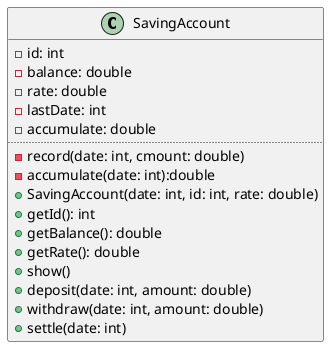

```plantuml
@startuml
class SavingAccount{
    -id: int
    -balance: double
    -rate: double
    -lastDate: int
    -accumulate: double
    ..
    -record(date: int, cmount: double)
    -accumulate(date: int):double
    +SavingAccount(date: int, id: int, rate: double)
    +getId(): int
    +getBalance(): double
    +getRate(): double
    +show()
    +deposit(date: int, amount: double)
    +withdraw(date: int, amount: double)
    +settle(date: int)
}
@enduml
```