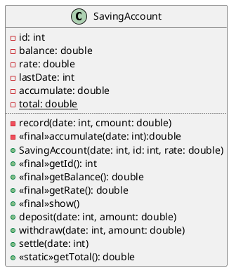

```plantuml
@startuml
class SavingAccount{
    -id: int
    -balance: double
    -rate: double
    -lastDate: int
    -accumulate: double
    -total: {static} double
    ..
    -record(date: int, cmount: double)
    -<<final>>accumulate(date: int):double
    +SavingAccount(date: int, id: int, rate: double)
    +<<final>>getId(): int
    +<<final>>getBalance(): double
    +<<final>>getRate(): double
    +<<final>>show()
    +deposit(date: int, amount: double)
    +withdraw(date: int, amount: double)
    +settle(date: int)
    +<<static>>getTotal(): double
}
@enduml
```