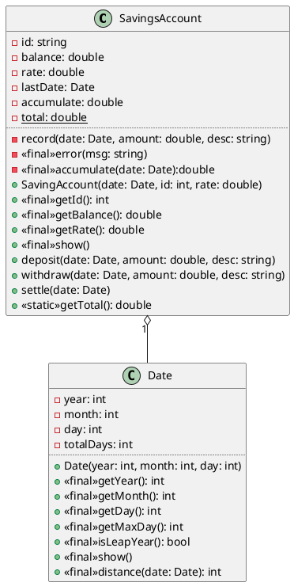

```plantuml
@startuml
class SavingsAccount{
    -id: string
    -balance: double
    -rate: double
    -lastDate: Date
    -accumulate: double
    -total: {static} double
    ..
    -record(date: Date, amount: double, desc: string)
    -<<final>>error(msg: string)
    -<<final>>accumulate(date: Date):double
    +SavingAccount(date: Date, id: int, rate: double)
    +<<final>>getId(): int
    +<<final>>getBalance(): double
    +<<final>>getRate(): double
    +<<final>>show()
    +deposit(date: Date, amount: double, desc: string)
    +withdraw(date: Date, amount: double, desc: string)
    +settle(date: Date)
    +<<static>>getTotal(): double
}

class Date{
    -year: int
    -month: int
    -day: int
    -totalDays: int
    ..
    +Date(year: int, month: int, day: int)
    +<<final>>getYear(): int
    +<<final>>getMonth(): int
    +<<final>>getDay(): int
    +<<final>>getMaxDay(): int
    +<<final>>isLeapYear(): bool
    +<<final>>show()
    +<<final>>distance(date: Date): int
}

SavingsAccount "1" o-- Date

@enduml
```