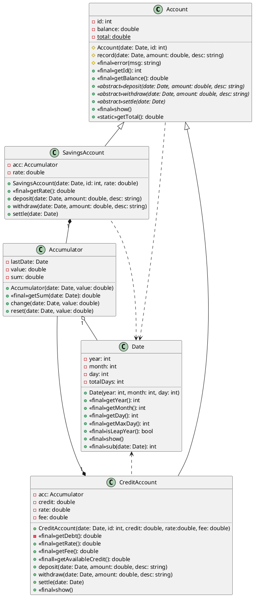

```plantuml
@startuml

class Account{
    -id: int
    -balance: double
    -{static}total: double
    ..
    #Account(date: Date, id: int)
    #record(date: Date, amount: double, desc: string)
    #<<final>>error(msg: string)
    +<<final>>getId(): int
    +<<final>>getBalance(): double
    +{abstract}<<abstract>>deposit(date: Date, amount: double, desc: string)
    +{abstract}<<abstract>>withdraw(date: Date, amount: double, desc: string)
    +{abstract}<<abstract>>settle(date: Date)
    +<<final>>show()
    +<<static>>getTotal(): double
}

class SavingsAccount{
    -acc: Accumulator
    -rate: double
    ..
    +SavingsAccount(date: Date, id: int, rate: double)
    +<<final>>getRate(): double
    +deposit(date: Date, amount: double, desc: string)
    +withdraw(date: Date, amount: double, desc: string)
    +settle(date: Date)
}

class CreditAccount{
    -acc: Accumulator
    -credit: double
    -rate: double
    -fee: double
    ..
    +CreditAccount(date: Date, id: int, credit: double, rate:double, fee: double)
    -<<final>>getDebt(): double
    +<<final>>getRate(): double
    +<<final>>getFee(): double
    +<<finall>>getAvailableCredit(): double
    +deposit(date: Date, amount: double, desc: string)
    +withdraw(date: Date, amount: double, desc: string)
    +settle(date: Date)
    +<<final>>show()
}

class Accumulator{
    -lastDate: Date
    -value: double
    -sum: double
    ..
    +Accumulator(date: Date, value: double)
    +<<final>>getSum(date: Date): double
    +change(date: Date, value: double)
    +reset(date: Date, value: double)
}

class Date{
    -year: int
    -month: int
    -day: int
    -totalDays: int
    ..
    +Date(year: int, month: int, day: int)
    +<<final>>getYear(): int
    +<<final>>getMonth(): int
    +<<final>>getDay(): int
    +<<final>>getMaxDay(): int
    +<<final>>isLeapYear(): bool
    +<<final>>show()
    +<<final>>sub(date: Date): int
}

Account <|-- SavingsAccount
Account <|-- CreditAccount
Accumulator "1" o-- Date
SavingsAccount "1" *--Accumulator
CreditAccount "1" *-- Accumulator
Date <.. SavingsAccount
Date <.. Account
Date <.. CreditAccount


@enduml
```